# Structure from Motion 与相机位姿估计

**作者**: Course Staff | **日期**: 2026年05月 | **状态**: 定稿

## 概述

三维计算成像的核心问题之一是：如何从多张二维图像中恢复出三维场景结构和拍摄这些图像时相机的位置与朝向？**Structure from Motion（SfM）** 正是解决这一问题的关键技术。本讲义涵盖 SfM 所需的全部前置知识和核心理论，从相机模型的数学基础开始，逐步深入到对极几何、特征匹配、三角化、光束法平差等关键算法，最后介绍坐标系对齐、轨迹评估、动态场景处理和位姿质量分析等进阶话题。

---

## 1 相机模型与投影几何

### 1.1 针孔相机模型

三维计算成像的起点是理解相机如何将三维世界映射到二维图像。**针孔相机模型（pinhole camera model）** 提供了最基本的数学描述：三维空间中的点通过小孔投影到成像平面上，形成倒立的像。

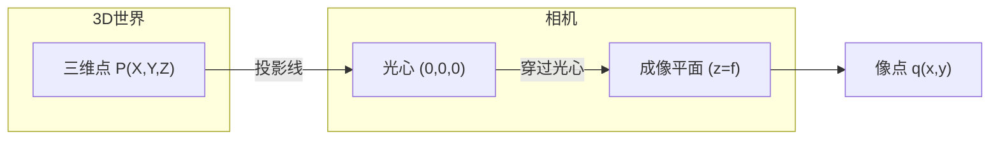

在实际计算中，为方便起见，通常将成像平面放在相机中心前方（虚拟成像平面），从而得到一个正立的像。针孔相机的成像过程可以用**相似三角形**来描述。设三维点 $\mathbf{X} = (X, Y, Z)^T$ 在相机坐标系中，其投影到图像平面上的坐标为：

$$
\mathbf{x} = \left(\frac{f \cdot X}{Z}, \frac{f \cdot Y}{Z}\right)^T
$$

其中 $f$ 为**焦距（focal length）**。这一投影过程具有一个关键的特性：存在对 $Z$ 的除法运算，因此从 3D 到 2D 的映射并非线性变换。这一非线性性是后续引入齐次坐标的直接动机。

### 1.2 齐次坐标

为将上述非线性投影转化为线性形式，引入**齐次坐标（homogeneous coordinates）**。在齐次坐标中，二维点 $(x, y)$ 表示为 $(x, y, 1)$，三维点 $(X, Y, Z)$ 表示为 $(X, Y, Z, 1)$。齐次坐标的一个重要性质是**尺度等价性**：

$$
(x, y, 1) \sim (w x, w y, w)
$$

乘以任意非零标量代表同一个点，这恰好对应了投影几何中「一条射线上所有点投影到同一个像点」这一事实。

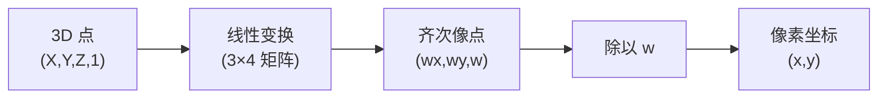

使用齐次坐标后，投影方程可以改写为线性形式：

$$
\begin{bmatrix} w x \\ w y \\ w \end{bmatrix} \sim \begin{bmatrix} f \cdot X + Z \cdot c_x \\ f \cdot Y + Z \cdot c_y \\ Z \end{bmatrix}
$$

其中 $w$ 是齐次缩放因子，$c_x, c_y$ 为主点偏移（详见 1.3 节），最终的像素坐标通过对齐次结果的前两维除以第三维得到。

### 1.3 相机内参矩阵

相机的**内参矩阵（intrinsic matrix）** $\mathbf{K}$ 描述了相机内部几何属性对投影的影响：

$$
\mathbf{K} = \begin{bmatrix} f & 0 & c_x \\ 0 & f & c_y \\ 0 & 0 & 1 \end{bmatrix}
$$

其中 $f$ 为焦距。$(c_x, c_y)$ 为**主点（principal point）**，即**光轴（optical axis）与成像平面的交点**在像素坐标系中的坐标。光轴是通过光心且垂直于成像平面的直线，它是相机坐标系的 $Z$ 轴。理想情况下，主点位于图像中心（例如对于 $W \times H$ 的图像，中心为 $(W/2, H/2)$），但由于传感器组装的制造公差，实际主点可能略有偏离。

内参矩阵的作用是将相机坐标系中的三维点映射到像素坐标系。焦距决定了视场角的大小——焦距越短，视场角越大（广角镜头）；焦距越长，视场角越小（长焦镜头）。

利用内参矩阵，投影方程可以写为简洁的矩阵形式（注意此处 $(X, Y, Z)^T$ 为**相机坐标系**下的坐标）：

$$
\begin{bmatrix} w x \\ w y \\ w \end{bmatrix} = \mathbf{K} \begin{bmatrix} X \\ Y \\ Z \end{bmatrix}
$$

### 1.4 相机外参矩阵

三维点的坐标通常在**世界坐标系（world coordinate system）** 中定义，而相机位于世界坐标系中的某个位置和朝向。从世界坐标系到相机坐标系的变换由**外参矩阵（extrinsic matrix）** 描述：

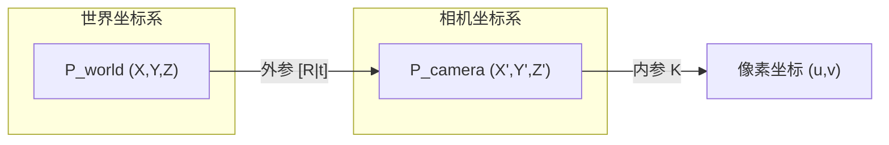

外参包含**旋转矩阵（rotation matrix）** $\mathbf{R}$ 和**平移向量（translation vector）** $\mathbf{t}$：

$$
\mathbf{X}_{\text{cam}} = \mathbf{R} (\mathbf{X}_{\text{world}} - \mathbf{C}) = \mathbf{R} \mathbf{X}_{\text{world}} + \mathbf{t}
$$

其中 $\mathbf{C}$ 为相机中心在世界坐标系中的位置，$\mathbf{t} = -\mathbf{R}\mathbf{C}$。旋转矩阵 $\mathbf{R}$ 是正交矩阵（$\mathbf{R}^T \mathbf{R} = \mathbf{I}$, $\det(\mathbf{R}) = 1$），表示相机朝向的旋转变换。外参的 6 个自由度（3 旋转 + 3 平移）完整描述了相机在三维空间中的位姿（pose）。

### 1.5 投影矩阵

综合内参和外参，完整的**投影矩阵（projection matrix）** $\mathbf{P}$ 为：

$$
\mathbf{P} = \mathbf{K} \begin{bmatrix} \mathbf{R} & \mathbf{t} \end{bmatrix}
$$

这是一个 $3 \times 4$ 的矩阵。给定一个三维点 $\mathbf{X} = (X, Y, Z, 1)^T$ 的齐次坐标，其投影到图像上的像素坐标通过 $\mathbf{P} \mathbf{X}$ 计算，然后除以第三个分量得到归一化的像素坐标：

$$
\begin{bmatrix} u \\ v \\ 1 \end{bmatrix} \sim \mathbf{P} \begin{bmatrix} X \\ Y \\ Z \\ 1 \end{bmatrix}
$$

投影矩阵 $\mathbf{P}$ 将相机位姿（外参）和相机内部属性（内参）统一在一个矩阵中，是连接三维世界和二维图像的核心纽带。在 SfM 中，我们需要从多张图像中同时估计每帧的投影矩阵 $\mathbf{P}_i$（即相机位姿）和三维点 $\mathbf{X}_j$（即场景结构）。

### 1.6 投影性质

透视投影具有几个重要的几何性质。首先，投影是**多对一映射**：同一条射线上的所有三维点投影到同一个像点，因此单张图像无法确定深度。其次，**点投影为点，线投影为线**（除非线通过光心，此时投影为点）。此外，**平行线在图像中交于灭点（vanishing point）**，不同方向的平行线对应不同的灭点，利用灭点可以反推三维方向。

这些性质决定了从单张图像恢复三维信息本质上是欠定的。解决这一欠定性的关键在于：**使用多张不同视角的图像**。

---

## 2 对极几何

### 2.1 对极约束与本质矩阵

当相机从两个不同位置拍摄同一场景时，两幅图像之间存在重要的几何约束，称为**对极几何（epipolar geometry）**。这一约束是 SfM 中求解相机相对位姿和验证特征匹配正确性的理论基础。

考虑两台相机，光心分别为 $O$ 和 $O'$，连接两光心的直线称为**基线（baseline）**。空间中任意三维点 $X$ 在两幅图像中的投影分别为 $x$ 和 $x'$。

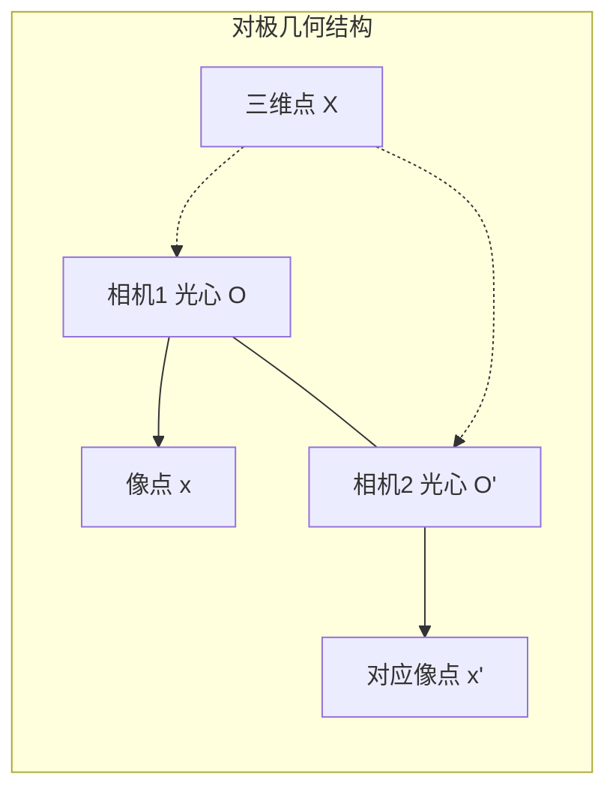

两个光心与三维点 $X$ 构成一个三角形，该三角形所在的平面称为**极平面（epipolar plane）**。根据光线传播的规律，两个像点也位于这个平面内。

下面从数学上推导这一约束的代数表达。设两台相机之间的相对运动由旋转 $\mathbf{R}$ 和平移 $\mathbf{t}$ 描述，其中 $\mathbf{t}$ 表示第二台相机光心在第一台相机坐标系下的位置（注意：这与第 1.4 节定义的外参平移向量 $\mathbf{t}_{\text{ext}} = -\mathbf{R}\mathbf{C}$ 方向相反）。为简化推导，假设第一台相机的坐标系与世界坐标系重合。

以下推导在**归一化像平面坐标系**下进行，即假设像点坐标已通过 $\hat{\mathbf{x}} = \mathbf{K}^{-1}\mathbf{x}$ 去除了焦距 $f$ 和主点 $(c_x, c_y)$ 的影响。设三维点 $X$ 的坐标为 $\mathbf{X} = (X, Y, Z)^T$，其在归一化像平面上的齐次坐标为 $\mathbf{x} = (X/Z, Y/Z, 1)^T$。在齐次坐标下 $\mathbf{x} \propto \mathbf{X}$（方向相同，相差尺度因子），因此对极约束中可将 $\mathbf{X}$ 替换为 $\mathbf{x}$。三维点在第二台相机坐标系下的坐标为 $\mathbf{R}(\mathbf{X} - \mathbf{t})$，对应的归一化像点为 $\mathbf{x}'$。

在第一台相机坐标系中，三个向量 $\mathbf{X}$（光心 $O$ 指向三维点）、$\mathbf{t}$（光心 $O$ 指向光心 $O'$）和 $\mathbf{X} - \mathbf{t}$（光心 $O'$ 指向三维点）都位于极平面内，因此共面。共面等价于它们构成的平行六面体体积为零，可用**标量三重积**判定：

$$
(\mathbf{X} - \mathbf{t})^T (\mathbf{t} \times \mathbf{X}) = 0
$$

接下来将此约束转换为用像点 $\mathbf{x}$ 和 $\mathbf{x}'$ 表示的形式。首先利用叉乘的矩阵表示：对任意向量 $\mathbf{a}$ 和 $\mathbf{b}$，有 $\mathbf{a} \times \mathbf{b} = [\mathbf{a}]_\times \mathbf{b}$，其中 $[\mathbf{a}]_\times$ 是**反对称矩阵（skew-symmetric matrix）**：

$$
[\mathbf{a}]_\times = \begin{bmatrix} 0 & -a_3 & a_2 \\ a_3 & 0 & -a_1 \\ -a_2 & a_1 & 0 \end{bmatrix}
$$

利用这一性质，共面约束改写为 $(\mathbf{X} - \mathbf{t})^T [\mathbf{t}]_\times \mathbf{X} = 0$。再由坐标变换 $\mathbf{x}' = \mathbf{R}(\mathbf{X} - \mathbf{t})$，可得 $\mathbf{X} - \mathbf{t} = \mathbf{R}^T \mathbf{x}'$。代入并利用 $(\mathbf{R}^T \mathbf{x}')^T = \mathbf{x}'^T \mathbf{R}$，最终得到：

$$
\mathbf{x}'^T \mathbf{R} [\mathbf{t}]_\times \mathbf{x} = 0
$$

定义**本质矩阵（essential matrix）** $\mathbf{E} = \mathbf{R} [\mathbf{t}]_\times$，对极约束简洁地表示为：

$$
\mathbf{x}'^T \mathbf{E} \mathbf{x} = 0
$$

这个方程称为 **Longuet-Higgins 方程**（Longuet-Higgins, 1981）。$\mathbf{E}$ 的秩为 2（因为 $[\mathbf{t}]_\times$ 秩为 2），且奇异值具有 $[\sigma, \sigma, 0]$ 的特殊形式（两个非零奇异值相等）。

### 2.2 归一化坐标与基础矩阵

前述推导在**归一化坐标系**下进行，即像点坐标已通过 $\hat{\mathbf{x}} = \mathbf{K}^{-1} \mathbf{x}$ 转换为相机坐标系下的方向向量。当内参未知时，可以直接在像素坐标系下估计**基础矩阵（fundamental matrix）** $\mathbf{F}$：

$$
\mathbf{F} = \mathbf{K}^{-T} \mathbf{E} \mathbf{K}^{-1}
$$

基础矩阵满足 $\mathbf{x}'^T \mathbf{F} \mathbf{x} = 0$，直接作用于像素坐标。$\mathbf{F}$ 与 $\mathbf{E}$ 的区别仅在于参考坐标系不同：$\mathbf{E}$ 要求归一化坐标，$\mathbf{F}$ 直接处理像素坐标。

需要注意的是，奇异值条件 $[\sigma, \sigma, 0]$ 是本质矩阵的**必要条件**而非充分条件。在 5-point 算法等求解过程中，需要将候选解通过 SVD 投影到本质矩阵流形上（强制奇异值为 $[\sigma, \sigma, 0]$），以确保解满足全部约束。

### 2.3 八点算法

估计本质矩阵（或基础矩阵）最经典的线性方法是**八点算法（8-point algorithm）**（Longuet-Higgins, 1981）。其核心是将 $\mathbf{x}'^T \mathbf{E} \mathbf{x} = 0$ 展开为关于 $\mathbf{E}$ 元素的线性方程。将 $\mathbf{E}$ 的 9 个元素按行拉成向量 $\mathbf{e}$，每对匹配点 $\mathbf{x} = (x_1, x_2, 1)^T$ 和 $\mathbf{x}' = (x'_1, x'_2, 1)^T$ 贡献一个方程 $\mathbf{a}^T \mathbf{e} = 0$，其中系数向量为：

$$
\mathbf{a} = (x'_1 x_1, x'_1 x_2, x'_1, x'_2 x_1, x'_2 x_2, x'_2, x_1, x_2, 1)^T
$$

由于 $\mathbf{E}$ 乘以任意非零常数后对极约束仍成立（**尺度等价性**），$\mathbf{E}$ 的自由度为 $9 - 1 = 8$，至少需要 8 对匹配点。从几何角度看，相机的相对位姿有 5 个自由度（3 个旋转 + 2 个平移方向，平移只能确定方向而不能确定长度），代数上的 8 个独立参数减去 3 个内部约束（两个非零奇异值相等、一个奇异值为零）恰好等于 5 个几何自由度。

$n$ 对匹配点构成 $\mathbf{A} \mathbf{e} = \mathbf{0}$，其中 $\mathbf{A}$ 是 $n \times 9$ 的系数矩阵。解为 $\mathbf{A}$ 的 SVD 分解中最小奇异值对应的右奇异向量。得到 $\mathbf{E}$ 后，还需通过 SVD 投影到本质矩阵流形：$\mathbf{E} = \mathbf{U} \operatorname{diag}(\sigma, \sigma, 0) \mathbf{V}^T$（其中 $\sigma = (\sigma_1 + \sigma_2)/2$），确保其满足全部约束。

八点算法对数据的数值尺度敏感。**归一化八点算法**（Hartley, 1997）在求解前将图像坐标平移并缩放到 $[-1, 1]$ 范围内，显著提升数值稳定性。具体方法是对每幅图像计算变换矩阵 $\mathbf{T}$，在归一化坐标 $\tilde{\mathbf{x}} = \mathbf{T} \mathbf{x}$ 下估计 $\tilde{\mathbf{E}}$，再通过 $\mathbf{E} = \mathbf{T}'^T \tilde{\mathbf{E}} \mathbf{T}$ 转换回原始坐标系。

### 2.4 极线与极点

给定第一幅图像中的点 $\mathbf{x}$，其在第二幅图像中的对应点 $\mathbf{x}'$ 必须满足 $\mathbf{x}'^T \mathbf{E} \mathbf{x} = 0$。固定 $\mathbf{x}$，令 $\mathbf{l}' = \mathbf{E} \mathbf{x}$，则方程变为 $\mathbf{x}'^T \mathbf{l}' = 0$。在射影几何中，这表示点 $\mathbf{x}'$ 位于直线 $\mathbf{l}'$ 上。这条直线称为**极线（epipolar line）**，它是极平面与第二幅图像平面的交线。同理，$\mathbf{x}$ 在第一幅图像中对应的极线为 $\mathbf{l} = \mathbf{E}^T \mathbf{x}'$。

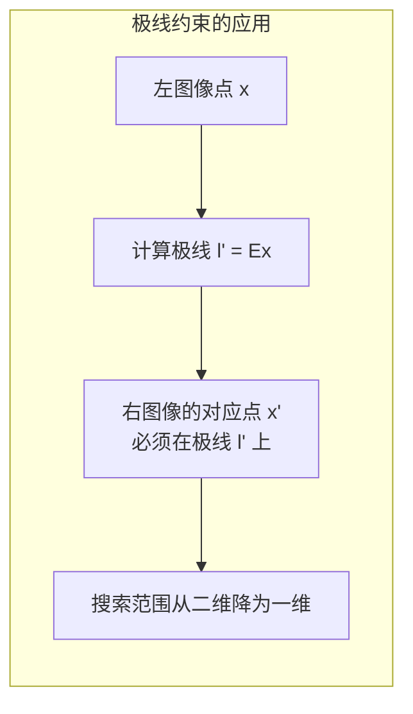

**极点（epipole）** 是基线与图像平面的交点，即另一台相机光心在本幅图像中的投影。代数上，极点满足 $\mathbf{E} \mathbf{e} = \mathbf{0}$ 和 $\mathbf{e}'^T \mathbf{E} = \mathbf{0}$，分别是 $\mathbf{E}$ 的右零空间和左零空间向量。由于 $\mathbf{E}$ 的秩为 2，极点在齐次坐标下唯一确定。

对极几何的重要意义在于：它**将对应点搜索从二维降为一维**。有了极线约束后，搜索范围被限制在一条直线上，极大地缩小了匹配搜索范围。同时，通过验证匹配点到极线的距离，可以有效判断匹配是否正确，这是 RANSAC 鲁棒估计的基础。

---

## 3 Structure from Motion 核心流程

### 3.1 SfM 问题概述

**Structure from Motion（SfM）** 的核心目标是：给定多张同一场景的图像，同时恢复每张图像对应的相机位姿和场景的三维结构。数学形式化为：

$$
\mathbf{x}_{ij} \cong \mathbf{P}_i \mathbf{X}_j, \quad i = 1, \ldots, m, \quad j = 1, \ldots, n
$$

其中 $\mathbf{x}_{ij}$ 是第 $j$ 个三维点在第 $i$ 幅图像中的投影，$\mathbf{P}_i = \mathbf{K}_i [\mathbf{R}_i \mid \mathbf{t}_i]$ 是第 $i$ 幅图像的投影矩阵（由内参和外参组合而成，见 1.5 节），$\mathbf{X}_j$ 是第 $j$ 个三维点的齐次坐标。未知量为 $m$ 个投影矩阵和 $n$ 个三维点。

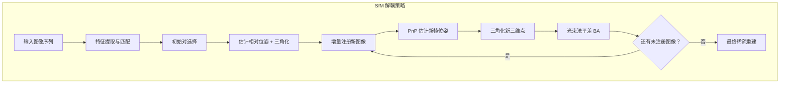

SfM 的核心在于它是一个**耦合问题**：知道相机位姿可以三角化三维点，知道三维点可以求解相机位姿，但两者都未知。现代增量式 SfM（incremental SfM）通过「先估计一对图像，再逐步加入新图像」的方式解耦这一循环。其具体流程如上述流程图所示。

### 3.2 特征提取与匹配

SfM 的第一步是建立图像间的特征对应关系。**SIFT（Scale-Invariant Feature Transform，尺度不变特征变换）**（Lowe, 2004）是 SfM 中最常用的特征描述子。

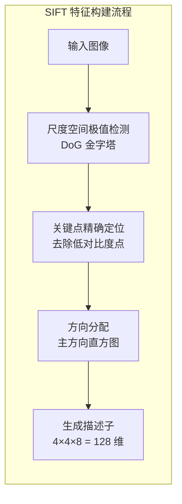

SIFT 特征具有两个关键的不变性：

- **尺度不变性（scale invariance）**：通过构建**图像金字塔（image pyramid）** 并在各尺度的**高斯差分（Difference of Gaussian, DoG）** 空间中检测极值点，SIFT 能够在不同缩放尺度下识别相同的特征点
- **旋转不变性（rotation invariance）**：为每个关键点分配主方向（dominant orientation），然后在其邻域内以该方向为参考计算描述子

SIFT 描述子的具体构建过程包括：

1. **尺度空间极值检测**：在不同尺度的 DoG 图像中寻找局部极值点，这些点在不同缩放尺度下保持稳定
2. **关键点精确定位**：去除低对比度的点和边缘响应点，只保留具有高辨识度的关键点
3. **方向分配**：统计局部梯度方向直方图，取峰值方向为关键点主方向
4. **关键点描述**：在 $16 \times 16$ 的邻域内，划分为 $4 \times 4$ 个子块，每个子块计算 8 个方向的梯度直方图，最终形成 128 维的描述子向量

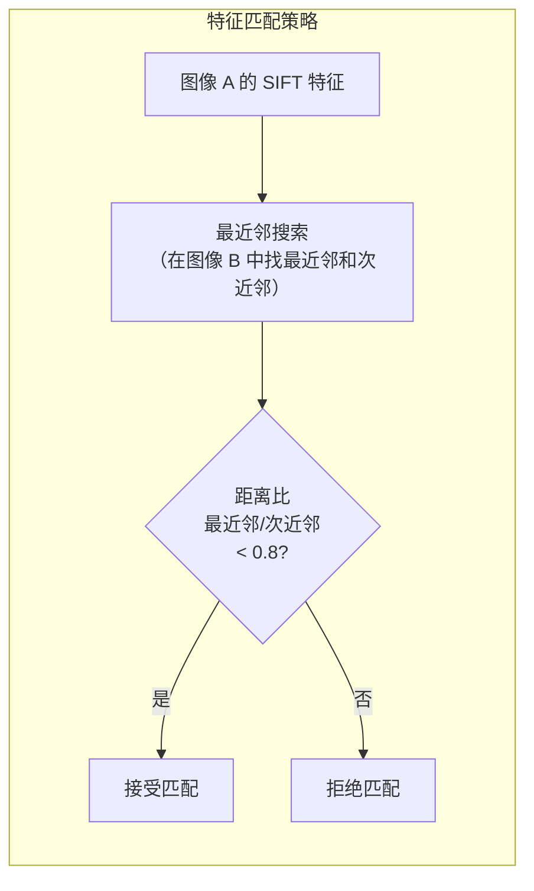

特征匹配采用**最近邻搜索（nearest neighbor search）**。由于真实图像中存在大量噪声，仅取最近邻容易产生误匹配。一个实践中极为有效的方法是**最近邻距离比测试**（Lowe, 2004）：

$$
\text{Reject if } \frac{\text{closest distance}}{\text{second-closest distance}} > 0.8
$$

将最近邻距离与次近邻距离的比值作为匹配质量的判断依据。比值为 1.0 意味着两个候选匹配几乎一样好，此时匹配不可靠。阈值为 0.8 的设定基于经验统计：这一阈值可以剔除约 90% 的误匹配，同时仅丢弃约 5% 的正确匹配。

### 3.3 鲁棒估计：RANSAC

由于特征匹配不可避免地包含**外点（outliers）**——即错误的匹配对，SfM 依赖 **RANSAC（Random Sample Consensus）** 算法进行鲁棒估计。

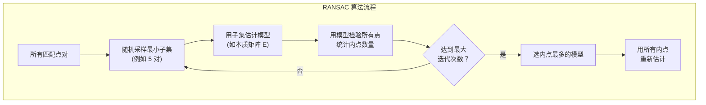

以估计本质矩阵 $\mathbf{E}$ 为例，RANSAC 的流程为：

1. 从匹配点对中随机抽取 5 对（对于简单针孔模型，5 对即可求解 $\mathbf{E}$）
2. 用这 5 对点计算 $\mathbf{E}$ 的候选值
3. 用该 $\mathbf{E}$ 检验所有匹配点对，满足对极约束的点标记为**内点（inliers）**
4. 重复步骤 1-3 共 $N$ 次
5. 选取内点数量最多的 $\mathbf{E}$，用所有内点重新估计最终结果

RANSAC 的成功概率随采样次数的增加而显著提升。假设内点率为 $p = 0.3$，每次采样需要 5 个正确匹配：采样 1 次的成功概率仅为 $0.3^5 = 0.24\%$；采样 1000 次时成功概率升至 $1 - (1 - 0.3^5)^{1000} = 91.22\%$；采样 10000 次时则达到 $1 - (1 - 0.3^5)^{10000} = 99.99\%$。

这一分析表明，即使内点率只有 30%，通过足够多次的随机采样，RANSAC 也能以极高的概率找到正确的解。

### 3.4 三角化

给定已知位姿的两台相机 $\mathbf{P}_1$ 和 $\mathbf{P}_2$，以及一对匹配的二维点 $\mathbf{x}_1 \leftrightarrow \mathbf{x}_2$，**三角化（triangulation）** 的目标是恢复三维点 $\mathbf{X}$ 的空间坐标。

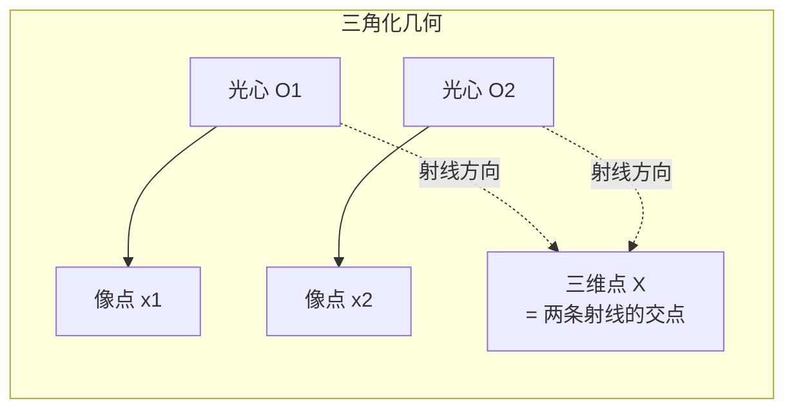

基本思路是利用 $\mathbf{x} \times \mathbf{P}\mathbf{X} = \mathbf{0}$ 这一关系。叉积为零向量是因为在齐次坐标下，$\mathbf{x}$ 和 $\mathbf{P}\mathbf{X}$ 方向相同（只差一个尺度因子）。利用叉乘的矩阵表示（见 2.1 节），将 $\mathbf{x}_i$ 写成反对称矩阵 $[\mathbf{x}_i]_\times$：

$$
[\mathbf{x}_i]_\times \mathbf{P}_i \bar{\mathbf{X}} = \mathbf{0}
$$

其中 $\mathbf{P}_i$ 的每一行记为 $\mathbf{p}_i^{kT}$（$k = 1, 2, 3$），$\bar{\mathbf{X}} = (X, Y, Z, 1)^T$。展开后得到三个方程，其中只有两个是线性独立的（第三个是前两个的线性组合）。选取前两个方程：

$$
\begin{bmatrix} x_i \mathbf{p}_i^{3T} - \mathbf{p}_i^{1T} \\ y_i \mathbf{p}_i^{3T} - \mathbf{p}_i^{2T} \end{bmatrix} \bar{\mathbf{X}} = \mathbf{0}
$$

其中 $(x_i, y_i)$ 是 $\mathbf{x}_i$ 的像素坐标。对两个相机各取两个方程，得到 $4 \times 4$ 的齐次方程组 $\mathbf{A}\bar{\mathbf{X}} = \mathbf{0}$，通过 SVD 求解：$\mathbf{A} = \mathbf{U} \boldsymbol{\Sigma} \mathbf{V}^T$，解为 $\mathbf{V}$ 的最后一列。

三角化的精度受到多种因素的影响。**基线宽度（baseline）** 是首要因素：基线越宽，三角化的角度越理想，深度估计越精确，但基线过宽会导致视角变化过大，特征匹配困难。其次是**噪声水平**：特征点检测和匹配中的像素级误差会传播到三维点的估计中。此外，**外点匹配**会直接产生完全错误的三维点。

### 3.5 PnP 问题

在增量式 SfM 中，当已知场景中一批三维点及其在图像中的二维投影时，如何估计新图像的相机位姿？这就是 **PnP（Perspective-n-Point）** 问题。

给定 $n$ 对 3D-2D 对应关系 $\{\mathbf{X}_j \leftrightarrow \mathbf{x}_j\}$，PnP 求解相机外参 $\mathbf{R}$ 和 $\mathbf{t}$：

$$
\mathbf{x}_j \sim \mathbf{K} [\mathbf{R} | \mathbf{t}] \bar{\mathbf{X}}_j
$$

其中 $\bar{\mathbf{X}}_j = (X_j, Y_j, Z_j, 1)^T$ 为三维点的齐次坐标，$\sim$ 表示齐次等价。

经典的 PnP 求解方法包括：

- **P3P**：利用 3 对对应点，通过求解四次方程得到最多 4 个候选解，再用第 4 个点选优
- **EPnP**（Efficient PnP）：将三维点表示为 4 个控制点的加权和，将问题转化为 $O(n)$ 的线性求解
- **直接线性变换（DLT）**：构建线性方程组直接求解投影矩阵

PnP 与 RANSAC 的结合是实现鲁棒位姿估计的标准做法：随机采样最小点集（如 3 对），求解候选位姿，统计内点数量，迭代后取最优。

### 3.6 光束法平差

**光束法平差（Bundle Adjustment, BA）** 是 SfM 流水线中的核心优化步骤。BA 是一个非线性优化过程，同时精化所有相机位姿和三维点，以最小化**重投影误差（reprojection error）**：

$$
\min_{\mathbf{P}_i, \mathbf{X}_j} \sum_{i=1}^{m} \sum_{j=1}^{n} w_{ij} \, d\big(\mathbf{x}_{ij}, \text{proj}(\mathbf{P}_i, \mathbf{X}_j)\big)^2
$$

其中 $w_{ij}$ 是可见性标志（点 $j$ 是否在图像 $i$ 中可见），$d(\cdot)$ 是图像平面上的欧氏距离。

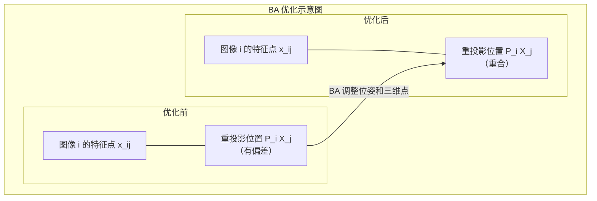

这一目标函数的几何意义是：**三维点投影到图像平面的位置应该与观测到的特征点位置尽可能接近**。BA 的「光束」一词来源于每条投影光线（从三维点到像点的连线）的优化。

BA 的优化通常使用 **Levenberg-Marquardt 算法**，一种结合了高斯-牛顿法和梯度下降法的非线性最小二乘优化方法。由于 $\mathbf{P}_i$ 和 $\mathbf{X}_j$ 共同构成了海量参数（现代 SfM 系统处理成千上万幅图像和百万级的三维点），BA 必须利用问题的稀疏结构进行高效求解。典型的方法是利用 **Schur complement** 先消去三维点参数（结构），只优化相机参数（运动），再将更新后的位姿用于更新三维点。

BA 还有一个重要的概念：**闭环（loop closure）**。当相机运动形成一个闭环（如环绕场景一周回到起点），首尾图像之间的匹配为 BA 提供了额外的约束，使得重建的整体一致性显著提升。

---

## 4 SfM 实践工具：COLMAP

### 4.1 COLMAP 基本流程

**COLMAP**（Schönberger & Frahm, 2016）是目前最流行的开源 SfM 系统。COLMAP 的 **sparse reconstruction** 阶段（仅 SfM，不含 MVS 密集匹配）包含三个主要步骤：


**特征提取：**

```bash
colmap feature_extractor \
    --database_path $DATASET_PATH/database.db \
    --image_path $DATASET_PATH/images
```

这一步对输入图像执行 SIFT 特征检测和描述。关键参数包括：`ImageReader.camera_model`（相机模型类型，默认为 PINHOLE）、`SiftExtraction.max_image_size`（最大图像尺寸）、`SiftExtraction.estimate_affine_shape`（是否估计仿射形状）。

**特征匹配：**

对于无序图像集，使用全量匹配（exhaustive matching）：

```bash
colmap exhaustive_matcher \
    --database_path $DATASET_PATH/database.db
```

对于有序视频序列，使用**序列匹配（sequential matching）**：

```bash
colmap sequential_matcher \
    --database_path $DATASET_PATH/database.db \
    --SequentialMatching.overlap 10
```

`overlap` 参数指定每帧向后搜索匹配的帧数。Sequential matching 利用了视频帧的时间顺序先验，避免了全量匹配中计算所有帧对匹配的冗余。

**稀疏重建：**

```bash
colmap mapper \
    --database_path $DATASET_PATH/database.db \
    --image_path $DATASET_PATH/images \
    --output_path $DATASET_PATH/sparse
```

mapper 执行增量式 SfM 重建，包含自动初始对选择、增量注册、周期性 BA 等完整流程。

### 4.2 相机模型选择

COLMAP 支持多种相机模型，不同模型对参数数量和适用场景有所区别：

- **PINHOLE**（4 参数：fx, fy, cx, cy）：最简单的针孔模型，适用于畸变较小的相机
- **SIMPLE_RADIAL**（5 参数）：在 PINHOLE 基础上增加一个径向畸变参数，适用于手机摄像头等存在轻度畸变的场景
- **OPENCV**（8 参数）：包含完整的径向和切向畸变模型
- **FOV**（5 参数）：Fisheye 畸变模型，适用于鱼眼镜头

参数较少的模型更容易收敛，但对于畸变较大的图像可能无法精确描述投影关系。参数较多的模型表达能力更强，但需要更多的匹配点来稳定估计。

### 4.3 SfM 的输出解释

COLMAP 的 sparse reconstruction 默认输出二进制格式（`cameras.bin`、`images.bin`、`points3D.bin`），存放在 `sparse/0/` 子目录下。可通过 `colmap model_converter` 转换为文本格式：

```bash
colmap model_converter \
    --input_path $DATASET_PATH/sparse/0 \
    --output_path $DATASET_PATH/sparse/0 \
    --output_type TXT
```

文本格式包含三个核心文件：

- **cameras.txt**：每帧图像的相机内参（相机模型类型、焦距、主点、畸变参数）
- **images.txt**：每幅图像的相机外参（旋转矩阵的四元数表示、平移向量），以及每个特征点对应的三维点索引
- **points3D.txt**：重建的三维点坐标及其在哪些图像中可见的信息

这些文件中位姿的坐标定义在任意尺度下——SfM 只能恢复 up-to-scale 的重建结果。

---

## 5 坐标系对齐与轨迹评估

### 5.1 Sim(3) 与尺度歧义性

SfM 输出的三维重建结果定义在**任意坐标系**中——尺度、旋转和平移都是不确定的。这意味着两个不同的 SfM 重建（例如完整序列和子序列各自独立运行的结果）不能直接进行比较，需要先将它们对齐到同一坐标系下。

SfM 的位姿恢复存在一个 **7 自由度的歧义性（7-DOF ambiguity）**：1 个**尺度（scale）**因子、3 个**旋转（rotation）**自由度和 3 个**平移（translation）**自由度。因此，两组位姿之间的对齐需要求解一个 **Sim(3) 变换**（similarity transformation），包含 1 个尺度、1 个旋转矩阵和 1 个平移向量。

### 5.2 Procrustes 分析

**Procrustes 分析（Procrustes analysis）** 是求解 Sim(3) 变换的标准方法。给定两组对应点 $\{\mathbf{p}_i\}$（源）和 $\{\mathbf{q}_i\}$（目标），Procrustes 分析求解以下优化问题：

$$
\min_{s, \mathbf{R}, \mathbf{t}} \sum_{i=1}^{n} \|\mathbf{q}_i - s \mathbf{R} \mathbf{p}_i - \mathbf{t}\|^2
$$

求解算法分为三个步骤：

$$\tilde{\mathbf{p}}_i = \mathbf{p}_i - \bar{\mathbf{p}}, \quad \tilde{\mathbf{q}}_i = \mathbf{q}_i - \bar{\mathbf{q}}$$

先将两点集平移到各自的**质心（centroid）**。然后计算协方差矩阵 $\mathbf{H} = \sum_i \tilde{\mathbf{q}}_i \tilde{\mathbf{p}}_i^T$，通过 SVD 分解 $\mathbf{H} = \mathbf{U} \boldsymbol{\Sigma} \mathbf{V}^T$ 得到旋转矩阵 $\mathbf{R} = \mathbf{V} \mathbf{U}^T$（需确保 $\det(\mathbf{R}) = 1$，否则取 $\mathbf{R} = \mathbf{V} \operatorname{diag}(1, 1, -1) \mathbf{U}^T$）。尺度 $s$ 为：

$$
s = \frac{\operatorname{tr}(\boldsymbol{\Sigma})}{\sum_i \|\tilde{\mathbf{p}}_i\|^2}
$$

最后，平移为 $\mathbf{t} = \bar{\mathbf{q}} - s \mathbf{R} \bar{\mathbf{p}}$。

对于位姿对齐，使用**相机中心（camera center）** 作为对应点。相机中心可由 $\mathbf{C}_i = -\mathbf{R}_i^T \mathbf{t}_i$ 从 $\mathbf{R}_i$ 和 $\mathbf{t}_i$ 恢复。

### 5.3 ATE（Absolute Trajectory Error）

**绝对轨迹误差（Absolute Trajectory Error, ATE）** 是一种定量评估相机位姿估计精度的标准指标。在将估计位姿与参考位姿对齐到同一坐标系后，ATE 计算所有帧的位姿误差的均方根：

$$
\text{ATE} = \sqrt{\frac{1}{n} \sum_{i=1}^{n} \|\mathbf{C}_i^{\text{est}} - \mathbf{C}_i^{\text{ref}}\|^2}
$$

其中 $\mathbf{C}_i^{\text{est}}$ 是对齐后的估计相机中心，$\mathbf{C}_i^{\text{ref}}$ 是参考相机中心。ATE 直接反映了轨迹在三维空间中的整体偏离程度，单位与场景尺度一致。

ATE 也常与 **RPE（Relative Pose Error）** 配合使用。RPE 评估相邻帧间相对运动的误差，不受全局对齐的影响，更关注局部一致性：

$$
\text{RPE} = \sqrt{\frac{1}{n-1} \sum_{i=1}^{n-1} \|\Delta \mathbf{T}_i^{\text{est}} - \Delta \mathbf{T}_i^{\text{ref}}\|^2}
$$

其中 $\Delta \mathbf{T}_i = \mathbf{T}_i^{-1} \mathbf{T}_{i+1}$ 是相邻帧之间的相对变换（$\mathbf{T}_i$ 为第 $i$ 帧的 $4 \times 4$ 齐次位姿矩阵）。ATE 检测全局漂移，RPE 检测局部跳变，两者互补。

---

## 6 进阶话题

### 6.1 动态场景下的 SfM

传统 SfM 建立在**静态场景假设（static scene assumption）** 之上：所有特征点对应的是空间中固定不动的三维点。这一假设在现实应用中经常被违反，例如行人、车辆、飘动的旗帜等动态物体出现在场景中。

动态物体带来的核心问题在于：**动态物体上的特征点违反了 SfM 的基本假设**，其匹配关系对应的三维点在空间中并非固定。

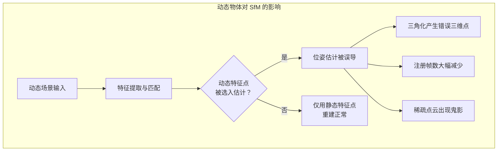

可能的改进方向包括：

- **特征级过滤**：在特征提取或匹配阶段，识别并剔除落在动态区域的特征点
- **图像掩模（image mask）**：通过掩模图像屏蔽指定区域的特征检测，利用语义分割模型自动生成动态物体的掩模
- **运动分割（motion segmentation）**：利用光流或多视角几何一致性检测动态区域
- **鲁棒 BA**：在 BA 优化中引入鲁棒核函数（robust kernel），降低异常观测的影响

### 6.2 无 Ground Truth 的位姿质量评估

在真实应用中，通常没有精确的 ground truth 位姿。因此需要不依赖 ground truth 的位姿质量评估方法。四种常用的评估思路各有侧重：平滑性约束检测局部跳变但对漂移不敏感；对极一致性不需要三维重建但仅评估两帧质量；重投影误差可被 BA 过拟合；组合一致性计算代价高但能检测全局不一致。

**相邻帧平滑性（smoothness constraint）**：当相机运动连续时，相邻帧之间的位姿变化应当平滑。检测位姿序列中的突变可以暴露局部位姿误差。对于视频序列，计算每帧相对于前一帧的**相对变换** $\Delta \mathbf{T}_{i} = \mathbf{T}_{i}^{-1} \mathbf{T}_{i+1}$（其中 $\mathbf{T}_i$ 为第 $i$ 帧的 $4 \times 4$ 齐次位姿矩阵），分析其统计分布是否合理。

**对极几何一致性（epipolar consistency）**：给定两帧位姿后，匹配的特征点应满足对极几何约束。计算匹配点到极线的平均距离可以反映位姿的局部估计质量。距离越小，表示位姿与观测数据越一致。

**重投影误差（reprojection error）**：利用估计的位姿对匹配的特征点进行三角化，然后将三角化的三维点重投影回图像，计算重投影位置与原始特征点位置之间的偏差。较大的重投影误差暗示该帧的位姿估计不可靠。需要注意，重投影误差存在过拟合风险——BA 会最小化重投影误差，即使位姿是全局错误的也可能得到较小的重投影误差。

**组合一致性（composition consistency）**：多帧位姿之间应满足传递性约束，即 $\mathbf{T}_{ik} \approx \mathbf{T}_{ij} \cdot \mathbf{T}_{jk}$（设 $\mathbf{T}_{ij}$ 表示从帧 $i$ 到帧 $j$ 的相对变换）。如果从帧 $i$ 到帧 $k$ 的直接变换与经过帧 $j$ 的间接变换不一致，说明某个位姿的估计存在误差。这一指标可以捕捉全局不一致性，但计算量较大。

### 6.3 SfM 的歧义性

SfM 的结果存在几种固有的歧义性，按标定信息的完备程度排列如下：

**投影歧义性（projective ambiguity）**：当没有任何标定信息时，重建结果在任意 $4 \times 4$ 投影变换 $\mathbf{Q}$（15 个自由度）下保持不变：$\mathbf{X} \rightarrow \mathbf{Q} \mathbf{X}, \mathbf{P} \rightarrow \mathbf{P} \mathbf{Q}^{-1}$。这意味着重建可以是任何投影变换下的扭曲版本。

**度量歧义性（metric ambiguity）**：当相机内参已知（已标定），歧义性退化为 Sim(3) 变换（相似变换），即第 5.1 节所述的 7 自由度歧义性。

**Necker 反转（Necker reversal）**：在缺乏纹理信息的情况下，SfM 可能产生前后颠倒的重建——凹面被重建为凸面，反之亦然。这种歧义性是人类视觉系统中著名的视错觉。

**重复结构（repetitive structures）**：人造场景中常见的重复纹理（如建筑物的窗户阵列）会导致特征匹配产生大量歧义，SfM 可能将这些不同的三维点错误地关联到一起。

---

## 参考资料

- Lowe, D. G. "Distinctive image features from scale-invariant keypoints." *IJCV*, 2004.
- Longuet-Higgins, H. C. "A computer algorithm for reconstructing a scene from two projections." *Nature*, 1981.
- Triggs, B. et al. "Bundle adjustment — A modern synthesis." *International Workshop on Vision Algorithms*, 1999.
- Schönberger, J. L. & Frahm, J.-M. "Structure-from-Motion Revisited." *CVPR*, 2016.
- Hartley, R. "In defense of the eight-point algorithm." *TPAMI*, 1997.
- Hartley, R. & Zisserman, A. *Multiple View Geometry in Computer Vision*. Cambridge University Press, 2004.
