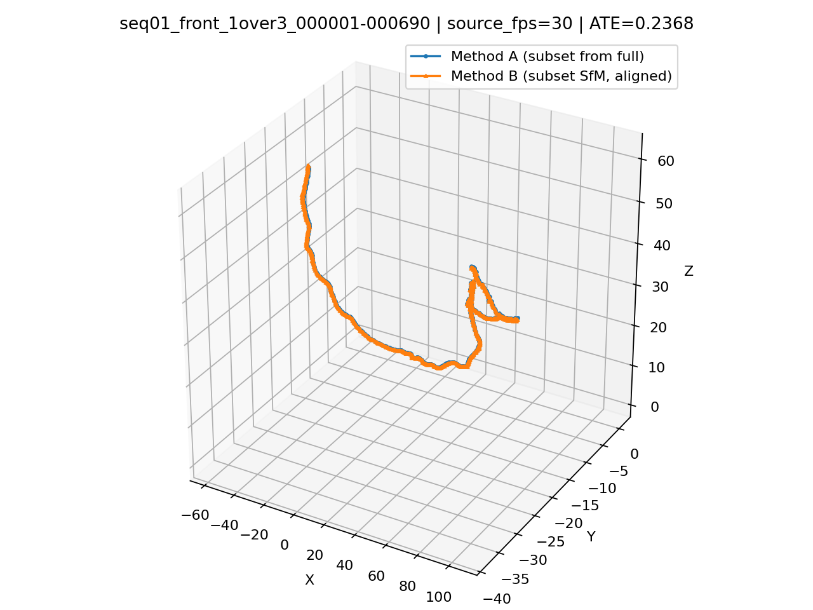
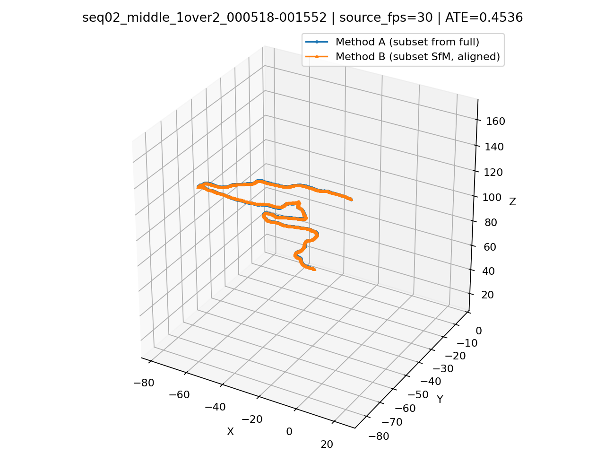
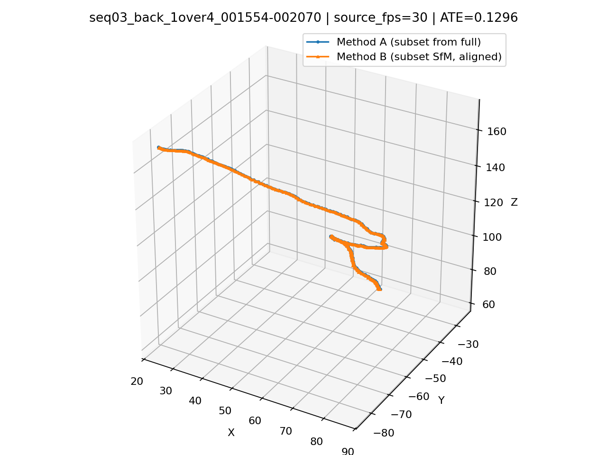

# Lab1 Report

## 运行环境

测试平台：Windows 台式机（本地实验环境）

 - CPU: Intel(R) Core(TM) i7-14700K, 20C20T @ 3.4GHz
 - Memory: 32GB
 - COLMAP 版本：4.1.0.dev0 (Commit 5b76f53, with CUDA)
 - GPU: NVIDIA GeForce RTX 4070 Ti SUPER（使用 GPU 加速）

## 题目一：静态场景 SfM

题目一的流程由 `ffmpeg + COLMAP` 完成。实现上，先用 `ffmpeg` 按固定 `fps` 从视频均匀抽帧，再依次调用 `COLMAP` 的 `feature_extractor`、`sequential_matcher`、`mapper` 和 `model_converter` 得到稀疏重建结果，最后根据 `images.txt` 反算相机中心并绘制轨迹图。实验中使用了 `single_camera=1` 和 `PINHOLE` 相机模型，抽帧策略采用等时间间隔采样。

为了比较抽帧策略对结果的影响，三段视频都测试了 `4 / 8 / 16 / 30 fps` 四组设置。对齐叠加图则使用 `uv run lab1 task1 merge` 输出。

### 拼图展示

`S1-1` 在四组帧率下的轨迹差异很明显。`4 fps` 和 `30 fps` 的注册率都偏低，`16 fps` 的轨迹最完整，回环和高度变化也最清楚，因此这一段最适合中等偏高的抽帧率。

`S1-2` 在四组帧率下都得到了稳定的环绕式轨迹，注册率始终为 **100%**。这一段说明场景本身约束充分，抽帧率更多影响的是轨迹稠密度和运行时间，而不是能否成功重建。**观看视频，`S1-2` 几乎始终对准同一批物体，并且这批物体中，不同的物体之间纹理差异较大，且在视角上分布均匀**。

`S1-3` 对抽帧率最敏感。`8 fps` 和 `30 fps` 可以得到完整轨迹，`4 fps` 和 `16 fps` 则明显退化。这一段更接近单方向扫描，因此相邻视角跨度是否合适会直接影响匹配连续性。

### 三段视频在 30 fps 下的轨迹与相机朝向

下图展示 `S1-1`、`S1-2` 和 `S1-3` 在 `30 fps` 设置下的相机轨迹图。蓝色折线表示相机中心轨迹，红色箭头表示沿轨迹均匀采样得到的相机朝向。

> 神奇的是， `S1-2` 的重建坐标系的上下方向反了，摄像机全程“朝上”。

### 合并图展示

`S1-1` 的合并图显示，`8 fps`、`16 fps` 和 `30 fps` 在主干部分大体一致。

`S1-2` 的合并图几乎完全重合。四组抽帧率在对齐后都沿着同一条主轨迹分布，这和它在定量表中始终保持 **100%** 注册率的结果一致，说明该场景最稳定。

`S1-3` 的合并图差异最大。`8 fps` 与 `30 fps` 的主轨迹虽然仍有重合区域，但整体分叉明显。

### 定量比较

注册率和 SfM 时间随抽帧率变化的统计结果如下。可以直接看出，**运行时间基本随 fps 增长而上升，但注册率并不单调变好**。这说明抽帧率不是越高越好，合理的采样密度比盲目增加帧数更重要。

| 视频 | fps | 抽帧数 | 注册帧数 | 注册率 | SfM时间/s |
|---|---:|---:|---:|---:|---:|
| S1-1 | 4  | 182  | 63  | 0.346 | 18.94 |
| S1-1 | 8  | 363  | 252 | 0.694 | 76.18 |
| S1-1 | 16 | 726  | 681 | 0.938 | 280.49 |
| S1-1 | 30 | 1362 | 482 | 0.354 | 441.65 |
| S1-2 | 4  | 276  | 276 | 1.000 | 71.94 |
| S1-2 | 8  | 552  | 552 | 1.000 | 135.47 |
| S1-2 | 16 | 1104 | 1104 | 1.000 | 668.25 |
| S1-2 | 30 | 2070 | 2070 | 1.000 | 878.84 |
| S1-3 | 4  | 100  | 44  | 0.440 | 68.21 |
| S1-3 | 8  | 200  | 200 | 1.000 | 1182.61 |
| S1-3 | 16 | 400  | 152 | 0.380 | 522.49 |
| S1-3 | 30 | 750  | 750 | 1.000 | 5936.41 |

## 题目二：子序列位姿分析

题目二以 `S1-2 @ 30 fps` 的完整重建结果作为参考。实现上，采用两种方式构造同一段子序列的位姿：**Method A** 直接从完整序列的 `images.txt` 中裁出对应帧的位姿，作为参考轨迹；**Method B** 则只保留该子序列图像，重新独立运行一次 `feature_extractor + sequential_matcher + mapper`，得到子序列自身的 SfM 结果。由于两个重建都只在各自的任意坐标系内成立，所以比较前需要先基于公共注册帧的相机中心做 **Sim(3)** 对齐，再计算 **ATE（Absolute Trajectory Error）**。

本实验按作业要求选取三段子序列：前 `1/3`、中间 `1/2` 和后 `1/4`。三段序列在 `30 fps` 下都能完整注册，说明 `S1-2` 这个场景即使截成较短片段，也仍然保留了足够稳定的纹理与视角约束。

### 轨迹叠加图

前 `1/3` 子序列的两条轨迹在对齐后基本重合，仅在长弯折段上存在轻微偏移，说明独立重建与完整重建在这一段上的几何关系总体一致。

中间 `1/2` 子序列覆盖范围最大，ATE 也是三段里最高的。叠加图可以看到主轨迹仍然一致，但在回环和转折处出现了更明显的局部漂移，说明更长的子序列虽然信息更多，但累计误差也更容易暴露。

后 `1/4` 子序列的重合度最好。该段长度最短、视角变化相对平滑，因此独立 SfM 后再对齐时的偏差最小。

### 定量结果

三段子序列的公共注册帧数都与子序列总帧数相同，即 **690 / 1035 / 517** 帧全部成功参与了对齐。ATE 结果表明，三段子序列与完整序列裁剪出的参考位姿总体一致，其中后 `1/4` 最稳定，中间 `1/2` 偏差最大。

| 子序列 | 帧范围 | 子序列帧数 | 公共注册帧数 | ATE | Sim(3) scale |
|---|---|---:|---:|---:|---:|
| 前 1/3 | `000001-000690` | 690 | 690 | 0.2368 | 16.8864 |
| 中间 1/2 | `000518-001552` | 1035 | 1035 | 0.4536 | 14.8725 |
| 后 1/4 | `001554-002070` | 517 | 517 | 0.1296 | 12.3092 |

从这个结果可以看出，**同一视频中，不同时间段的子序列在独立重建后仍能恢复出与完整重建高度一致的轨迹形状**。ATE 没有因为子序列独立运行而显著增大，说明 `S1-2` 的场景约束较强，局部片段已经足以支持稳定的 SfM。另一方面，中间 `1/2` 的误差最高，也说明子序列越长、包含的转向和累计路径越复杂，越容易出现局部漂移；较短且运动更平滑的后 `1/4` 则更容易保持一致。
