# Lab1 Report

## 运行环境

测试平台：Windows 台式机（本地实验环境）

 - CPU: Intel(R) Core(TM) i7-14700K, 20C20T @ 3.4GHz
 - Memory: 32GB
 - COLMAP 版本：4.1.0.dev0 (Commit 5b76f53, with CUDA)
 - GPU: NVIDIA GeForce RTX 4070 Ti SUPER（使用 GPU 加速）

## 题目一：静态场景 SfM

题目一的流程由 `ffmpeg + COLMAP` 完成。实现上，先用 `ffmpeg` 按固定 `fps` 从视频均匀抽帧，再依次调用 `COLMAP` 的 `feature_extractor`、`sequential_matcher`、`mapper` 和 `model_converter` 得到稀疏重建结果，最后根据 `images.txt` 反算相机中心并绘制轨迹图。实验中使用了 `single_camera=1` 和 `PINHOLE` 相机模型，抽帧策略采用等时间间隔采样。

为了比较抽帧策略对结果的影响，三段视频都测试了 `4 / 8 / 16 / 30 fps` 四组设置。对齐叠加图则使用 `uv run lab1 task1 merge` 输出。

### 拼图展示

`S1-1` 在四组帧率下的轨迹差异很明显。`4 fps` 和 `30 fps` 的注册率都偏低，`16 fps` 的轨迹最完整，回环和高度变化也最清楚，因此这一段最适合中等偏高的抽帧率。

`S1-2` 在四组帧率下都得到了稳定的环绕式轨迹，注册率始终为 **100%**。这一段说明场景本身约束充分，抽帧率更多影响的是轨迹稠密度和运行时间，而不是能否成功重建。**观看视频，`S1-2` 几乎始终对准同一批物体，并且这批物体中，不同的物体之间纹理差异较大，且在视角上分布均匀**。

`S1-3` 对抽帧率最敏感。`8 fps` 和 `30 fps` 可以得到完整轨迹，`4 fps` 和 `16 fps` 则明显退化。这一段更接近单方向扫描，因此相邻视角跨度是否合适会直接影响匹配连续性。

### 三段视频在 30 fps 下的轨迹与相机朝向

下图展示 `S1-1`、`S1-2` 和 `S1-3` 在 `30 fps` 设置下的相机轨迹图。蓝色折线表示相机中心轨迹，红色箭头表示沿轨迹均匀采样得到的相机朝向。

> 神奇的是， `S1-2` 的重建坐标系的上下方向反了，摄像机全程“朝上”。

### 合并图展示

`S1-1` 的合并图显示，`8 fps`、`16 fps` 和 `30 fps` 在主干部分大体一致。

`S1-2` 的合并图几乎完全重合。四组抽帧率在对齐后都沿着同一条主轨迹分布，这和它在定量表中始终保持 **100%** 注册率的结果一致，说明该场景最稳定。

`S1-3` 的合并图差异最大。`8 fps` 与 `30 fps` 的主轨迹虽然仍有重合区域，但整体分叉明显。

### 定量比较

注册率和 SfM 时间随抽帧率变化的统计结果如下。可以直接看出，**运行时间基本随 fps 增长而上升，但注册率并不单调变好**。这说明抽帧率不是越高越好，合理的采样密度比盲目增加帧数更重要。

| 视频 | fps | 抽帧数 | 注册帧数 | 注册率 | SfM时间/s |
|---|---:|---:|---:|---:|---:|
| S1-1 | 4  | 182  | 63  | 0.346 | 18.94 |
| S1-1 | 8  | 363  | 252 | 0.694 | 76.18 |
| S1-1 | 16 | 726  | 681 | 0.938 | 280.49 |
| S1-1 | 30 | 1362 | 482 | 0.354 | 441.65 |
| S1-2 | 4  | 276  | 276 | 1.000 | 71.94 |
| S1-2 | 8  | 552  | 552 | 1.000 | 135.47 |
| S1-2 | 16 | 1104 | 1104 | 1.000 | 668.25 |
| S1-2 | 30 | 2070 | 2070 | 1.000 | 878.84 |
| S1-3 | 4  | 100  | 44  | 0.440 | 68.21 |
| S1-3 | 8  | 200  | 200 | 1.000 | 1182.61 |
| S1-3 | 16 | 400  | 152 | 0.380 | 522.49 |
| S1-3 | 30 | 750  | 750 | 1.000 | 5936.41 |

> 整体上，fps越大，运行时间越长。

## 题目二：子序列位姿分析

题目二仍以 `S1-2` 的全量重建结果作为参考。这里比较两种位姿提取方式：**方法 A** 直接从全量 `images.txt` 切片得到子序列位姿，**方法 B** 仅对该子序列图像独立重建。随后在共同注册帧上做 Sim(3) 对齐，并计算 ATE 与轨迹形状相关指标。新增 `fps=8` 与 `fps=16` 实验，并与已有 `fps=30` 对比。

### 定量结果

| 帧率 fps | 子序列编号 | 子序列帧数 | 共同注册帧数 | ATE | 尺度 | 端点距离 | 轨迹长度 | 端点比例 |
|:---:|:---:|:---:|:---:|:---:|:---:|:---:|:---:|:---:|
| 8  | 01 | 192 | 192 | 0.0432 | 0.5869 | 18.2733 | 44.1938 | 0.4135 |
| 16 | 01 | 384 | 384 | 0.0687 | 6.0914 | 18.2659 | 46.8490 | 0.3899 |
| 30 | 01 | 720 | 720 | 0.0719 | 2.3617 | 18.3934 | 47.2025 | 0.3897 |
| 8  | 02 | 64  | 64  | 0.0115 | 0.3057 | 14.9377 | 16.3491 | 0.9137 |
| 16 | 02 | 128 | 128 | 0.0074 | 3.1764 | 15.0622 | 16.8041 | 0.8963 |
| 30 | 02 | 240 | 240 | 0.0108 | 1.2285 | 15.1095 | 17.3702 | 0.8698 |
| 8  | 03 | 240 | 240 | 0.0402 | 0.7572 | 26.0713 | 59.5756 | 0.4376 |
| 16 | 03 | 480 | 480 | 0.0666 | 7.8026 | 26.0020 | 62.7408 | 0.4144 |
| 30 | 03 | 900 | 900 | 0.0664 | 3.0207 | 26.0765 | 63.3635 | 0.4115 |

子序列编号与帧范围对应关系：
- 01：`000211-000930`（中等回环）
- 02：`000271-000510`（稳定扫描）
- 03：`000031-000930`（长回环）

> 这里统一以 `30fps` 的 Method A 作为参考坐标系。对 `8fps/16fps/30fps` 的 Method A 都先对齐到该参考系，再将对应的 Method B 对齐到各自的 Method A，因此表中的轨迹长度和端点距离处在同一空间尺度下。

从数据中可以看出，经过对齐的数据显示，对于稳定扫描片段，ATE显著低于回环片段，并且受帧率影响不大，而对于回环片段，ATE较高且随帧率增加而增加。

### 轨迹对齐可视化（统一到 30fps Method A）

子序列 01：`return_mid`，帧范围 `000211-000930`

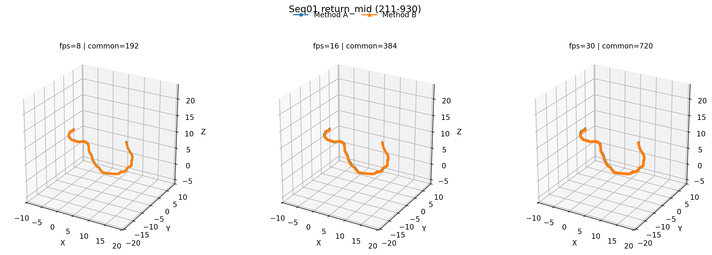

子序列 02：`scan_stable`，帧范围 `000271-000510`

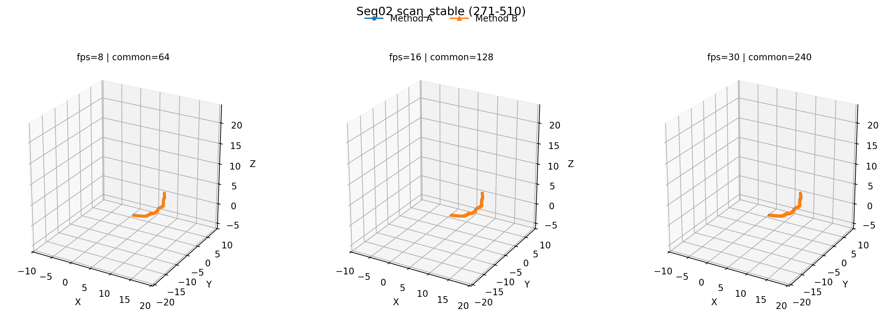

子序列 03：`return_long`，帧范围 `000031-000930`

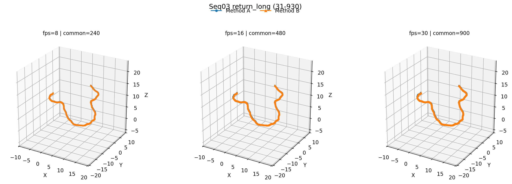

统一到 `30fps` 的 Method A 后，同一子序列在不同帧率下的轨迹长度和端点距离已经回到接近量级：01 约为 `18.27/18.27/18.39`，02 约为 `14.94/15.06/15.11`，03 约为 `26.07/26.00/26.08`。这说明当前对齐方式已经消除了不同 `fps` 全局重建坐标系带来的尺度差异。

## 题目三：动态场景 SfM

### 直接运行 SfM 的观察与分析

对两段动态视频 `S2-1`（街景，行人车辆密集）和 `S2-2`（道路场景，大量移动车辆）直接运行 COLMAP SfM（`raw` 方法，fps=30）：

- **S2-1**：600 帧中仅注册 84 帧（14.0%），大量帧因特征匹配不可靠而无法注册。已注册帧的轨迹出现明显跳变（`jump_ratio=0.0723`），稀疏点云中存在大量由动态物体产生的离群点。
- **S2-2**：注册率同样偏低（34.4%），轨迹跳变比例虽然相对较小（0.0145），但稀疏点云中动态车辆对应的三维点严重偏离静态结构。

**失败原因分析**：传统 SfM 假设场景中所有特征点在三维空间中保持静止。动态物体（行人、车辆）违反了这一假设，由此产生的特征匹配违反对极几何约束，误导了位姿估计和三角化。

下图展示了 `raw` SfM 重建时三角化的特征点（绿色圆点）叠加在视频帧上的效果。可以看到一部分三角化特征点落在动态物体（行人、车辆）上。

`S2-1` 三角化特征点分布（约 7-17s，已注册区间）：

`S2-2` 三角化特征点分布（约 12-20s，已注册区间）：

### 改进方案

实验测试了三种掩膜策略，在特征提取阶段屏蔽动态区域，从而阻止动态特征点参与 SfM：

1. **`mask_default`**：基于先验知识的静态 ROI 掩膜。对 `S2-1` 保留画面上方约 20%（建筑、天空区域），对 `S2-2` 保留左上方约 50%。作为 COLMAP 的 `camera_mask` 输入。

2. **`mask_motion`**：基于帧间差分的自适应运动掩膜。对每帧与其前后帧做配准后差分，像素级检测运动区域，再通过形态学膨胀扩大掩膜范围。

3. **`mask_yolo`**：基于 YOLOv11-seg 语义分割的掩膜。使用 `yolo11s-seg.pt` 模型检测并分割行人（class 0）、自行车（1）、汽车（2）、摩托车（3）、公交车（5）、卡车（7）等动态类别，同样经形态学膨胀后作为特征掩膜。

掩膜效果示例如下（左侧为原始帧，右侧为掩膜叠加效果，红色区域为被屏蔽的动态区域）：

`S2-1` YOLO 语义分割掩膜（前 10s）：

`S2-2` 运动差分掩膜（前 10s）：

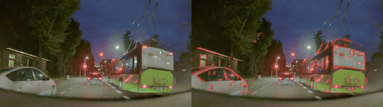

### 定量比较

#### S2-1 (fps30)

| 方法 | registration_ratio | reliable_ratio | reproj_median | reproj_p90 | track_median | jump_ratio |
|:---:|:---:|:---:|:---:|:---:|:---:|:---:|
| `raw` | 0.1400 | 0.6319 | 0.7495 | 1.7014 | 7  | 0.0723 |
| `mask_default` | 0.2167 | 0.6189 | 0.5101 | 1.0582 | 54 | 0.0388 |
| `mask_motion` | 0.5683 | 0.6391 | 0.5137 | 1.5263 | 20 | 0.0235 |
| `mask_yolo` | 0.2083 | 0.6601 | 0.7080 | 1.5844 | 10 | 0.0000 |

对 `S2-1`，`mask_motion` 的综合权衡最好：注册率最高（56.8%）且跳变比例较低。`mask_yolo` 轨迹最平滑（零跳变），但注册率明显偏低（20.8%）。`mask_default` 的静态 ROI 策略过于粗糙，大部分可以利用的信息严重丢失。`raw` 注册率最低且跳变更高，体现出更强的动态干扰。

由于特征点实际上落在动态物体上的比例并不是很大，因此简单的动态掩膜就能显著提升 SfM 的稳定性和注册率，而过强的掩膜（如基于语义分割的 `mask_yolo`）反而因可用特征不足导致注册率大幅下降。

#### S2-2 (fps30)

| 方法 | registration_ratio | reliable_ratio | reproj_median | reproj_p90 | track_median | jump_ratio |
|---|---:|---:|---:|---:|---:|---:|
| `raw` | 0.3438 | 0.7094 | 0.6118 | 1.6038 | 6 | 0.0145 |
| `mask_default` | 0.0430 | 0.5860 | 0.5739 | 1.5191 | 7 | 0.0000 |
| `mask_motion` | 0.4512 | 0.6953 | 0.6394 | 1.5971 | 6 | 0.0294 |
| `mask_yolo` | 0.0314 | 0.5898 | 0.9413 | 1.8697 | 5 | 0.0000 |

对 `S2-2`，`mask_motion` 同样表现最佳：注册率 45.1% 是四种方法中最高的，且可靠点比例和重投影误差与 `raw` 接近。`mask_default` 和 `mask_yolo` 的注册率极低（4.3% 和 3.1%），属于重建失败。两个视频的结论一致：**自适应运动掩膜是最有效的策略，而基于语义或先验的过强掩膜反而因特征不足导致重建失败**。

### 轨迹与稀疏点云对比

各方法轨迹叠加图（已做 Sim(3) 对齐，以 `raw` 为参考）：

S2-1 轨迹叠加：

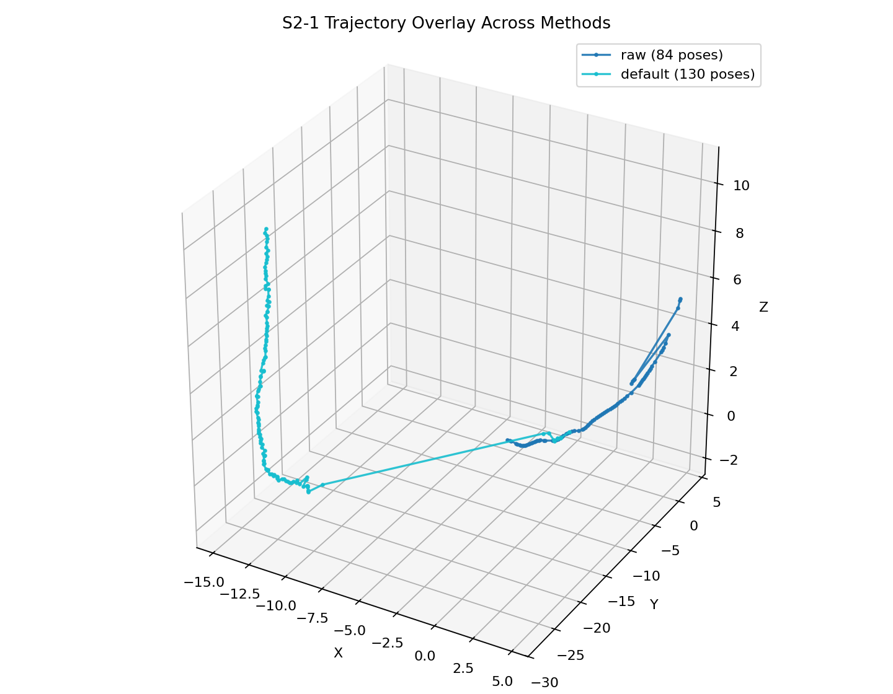

S2-2 轨迹叠加：

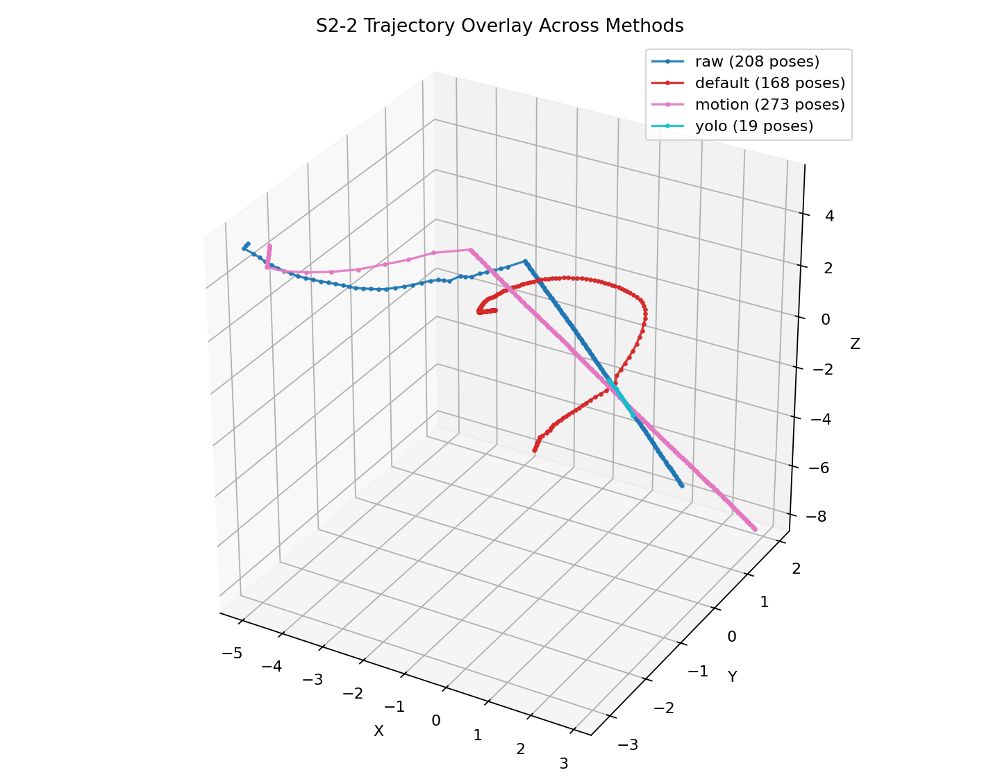

稀疏点云对比（左：`raw`，右：最佳掩膜方法）：

S2-1 `raw` vs `mask_motion`：

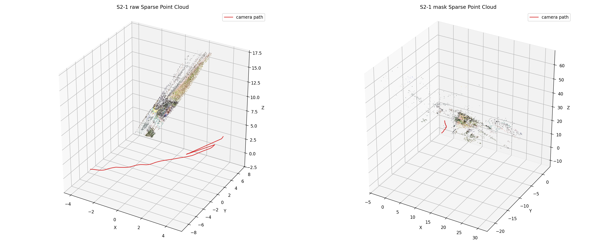

S2-2 `raw` vs `mask_motion`：

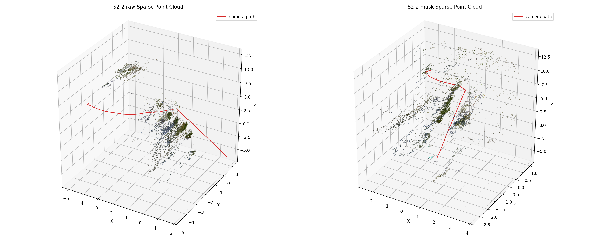

### 小结

题目二和题目三得到一致结论：**约束需要平衡，采样更密或掩膜更强并不必然更好**。在题目二中，`fps=8` 比 `fps=16/30` 更稳健；在题目三中，两个视频上自适应运动掩膜（`mask_motion`）都是最有效的策略，注册率分别从 14.0% 提升至 56.8%（S2-1）和从 34.4% 提升至 45.1%（S2-2）。而基于语义分割（`mask_yolo`）或先验 ROI（`mask_default`）的过强掩膜反而因可用特征不足导致注册率大幅下降。

## 题目四：位姿质量评估（annotations 01-10）

题目四使用四类指标：

- **相邻帧位姿平滑性** `smooth_jump_ratio`：计算相邻帧相机中心的步长序列，统计步长超过 3 倍中位数的比例。好的位姿序列应当平滑，跳变比例越低越好。
- **对极几何一致性** `epi_dist_px`：对相邻帧做 ORB 匹配，使用 `images.txt` 中标注位姿生成基础矩阵 $F_{gt}$，仅保留满足标注对极约束的匹配点，再计算匹配点到极线的对称距离中位数。好的位姿应当与实际图像匹配一致，距离越小越好。
- **三角化重投影误差** `reproj_err_px`：对满足标注对极约束的匹配点，使用标注相对位姿做三角化，并将 3D 点投影回两帧，计算重投影误差中位数。好的位姿给出的几何关系应当自洽。
- **多帧组合一致性** `compose_rot_err_deg`：对相邻两段图像匹配分别估计旋转 `R_est(i,i+1)` 与 `R_est(i+1,i+2)`，再与标注两步旋转 `R_gt(i,i+2)` 比较组合残差。好的位姿应当能被局部图像几何支持。

实现要点：特征匹配基于各 case 的 `video.mp4` 采样帧（ORB + ratio test + mutual check）。`epi_dist_px` 与 `reproj_err_px` 都直接使用标注位姿作为几何基准；图像估计仅用于 `compose_rot_err_deg` 提供独立旋转参考。每个指标先对单个帧对取中位数，再对所有有效帧对/三元组取稳健中位数汇总。

### 单项指标

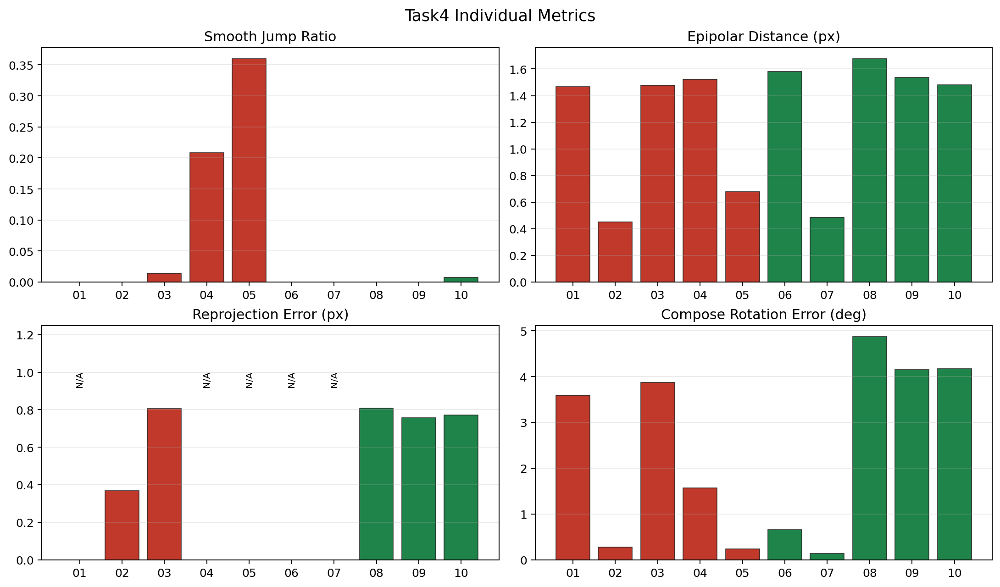

从单项指标来看：
- `smooth_jump_ratio`：bad case（04、05）有明显的轨迹跳变（0.21、0.36），而 good case 全部为 0 或极小值。这一指标的区分力最强。
- `epi_dist_px`：修正实现后，数值不再集中在亚像素范围，而是扩展到约 0.45–1.68 px。02、05、07 的标注与图像匹配更一致，而 01、03、04、06、08、09、10 的残差更高，说明该指标现在确实在测标注位姿与图像观测的一致性。
- `reproj_err_px`：仍有多例返回无效值（01、04、05、06、07），说明这些 case 即使满足部分对极约束，也难以在标注位姿下稳定三角化。有效 case 中 02 的误差最低（0.37 px），08–10 约为 0.76–0.81 px，03 为 0.81 px。
- `compose_rot_err_deg`：修正后不再接近 0，而是扩展到约 0.14–4.87 deg。good case（08、09、10）和部分 bad case（01、03）的残差都较大，表明这一项更像“局部图像旋转是否支持标注轨迹”，区分力仍有限。

### 混合质量分数

最终质量分数由四类指标加权混合得到：

`penalty = 0.25 * (6 × smooth_jump_ratio) + 0.25 * log(1 + epi_dist_px/1.5) + 0.25 * log(1 + reproj_err_px/1.5) + 0.25 * log(1 + compose_rot_err_deg/2.0)`

`quality_score = 100 × exp(-penalty)` (higher is better)

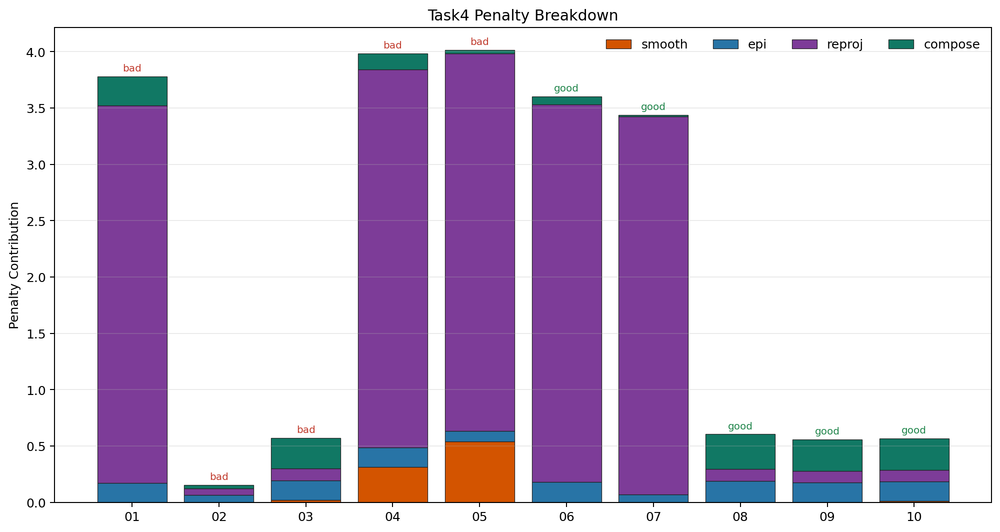

Penalty 分解图展示了各指标对最终分数的贡献。对 01、04、05、06、07，主要惩罚来自 `reproj` 的失败项；对 04、05 还叠加了明显的 `smooth` 惩罚。08–10 虽然没有重投影失败，但 `epi` 与 `compose` 项都不低，因此最终得分仅在 55–57 分左右；02 的所有分量都较小，因此被打成高分离群点。

### 分类效果

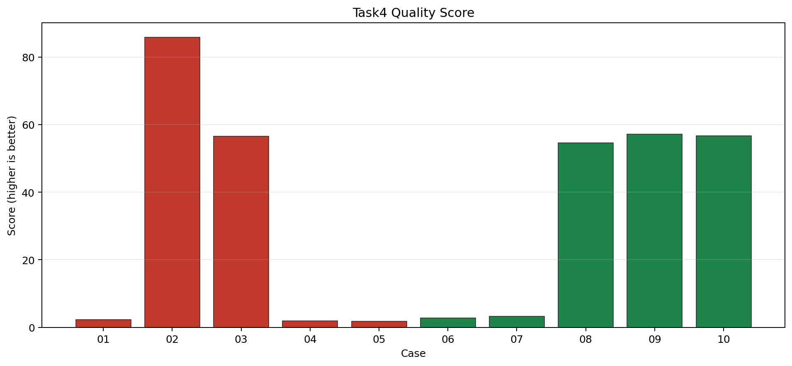

- 最优阈值：`2.72`
- 准确率：`0.8000`（8/10）
- 精确率（good）：`0.7143`
- 召回率（good）：`1.0000`
- AUC: `0.6800`
- 混淆矩阵：`TP=5, TN=3, FP=2, FN=0`

所有 good case 仍被正确识别（召回率 100%），但 02 和 03 两个 bad case 也落在阈值上方，被误判为 good。02 的高分说明它虽然标签为 bad，但局部几何与图像匹配相当一致；03 则说明“轻微不平滑 + 中等几何误差”不足以把它与 good 完全拉开。这反映了混合指标的一个局限：当前四项指标更擅长识别“明显坏”的轨迹（如 04、05），但对边界样本的区分仍然有限。

**优点**：修正后，`epi_dist_px`、`reproj_err_px` 和 `compose_rot_err_deg` 都真正以标注位姿为评估对象，不再退化为“图像两视图几何能否自洽重估”。`smooth_jump_ratio` 仍然是最稳定、区分力最强的指标。**局限**：`reproj_err_px` 仍然容易因有效几何点不足而失效；`compose_rot_err_deg` 对边界样本的排序能力一般；如果后续需要更稳健地区分 02、03 这类样本，应进一步加入 `gt_inlier_ratio` 或 `cheirality_ratio` 之类的支持度指标。
