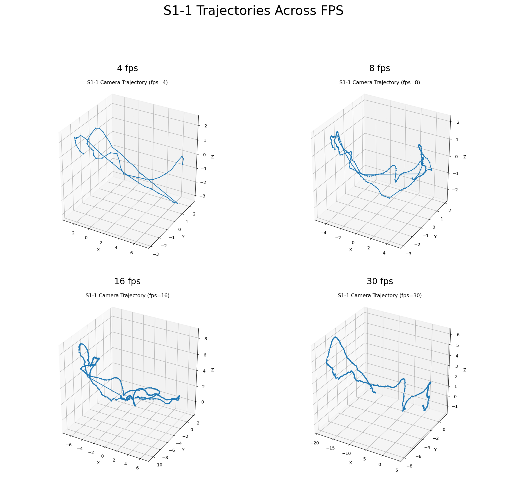
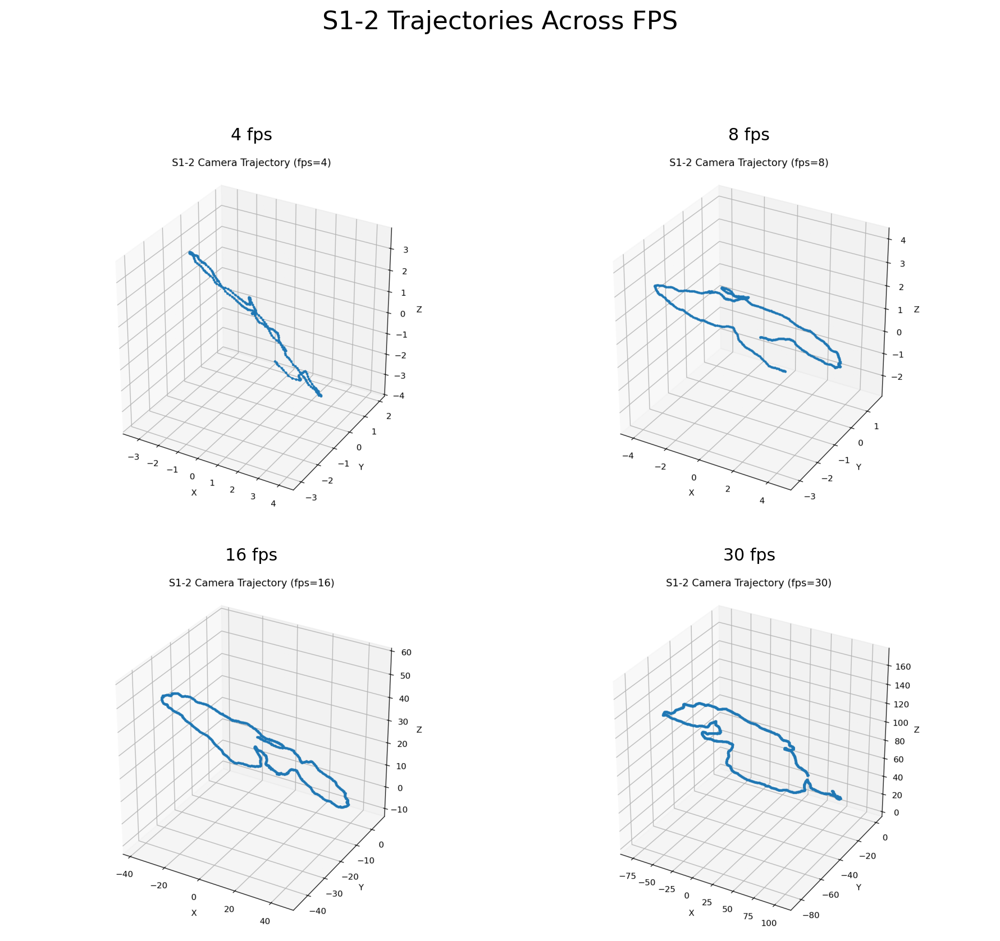
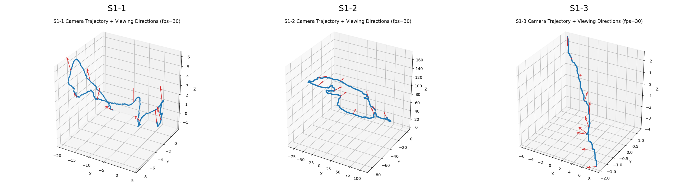
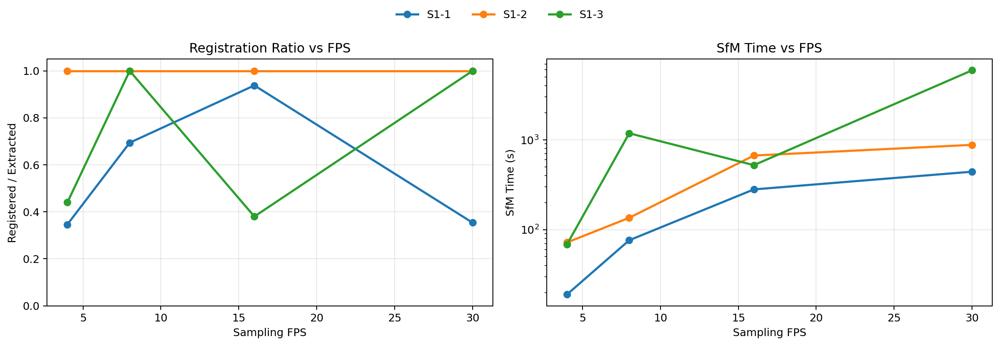
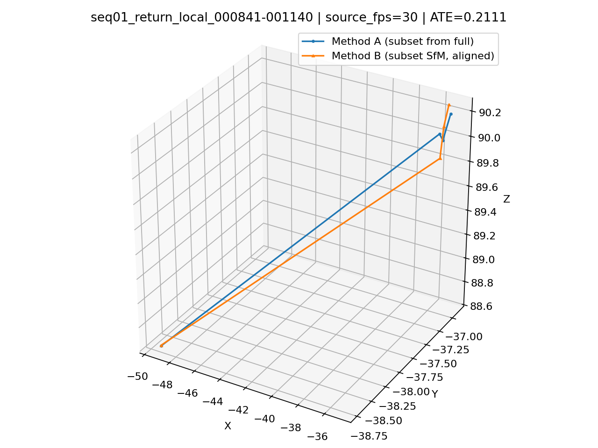
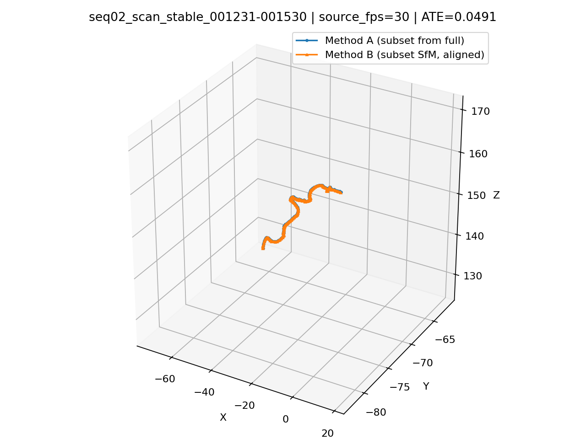
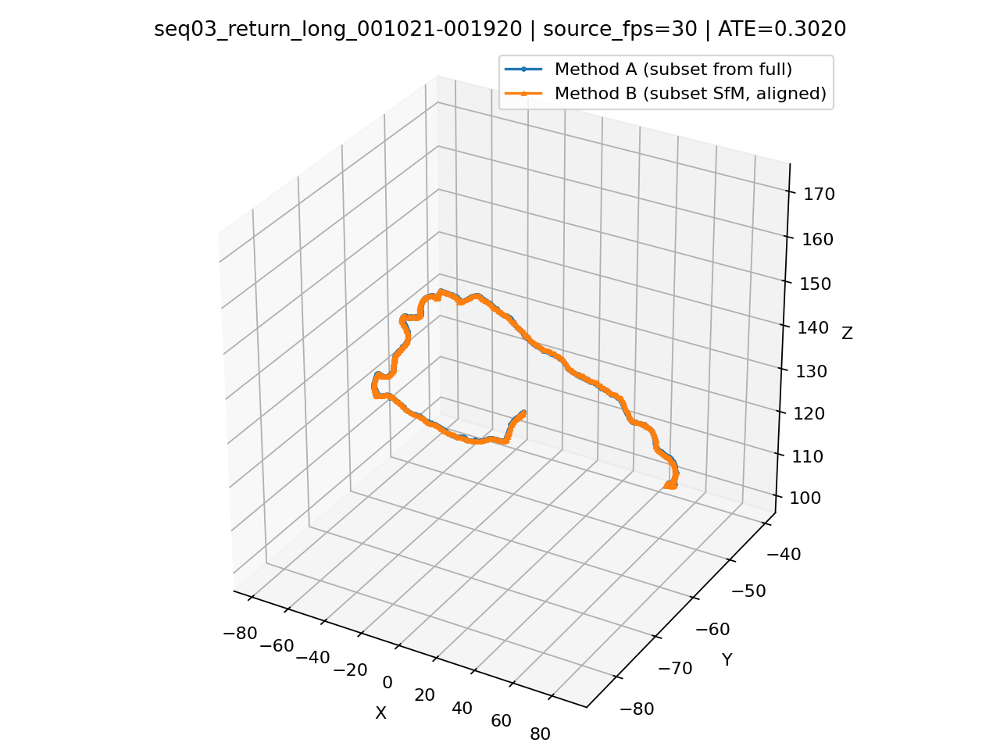

# Lab1 Report

## 运行环境

测试平台：Windows 台式机（本地实验环境）

 - CPU: Intel(R) Core(TM) i7-14700K, 20C20T @ 3.4GHz
 - Memory: 32GB
 - COLMAP 版本：4.1.0.dev0 (Commit 5b76f53, with CUDA)
 - GPU: NVIDIA GeForce RTX 4070 Ti SUPER（使用 GPU 加速）

## 题目一：静态场景 SfM

题目一的流程由 `ffmpeg + COLMAP` 完成。实现上，先用 `ffmpeg` 按固定 `fps` 从视频均匀抽帧，再依次调用 `COLMAP` 的 `feature_extractor`、`sequential_matcher`、`mapper` 和 `model_converter` 得到稀疏重建结果，最后根据 `images.txt` 反算相机中心并绘制轨迹图。实验中使用了 `single_camera=1` 和 `PINHOLE` 相机模型，抽帧策略采用等时间间隔采样。

为了比较抽帧策略对结果的影响，三段视频都测试了 `4 / 8 / 16 / 30 fps` 四组设置。对齐叠加图则使用 `uv run lab1 task1 merge` 输出。

### 拼图展示

`S1-1` 在四组帧率下的轨迹差异很明显。`4 fps` 和 `30 fps` 的注册率都偏低，`16 fps` 的轨迹最完整，回环和高度变化也最清楚，因此这一段最适合中等偏高的抽帧率。

`S1-2` 在四组帧率下都得到了稳定的环绕式轨迹，注册率始终为 **100%**。这一段说明场景本身约束充分，抽帧率更多影响的是轨迹稠密度和运行时间，而不是能否成功重建。**观看视频，`S1-2` 几乎始终对准同一批物体，并且这批物体中，不同的物体之间纹理差异较大，且在视角上分布均匀**。

`S1-3` 对抽帧率最敏感。`8 fps` 和 `30 fps` 可以得到完整轨迹，`4 fps` 和 `16 fps` 则明显退化。这一段更接近单方向扫描，因此相邻视角跨度是否合适会直接影响匹配连续性。

### 三段视频在 30 fps 下的轨迹与相机朝向

下图展示 `S1-1`、`S1-2` 和 `S1-3` 在 `30 fps` 设置下的相机轨迹图。蓝色折线表示相机中心轨迹，红色箭头表示沿轨迹均匀采样得到的相机朝向。

> 神奇的是， `S1-2` 的重建坐标系的上下方向反了，摄像机全程“朝上”。

### 合并图展示

`S1-1` 的合并图显示，`8 fps`、`16 fps` 和 `30 fps` 在主干部分大体一致。

`S1-2` 的合并图几乎完全重合。四组抽帧率在对齐后都沿着同一条主轨迹分布，这和它在定量表中始终保持 **100%** 注册率的结果一致，说明该场景最稳定。

`S1-3` 的合并图差异最大。`8 fps` 与 `30 fps` 的主轨迹虽然仍有重合区域，但整体分叉明显。

### 定量比较

注册率和 SfM 时间随抽帧率变化的统计结果如下。可以直接看出，**运行时间基本随 fps 增长而上升，但注册率并不单调变好**。这说明抽帧率不是越高越好，合理的采样密度比盲目增加帧数更重要。

| 视频 | fps | 抽帧数 | 注册帧数 | 注册率 | SfM时间/s |
|---|---:|---:|---:|---:|---:|
| S1-1 | 4  | 182  | 63  | 0.346 | 18.94 |
| S1-1 | 8  | 363  | 252 | 0.694 | 76.18 |
| S1-1 | 16 | 726  | 681 | 0.938 | 280.49 |
| S1-1 | 30 | 1362 | 482 | 0.354 | 441.65 |
| S1-2 | 4  | 276  | 276 | 1.000 | 71.94 |
| S1-2 | 8  | 552  | 552 | 1.000 | 135.47 |
| S1-2 | 16 | 1104 | 1104 | 1.000 | 668.25 |
| S1-2 | 30 | 2070 | 2070 | 1.000 | 878.84 |
| S1-3 | 4  | 100  | 44  | 0.440 | 68.21 |
| S1-3 | 8  | 200  | 200 | 1.000 | 1182.61 |
| S1-3 | 16 | 400  | 152 | 0.380 | 522.49 |
| S1-3 | 30 | 750  | 750 | 1.000 | 5936.41 |

## 题目二：子序列位姿分析

题目二以 `S1-2 @ 30 fps` 的完整重建结果作为参考。实现上，采用两种方式构造同一段子序列的位姿：**Method A** 直接从完整序列的 `images.txt` 中裁出对应帧的位姿，作为参考轨迹；**Method B** 则只保留该子序列图像，重新独立运行一次 `feature_extractor + sequential_matcher + mapper`，得到子序列自身的 SfM 结果。由于两个重建都只在各自的任意坐标系内成立，所以比较前需要先基于公共注册帧的相机中心做 **Sim(3)** 对齐，再计算 **ATE（Absolute Trajectory Error）**。

结合完整轨迹形状与实际重建结果，最终选取三段更有代表性的子序列：一段局部折返短段 `return_local`，一段稳定单向扫描段 `scan_stable`，以及一段较长的折返段 `return_long`。其中第一段用于观察独立 SfM 在局部折返段上的失败模式，后两段用于比较独立重建与完整重建之间的轨迹一致性。

### 轨迹叠加图

`return_local` 这一段中，Method A 和 Method B 最终只有极少数公共注册帧，叠加图里也只能看到几个点，说明独立 SfM 在这段局部折返短片段上基本没有成功重建起来。此时虽然仍然可以做 Sim(3) 对齐，但由于公共点太少，ATE 已经不再适合拿来代表整段质量。

`scan_stable` 是一段单向扫描段。两种方法得到的轨迹几乎完全重合，说明在这一类纹理和视角变化都较稳定的片段上，仅用子序列本身也足以支撑可靠的 SfM 重建。

`return_long` 覆盖范围更大，也更接近整段视频中能够观察到的折返结构。虽然这一段的 ATE 明显高于 `scan_stable`，但叠加图仍能看出两条轨迹的主体形状高度一致，只是在长程范围上存在更明显的累计偏移。

### 定量结果

定量结果表明，这三段片段可以分成两类：`return_local` 基本没有独立重建成功，而 `scan_stable` 和 `return_long` 都能与完整重建建立高质量对应关系。其中 `scan_stable` 的误差最小，`return_long` 的误差更大，但两者都远比 `return_local` 更有比较意义。

| 子序列 | 帧范围 | 子序列帧数 | 公共注册帧数 | ATE | Sim(3) scale |
|---|---|---:|---:|---:|---:|
| `return_local` | `000841-001140` | 300 | 4 | 0.2111 | 1.4414 |
| `scan_stable` | `001231-001530` | 300 | 300 | 0.0491 | 8.2871 |
| `return_long` | `001021-001920` | 900 | 900 | 0.3020 | 17.0878 |

这个结果说明，两种方法的差异并不只由“是否存在折返”决定，还强烈依赖于子序列本身能否独立形成稳定重建。局部折返短段 `return_local` 虽然在完整轨迹里看起来存在回折，但独立 SfM 时几乎只注册了几个点，因此无法形成可靠比较；相比之下，`scan_stable` 和 `return_long` 都能完整注册，并且与 Method A 的轨迹主体保持较高一致性。进一步看，`scan_stable` 的重合度最高，说明单向但纹理稳定、视角连续的片段并不难独立重建；`return_long` 则展示了另一种情况，即使整体形状仍然对得上，更长的路径和更复杂的长程约束仍会带来更明显的累计偏移。这也说明，对 `S1-2` 来说，真正能够把两种方法拉开差异的，不是简单的“短回折 vs 扫描”，而是“独立 SfM 是否有足够观测支撑全局 BA 收敛到稳定结果”。
