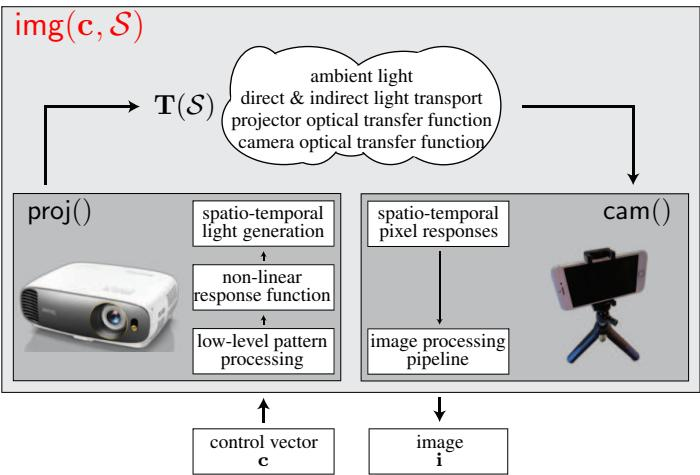
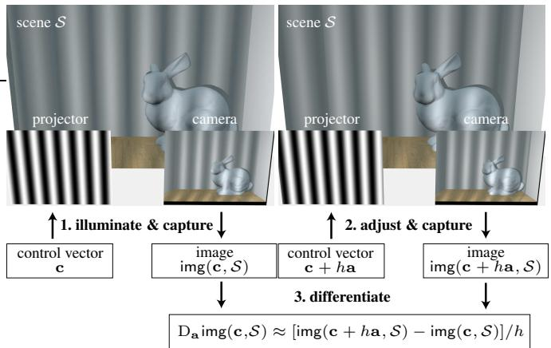
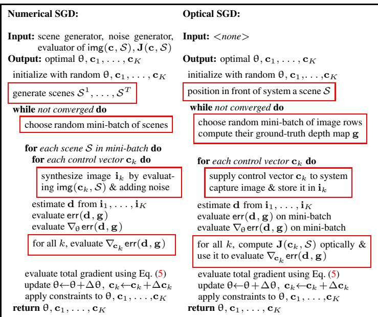
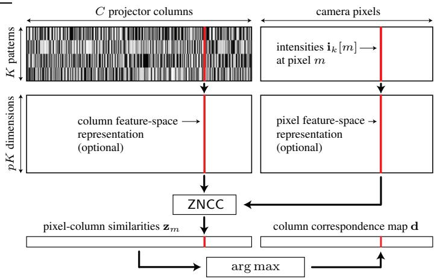

# Lab 2 讲义：结构光三维成像与 Optical SGD

**作者**: Course Staff | **日期**: 2026年05月 | **状态**: 定稿

## 概述

本次讲义是 Lab 2 的配套补充知识文档，涵盖结构光三维成像的理论基础以及 Optical SGD（Chen et al., CVPR 2020）论文的核心思想。Lab 1 讲义已详细介绍了相机模型与 SfM 流程，本讲义不再重复这些内容，而是聚焦于**结构光主动三维成像**这一全新领域：从投影仪-相机系统的基本几何关系，到可微分成像系统的数学框架，再到图案优化与解码的完整方法论。本讲义旨在提供独立于作业实现的知识体系，帮助理解实验背后的基本原理。

---

## 1 从被动到主动：结构光三维成像

### 1.1 为什么需要结构光

Lab 1 讨论的 SfM 属于**被动三维成像**——仅依靠场景的自然光照和纹理信息来推断三维结构。被动方法的优势在于设备简单、适用范围广，但其核心局限在于对场景纹理的依赖：当场景缺乏足够的特征点（如白墙、光滑表面）时，SfM 将难以建立可靠的匹配关系。

**结构光三维成像（structured light 3D imaging）** 通过引入可控的主动光源来克服这一局限。其基本思想是：用投影仪向场景投射已知的编码图案，相机拍摄被场景形状调制后的图案图像，然后通过分析图案的变形来推断深度信息。主动投影相当于在场景表面"印制"了已知的特征，使得无纹理区域的匹配成为可能。

### 1.2 三角测量的基本原理

结构光三维成像的几何基础仍然是**三角测量（triangulation）**，但与传统双目立体视觉有所不同。在结构光系统中，投影仪扮演了"第二只眼睛"的角色——只不过它不"看"场景，而是向场景投射已知图案。相机和投影仪之间的相对位置与朝向构成了一个已知的基线。

具体而言，考虑投影仪上的一个像素列坐标 $n$。该列投影到场景表面后，被相机拍摄到的像素 $m$ 观察到。相机像素 $m$ 和投影仪列 $n$ 之间的对应关系一旦确定，就可以通过三角测量计算该点的三维坐标。这个对应关系通常称为**视差（disparity）**，定义为相机像素列坐标与对应投影仪列坐标之差。

**对应关系估计（correspondence estimation）** 是结构光系统的核心问题：给定相机像素 $m$ 观测到的一组强度值，如何确定它在投影仪平面上的匹配列 $n$？这正是编码和解码环节要解决的问题。

### 1.3 结构化编码的核心思想

结构光系统的图案编码策略可以按时间维度分为两大类：

- **时间复用编码（time-multiplexed coding）**：依次投影多幅图案（通常 $K$ 幅），每幅图案编码部分信息，综合 $K$ 幅观测来恢复每个像素的对应关系。投影图案的数量 $K$ 越多，能编码的投影仪列数就越多，精度也越高，但代价是采集时间更长，不适合动态场景。
- **空间邻域编码（spatial neighborhood coding）**：仅投影一幅或少数几幅图案，依赖像素邻域的图案结构来编码位置信息。速度更快，但对场景表面的连续性有一定假设，且容易受到表面纹理和噪声的干扰。

时间复用编码在精度上通常优于空间编码，也是本讲义重点讨论的范畴。一个经典的时间复用策略是移相法（phase shifting），通过投影多幅正弦条纹图案来恢复每个像素的相位，进而建立投影仪-相机对应关系。具体来说，假设投影 $K$ 幅频率为 $\omega$ 的正弦条纹图案，图案强度满足 $I_k(n) = A + B \cos(2\pi \omega n + \phi_k)$，其中 $\phi_k = 2\pi k / K$ 为第 $k$ 幅图案的相移量。相机像素 $m$ 观测到的 $K$ 个强度值形成一个 $K$ 维信号，其相位可以通过反正切运算恢复，该相位直接编码了投影仪列坐标 $n$。

Optical SGD 所采用的方法则更为灵活：它不依赖固定的解析形式（如正弦波），而是将图案作为可优化的连续值变量，通过闭环优化自动发现最优的编码方案。

---

## 2 投影仪-相机系统模型

### 2.1 投影仪作为"逆相机"

从数学建模的角度，投影仪可以看作一台**逆相机（inverse camera）**：相机将三维场景映射到二维图像，而投影仪将二维图案投射到三维场景表面。两者遵循相同的几何模型——针孔模型。

但与标准相机不同的是，投影仪的作用是**照明**而非**成像**。投影仪输出的是已知的图案，经过场景表面的反射和调制，被相机采集。因此，投影仪-相机系统的成像过程可以分解为三个环节：

**第一环节**：投影仪将数字控制信号 $c$（分辨率 $N$ 的向量）转换为出射辐亮度。投影仪的响应通常是非线性的，即投影仪的非线性响应曲线——**gamma 校正**——将输入的数字信号映射为实际的光学输出。此外，投影仪内部可能还有对比度增强、颜色处理等前端处理步骤。这些非线性效应统一抽象为投影函数 $\text{proj}(c)$：

$$
\mathbf{p} = \text{proj}(\mathbf{c})
$$

其中 $\mathbf{p}$ 为投影仪像素的出射辐亮度向量，$\mathbf{c}$ 为输入的数字控制向量。

**第二环节**：投影出的光线经场景表面反射后传输到相机传感器。这一传输过程由**光传输矩阵（transport matrix）** $\mathbf{T}(\mathcal{S})$ 描述：

$$
\mathbf{e} = \mathbf{T}(\mathcal{S}) \mathbf{p} + \mathbf{a}
$$

其中 $\mathbf{e}$ 为入射到相机传感器的辐照度向量，$\mathbf{a}$ 为环境光分量。光传输矩阵 $\mathbf{T}(\mathcal{S})$ 不仅依赖于场景 $\mathcal{S}$ 的几何形状和表面材质，还包含了投影仪和相机的光学特性（景深、像差、衍射效应等）。

**第三环节**：相机将传感器接收到的辐照度转换为最终输出的图像。这一过程同样包含非线性效应——相机的响应曲线、去马赛克（demosaicing）、**自动增益控制**以及**色调映射**等内部图像处理管线。这些非线性效应抽象为相机函数 $\text{cam}(\cdot)$：

$$
\mathbf{i} = \text{cam}(\mathbf{e}) + \text{noise}
$$

其中 $\mathbf{i}$ 为最终输出的图像，噪声 $\text{noise}$ 包含散粒噪声（shot noise）、读出噪声（readout noise）等成分。

### 2.2 完整的成像链路

将上述三个环节合并，投影仪-相机系统的完整成像模型为：

$$
\mathbf{i} = \text{cam}\big(\mathbf{T}(\mathcal{S}) \, \text{proj}(\mathbf{c}) + \mathbf{a}\big) + \text{noise}
$$

其中 $\mathbf{i}$ 为相机输出的图像（$M$ 维向量），$\mathbf{c}$ 为投影仪输入的图案（$N$ 维向量）。这一模型的关键特征是：投影函数 $\text{proj}(\cdot)$、相机函数 $\text{cam}(\cdot)$ 和光传输矩阵 $\mathbf{T}(\mathcal{S})$ 都是未知的——它们共同构成了一个"黑箱"成像系统。

### 2.3 图像雅可比矩阵

对于投影仪-相机系统，**图像雅可比矩阵（image Jacobian）** $\mathbf{J}(\mathbf{c}, \mathcal{S})$ 描述了相机输出对投影图案的微分关系：

$$
\mathbf{J}(\mathbf{c}, \mathcal{S}) = \frac{\partial \text{cam}}{\partial \text{irr}} \; \mathbf{T}(\mathcal{S}) \; \frac{\partial \text{proj}}{\partial \mathbf{c}}
$$

这是一个 $M \times N$ 的矩阵，其第 $(m, n)$ 个元素告诉：如果投影仪像素 $n$ 的强度发生微小变化，相机像素 $m$ 的强度会如何改变。该矩阵包含了投影仪非线性、光传输物理和相机非线性的全部分布式信息。

图像雅可比矩阵在结构光优化中起着核心作用。如下图的示意所示：

该图展示了三个模块的串联关系：投影仪非线性、光传输矩阵和相机非线性。当没有间接光照（如次表面散射、全局照明）时，$\mathbf{T}(\mathcal{S})$ 是一个稀疏的对角占优矩阵——投影仪像素 $n$ 的光线只影响场景表面上与其对应的一个狭小区域。

---

## 3 可微分成像系统

### 3.1 定义与外延

**可微分成像系统（differentiable imaging system）** 是 Optical SGD 论文提出的核心概念，它将成像系统抽象为**控制向量（control vector）** 到输出图像的连续可微映射。具体而言，如果一个成像系统满足以下两个条件，则称其为可微分的：

1. 系统的光源、传感器或光学元件的状态完全由一个 $N$ 维连续控制向量 $\mathbf{c}$ 决定。
2. 对于任意静止场景 $\mathcal{S}$，输出图像关于控制向量的方向导数处处存在：

$$
\mathrm{D}_{\mathbf{a}} \, \text{img}(\mathbf{c}, \mathcal{S}) = \lim_{h \to 0} \frac{\text{img}(\mathbf{c} + h\mathbf{a}, \mathcal{S}) - \text{img}(\mathbf{c}, \mathcal{S})}{h}
$$

这一条件本质上要求成像系统的响应是连续的、可微的——微调投影图案将导致相机图像发生微小、可预测的变化。

下图直观地展示了可微分成像系统的概念：

从图中可以看出，投影仪-相机系统是可微分成像系统的典型例子：投影图案作为控制向量 $\mathbf{c}$，通过成像系统的光路得到相机图像，两者之间由图像雅可比矩阵 $\mathbf{J}(\mathbf{c}, \mathcal{S})$ 连接。

### 3.2 可微分成像系统的意义

可微分成像系统的价值在于，它允许像素在**光学域（optical domain）** 中计算梯度，而不需要知道系统的精确数学模型。具体来说，图像雅可比矩阵 $\mathbf{J}(\mathbf{c}, \mathcal{S})$ 的第 $n$ 列可以通过一个简单的**光学子程序**来估计：

- 设置控制向量为 $\mathbf{c}$，采集图像 $\mathbf{i}$
- 将控制向量调整为 $\mathbf{c} + h\mathbf{e}_n$（其中 $\mathbf{e}_n$ 为第 $n$ 维的单位向量），采集新图像 $\mathbf{i}'$
- 计算 $(\mathbf{i}' - \mathbf{i}) / h$ 作为第 $n$ 列的近似

这一过程的核心优势在于：**不依赖任何系统模型**。相机内部管线、投影仪非线性、光学像差——所有这些复杂因素都自动包含在采集的图像差异之中。这正是 Optical SGD 论文的核心洞察：将"困难的数值计算"转化为"简单的光学测量"。

### 3.3 适用于此框架的设备

可微分成像系统是一个相当广泛的框架。除了投影仪-相机系统外，以下设备也适用于此框架：

- **DLP/DMD 投影仪**（digital micromirror device projector）：通过数百万个微镜的开关来控制像素亮度
- **激光投影仪**（scanning laser projector）：通过调制激光功率来控制扫描点的亮度
- **编码曝光相机**（coded-exposure camera）：通过在曝光时间内控制传感器的时域响应来成像
- **关联飞行时间系统**（correlation ToF）：通过调制激光发射和像素解调信号来测量深度

不同类型的设备可以组合成多种可微分成像系统。投影仪-相机系统只是其中一种，但也是最直观、最易理解的一种。

---

## 4 Optical SGD 优化框架

### 4.1 问题形式化

Optical SGD 要解决的是一个通用的系统优化问题：给定一个可微分成像系统，如何找到最优的投影图案和控制参数，使得深度估计误差最小？

数学上，这一问题可以形式化为：对于一台可微分成像系统，该系统在第 $k$ 次投影时使用控制向量 $\mathbf{c}_k$，采集得到图像 $\mathbf{i}_k$。一个**解码器（decoder）** 从 $K$ 幅图像中估计深度图 $\mathbf{d}$：

$$
\mathbf{d} = \text{rec}(\mathbf{i}_1, \mathbf{c}_1, \ldots, \mathbf{i}_K, \mathbf{c}_K, \theta)
$$

其中 $\theta$ 为解码器的可学习参数。给定**惩罚函数（penalty function）** $\rho(\cdot)$ 来衡量估计深度 $\mathbf{d}$ 与真值深度 $\mathbf{g}$ 之间的偏差，系统优化的目标为：

$$
\hat{\mathbf{c}}_1, \ldots, \hat{\mathbf{c}}_K, \hat{\theta} = \arg\min \mathbb{E}_{\text{scenes, noise}}\left[\sum_{m=1}^{M} \rho\big(\mathbf{d}[m] - \mathbf{g}[m]\big)\right]
$$

这一目标函数的核心在于：**期望是对所有可能的场景和噪声情况取平均**，因此优化的结果是对于未见场景也具有泛化能力的编码方案。

### 4.2 损失函数的近似与梯度计算

为了实现上述优化，需要能够计算损失函数关于图案 $\mathbf{c}_k$ 的梯度。回忆式(3)中的系统优化目标，将其中的期望近似为 $T$ 个训练样本的平均：

$$
\mathbb{E}[\cdot] \approx \frac{1}{T} \sum_{t=1}^{T} \| \text{err}(\mathbf{d}^t, \mathbf{g}^t) \|_1
$$

其中 $\text{err}(\mathbf{d}^t, \mathbf{g}^t)[m] = \rho(\mathbf{d}^t[m] - \mathbf{g}^t[m])$。

损失对第 $k$ 幅图案 $\mathbf{c}_k$ 的梯度可以分解为以下链式法则：

$$
\nabla_{\mathbf{c}_k} \text{err} = \frac{\partial \text{err}}{\partial \text{rec}} \frac{\partial \text{rec}}{\partial \mathbf{c}_k} + \frac{\partial \text{err}}{\partial \text{rec}} \frac{\partial \text{rec}}{\partial \mathbf{i}_k} \frac{\partial \mathbf{i}_k}{\partial \mathbf{c}_k}
$$

上式中 $\partial \mathbf{i}_k / \partial \mathbf{c}_k$ 正是图像雅可比矩阵 $\mathbf{J}(\mathbf{c}_k, \mathcal{S}^t)$——它是整个梯度中唯一依赖于精确系统模型和场景模型的一项。其他项（$\partial \text{err} / \partial \text{rec}$、$\partial \text{rec} / \partial \mathbf{c}_k$ 和 $\partial \text{rec} / \partial \mathbf{i}_k$）都是解码器相关的，可以通过解析求导或自动微分计算。

### 4.3 数值 SGD 与光学 SGD 的区别

理解数值 SGD 和光学 SGD 的区别是理解 Optical SGD 论文的关键。

**数值 SGD（numerical SGD）** 依赖于一个完整的、精确的前向模型来合成训练场景和模拟图像。它需要：(a) 成像系统的精确数学模型——包括光学传递函数、传感器噪声模型、非线性响应等；(b) 大量合成的三维场景和材质；(c) 光传输的仿真计算（通常需要光线追踪）。梯度完全通过该模型的计算图反向传播获得。数值 SGD 的优势在于可以大规模生成训练数据、灵活调整参数，但其精度受制于模型的保真度。

**光学 SGD（optical SGD）** 则将梯度计算的关键部分——图像雅可比矩阵——转移到光学域中执行。其基本流程如下：

- 准备一块具有随机纹理的训练板（training board），其深度真值 $\mathbf{g}$ 已知
- 使用当前的投影图案 $\mathbf{c}_1, \ldots, \mathbf{c}_K$ 投影到训练板上并采集图像
- 通过光学子程序计算图像雅可比矩阵的列
- 利用解码器计算估计深度 $\mathbf{d}$，并计算误差 $\text{err}(\mathbf{d}, \mathbf{g})$
- 将解析可计算的梯度项与光学估计的图像雅可比拼接，获得完整的梯度
- 用 RMSprop 等优化器更新图案 $\mathbf{c}_k$ 和解码器参数 $\theta$

下图对比了数值 SGD 和光学 SGD 的流程差异：

红色框标出了两者的核心差异：光学 SGD 用图像采集操作替代了数值 SGD 中的系统建模和场景渲染步骤。

### 4.4 有效实现的关键技术

直接实现上述光学 SGD 面临三个实际挑战。

**挑战一：闭环形式的损失梯度计算**

损失函数 $\| \text{err}(\mathbf{d}, \mathbf{g}) \|_1$ 对 $\mathbf{c}_k$ 的梯度需要可微形式的近似。Optical SGD 使用 softmax 加权的方案——将每个相机像素 $m$ 的误差在所有可能的投影仪列 $n$ 上进行 softmax 加权平均：

$$
\| \text{err}(\mathbf{d}, \mathbf{g}) \|_1 \approx \sum_{m=1}^{M} \text{softmax}(\tau \mathbf{z}_m) \cdot \text{err}(\text{index} - \mathbf{g}[m], \mathbf{0})
$$

其中 $\mathbf{z}_m$ 是像素 $m$ 与所有投影仪列的 ZNCC 相似度向量，$\tau$ 是 softmax 温度参数。温度 $\tau$ 控制着 softmax 的"锐利程度"——高温使分布平滑（梯度更稳定），低温使分布尖锐（更接近 argmax）。论文中取 $\tau = 200$ 作为经验值。

**挑战二：场景多样性**

理论上，优化需要覆盖大量不同的场景和深度变化。但物理世界中反复采集大量不同场景是不现实的。Optical SGD 通过两种技巧来解决这个问题：

- 将**不同行**视为**不同场景**：训练板上的随机纹理确保每行像素具有不同的反照率组合。由于每个像素的对应关系估计是独立的，不同行可以视为独立的训练样本。
- **循环移位**模拟**不同深度**：对投影图案施加随机循环移位（circular shift），可以模拟场景在深度方向上的移动。这是因为图案的水平移位等价于改变了投影仪-场景的几何对应关系。

**挑战三：图像雅可比矩阵的高效获取**

图像雅可比矩阵是一个 $M \times N$ 的大矩阵，逐列采集在时间上不可行。Optical SGD 利用了矩阵的稀疏性——对于没有间接光照的场景，每个相机像素只对应投影仪的一小部分像素。因此，可以同时扰动多个投影仪像素（间隔不小于模糊半径 $B$），在一次采集中获得多列的叠加结果。

---

## 5 结构光解码器

### 5.1 ZNCC 解码器

在时间复用编码的结构光系统中，**解码器（decoder）** 负责从 $K$ 幅观测图像中为每个相机像素找到对应的投影仪列坐标。解码器的核心任务是：给定相机像素 $m$ 观测到的 $K$ 维强度向量 $\mathbf{i}_1[m], \ldots, \mathbf{i}_K[m]$，在投影仪的所有列中寻找最优匹配。

**零均值归一化互相关（Zero-mean Normalized Cross-Correlation, ZNCC）** 是一种在强度变化和偏移下具有鲁棒性的匹配度量。对于相机像素 $m$，其与投影仪第 $n$ 列的相似度定义为：

$$
\mathbf{z}_m[n] = \text{ZNCC}\big([\mathbf{i}_1[m], \ldots, \mathbf{i}_K[m]], [\mathbf{c}_1[n], \ldots, \mathbf{c}_K[n]]\big)
$$

ZNCC 的计算过程是：先将两个向量分别减去各自的均值，再计算归一化的相关性。这使得 ZNCC 对整体亮度的均匀偏移和线性缩放具有不变性——这正是它在实际系统中表现稳健的原因，因为真实系统的投影亮度和相机增益往往是不精确的。

最终，像素 $m$ 的对应列取相似度最大的投影仪列：

$$
\mathbf{d}[m] = \arg\max_{1 \leq n \leq N} \mathbf{z}_m[n]
$$

下图展示了这一解码过程：

从图中可以看出，相机像素观测到的 $K$ 维强度向量与投影仪各列的 $K$ 维编码向量逐一比较，选取最相似的列作为对应。

### 5.2 邻域解码

标准的 ZNCC 解码器在每个像素上独立决策——它只使用单个像素的 $K$ 维强度向量。但真实场景中，相邻像素的观测值并非独立：由于投影仪的物理模糊（defocus）、相机的光学模糊、以及场景表面的连续性，邻域像素之间存在相关性。

**邻域解码（neighborhood decoding）** 扩展了特征向量的范围：将相机像素 $m$ 及其左右各 $p$ 个邻居的强度值拼接成一个更长的特征向量，然后计算与投影仪对应邻域的 ZNCC 相似度。数学上，邻域解码的相似度定义为：

$$
\mathbf{z}_m[n] = \text{ZNCC}(\mathbf{f}_m, \hat{\mathbf{f}}_n)
$$

其中 $\mathbf{f}_m$ 是相机侧的特征向量（包含 $K \times (2p+1)$ 个元素），$\hat{\mathbf{f}}_n$ 是对应的投影仪侧特征向量。

邻域解码的优势在于，它自动利用了邻域像素间的强度模式作为额外的匹配线索。对于光学模糊造成的模式混合，邻域信息恰好提供了反卷积式的线索。论文的实验结果证实，一个简单的 $5\times 1$ 邻域（$p=2$）可以将无误差像素的比例从 33% 提升到 62%——几乎翻倍。这一提升表明，解码器的设计在结构光系统中扮演着与编码同等重要的角色，而以往的研究往往忽视了这一点。

### 5.3 ZNCC-NN 解码器

基于邻域解码的成功，Optical SGD 进一步引入了**可学习组件**来更好地利用邻域相关性。

第一个可学习组件是**投影仪响应曲线模型**。在实际系统中，投影仪的数字信号到光学输出的映射是非线性的，这种非线性因设备而异。Optical SGD 使用一个分段线性函数 $g(\cdot)$（32 个线段）来建模这一响应曲线，其参数 $\theta_g$ 通过光学 SGD 与投影图案一同优化。

第二个可学习组件是两个**残差网络模块（ResNet block）**。一个模块 $\mathcal{F}(\cdot)$ 处理相机侧的特征向量，另一个模块 $\hat{\mathcal{F}}(\cdot)$ 处理投影仪侧的特征向量。每个模块包含两个全连接层，维度均为 $(pK) \times (pK)$，中间以 ReLU 激活函数连接。

组合后的 **ZNCC-NN 解码器** 的相似度计算为：

$$
\mathbf{z}_m[n] = \text{ZNCC}\big(\mathbf{f}_m + \mathcal{F}(\mathbf{f}_m), \; g(\hat{\mathbf{f}}_n) + \hat{\mathcal{F}}(g(\hat{\mathbf{f}}_n))\big)
$$

ResNet 模块的残差连接设计保证：如果可学习组件学不到有用信息，残差 $\mathcal{F}(\cdot)$ 自然趋于零，解码器退化为标准的 ZNCC。这种设计既保留了经典方法的稳健基底，又赋予了系统适应特定设备特性的能力。

---

## 6 梯度计算方式

### 6.1 有限差分法

**有限差分法（finite difference method）** 是最直接、最可靠的梯度的数值近似方法。对于投影图案优化问题，有限差分的基本操作是：对投影图案中的每个像素施加一个微小扰动 $h$，通过两次渲染得到的相机图像变化来估计梯度：

$$
\frac{\partial L}{\partial \mathbf{c}[n]} \approx \frac{L(\mathbf{c} + h\mathbf{e}_n) - L(\mathbf{c})}{h}
$$

其中 $L$ 为损失函数，$\mathbf{e}_n$ 是仅在 $n$ 位置为 1 的单位向量。每个扰动需要一次独立的渲染——产生相机观测——然后通过解码器计算损失。

有限差分的核心优势在于**实现简单且通用**：它不需要成像链路中任何部分的可微模型，只需能够执行"投影-采集-解码-评估"这一闭环。其代价是计算效率：对于 $N$ 像素的投影图案，每次梯度计算需要 $N+1$ 次渲染。此外，扰动步长 $h$ 的选择也至关重要——$h$ 过大导致截断误差（truncation error），$h$ 过小导致噪声主导（数值不稳定性）。

### 6.2 自动微分法

**自动微分（automatic differentiation, autograd）** 通过构建完整的计算图并应用链式法则来精确地计算梯度。在结构光优化的上下文中，自动微分要求渲染过程的每个步骤都是可微的——包括几何变换、光传输模拟和材质响应。

自动微分的优势是**计算效率和梯度精度**：一次前向传播加上一次反向传播即可获得对所有参数的梯度，且梯度是精确的（仅受浮点精度限制）。在场景复杂、参数数量庞大的情况下，自动微分的效率优势尤为显著。例如，渲染器中的光线-三角形求交、纹理采样、BRDF 计算等操作，在可微分渲染框架（如 Mitsuba 3、PyTorch3D）中都有对应的可微实现。

### 6.3 两者的对比分析

有限差分和自动微分代表了两种不同的设计哲学。

有限差分的**优点**在于：不需要渲染器可微，实现难度低；对渲染器的任何修改（加入新的材质模型、修改渲染方程等）都不影响梯度计算的可行性；更容易发现渲染中的错误——如果两次渲染之间只有图案变化，任何异常结果都可以归因于图案。

有限差分的**缺点**在于：计算量与参数数量成正比——$N$ 个像素的图案需要 $N$ 次扰动渲染；步长 $h$ 需要人工调节，过小则被噪声淹没，过大则近似误差增大；梯度是近似值，优化时可能收敛到不同解。

自动微分的**优点**在于：一次反向传播即可计算所有梯度，计算量与参数数量无关；梯度精度高，利于优化收敛；可以处理复杂的、高度耦合的参数空间。

自动微分的**缺点**在于：要求整个渲染链路可微，限制了渲染器的选择；可微渲染器的实现复杂度高，需要处理光线求交的不连续性（discontinuities）和可见性变化（visibility changes）；调试难度大——梯度错误往往难以追踪其来源。

在实际实验中，通常比较两种方法在收敛速度、最终精度、运行时间和稳定性上的差异。对于特定的优化问题，两种方法可能收敛到不同的局域最优解——有限差分的梯度噪声可能起到隐式正则化（implicit regularization）的作用，防止过拟合到训练板的具体特征。

---

## 7 材质与光照对结构光的影响

### 7.1 BRDF 基础

场景表面的**双向反射分布函数（Bidirectional Reflectance Distribution Function, BRDF）** 描述了入射光线在表面上的反射特性。BRDF $f(\omega_i, \omega_r)$ 定义为出射方向 $\omega_r$ 上的辐亮度与入射方向 $\omega_i$ 上的辐照度之比。

在实际结构光系统中，表面的 BRDF 决定了相机观测到的图案变形质量。不同材质对结构光的响应差异很大，理解这些差异对于解释不同材质的重建结果至关重要。

### 7.2 常见材质及其影响

**漫反射表面（Lambertian surface）**：出射辐亮度在所有方向上相等，与视角无关。这是结构光系统最"友好"的表面类型——无论相机从哪个角度拍摄，观测到的图案亮度与投影图案之间保持简单的关系。大多数基准实验和理论分析都建立在漫反射假设之上。

**镜面反射表面（specular surface）**：反射光集中在镜像方向附近。当相机恰好位于镜面反射方向时，观测到极强的信号；否则信号极弱甚至完全丢失。镜面反射对结构光系统构成了严重挑战——大面积的镜面区域往往导致匹配失败。这也是为什么结构光系统通常避免直接扫描镜面物体的原因。

**大理石材质（marble material）**：大理石是一种典型的**次表面散射（subsurface scattering）** 材质——入射光线进入表面后，在内部发生多次散射，从入射点附近的不同位置出射。这一效应在结构光中会导致图案模糊：投影仪投射的锐利边界在大理石表面上看起来是模糊的。次表面散射的抹平效应降低了高频图案的可解码性。

**木材材质（wood material）**：木材具有各向异性的纹理和深度方向上的纤维结构，其反射特性通常介于漫反射和镜面反射之间。木材表面的自然纹理可能与投影图案发生非常复杂的干涉，影响解码精度。

**磨砂玻璃（frosted glass）**：磨砂玻璃同时表现出透射和反射特性——部分光线在表面反射，部分光线透射到后方。对于结构光系统，透射部分的光线通常无法被相机捕获，而反射部分则可能较为微弱。磨砂玻璃表面还会引入额外的散射，进一步模糊图案。

### 7.3 间接光照与全局照明

除了表面材质的直接影响，**间接光照（indirect light transport）**——光线在场景中经过多次反射后才到达相机——也会影响结构光的解码。典型的间接光照效应包括：

- **相互反射（interreflection）**：光线从一个表面反射到另一个表面后再到达相机。在凹面几何中尤为明显。
- **体积散射（volumetric scattering）**：光线在半透明介质内部的散射，如烟雾、浑浊液体等。

间接光照破坏了投影仪像素与相机像素之间的简单对应关系——相机像素 $m$ 观测到的强度可能来源于多个投影仪像素的贡献叠加。这使解码器基于"一对一"匹配的假设失效。

对于间接光照环境，Optical SGD 论文展示了两个重要发现。第一，使用与实际使用场景具有相似材质的光学特性的训练场景进行优化，可以获得更好的效果。第二，通过调整优化参数（如增大 softmax 温度 $\tau$ 到 1000），可以使系统适应更为复杂的光传输场景。

---

## 8 论文核心贡献回顾与延伸

### 8.1 Optical SGD 论文的核心贡献

Chen 等人（2020）提出的 Optical SGD 方法在结构光编码优化领域做出了几项有意义的贡献。

第一，提出了**光学域随机梯度下降（Optical SGD）**的框架，将梯度计算中依赖模型的部分转移到实际成像系统中，实现了无需系统标定的自动图案优化。这一方法的核心洞察——用光学测量代替数值计算——对计算成像领域具有更广泛的启发意义。

第二，引入了**即插即用的惩罚函数（plug-and-play penalty function）**，允许根据不同的应用场景选择不同的误差度量来驱动优化。论文实验表明，切换惩罚函数会得到具有完全不同空间结构和频率特征的图案。例如，零容忍度（0-tolerance）惩罚函数——只奖励完美匹配——倾向于产生锐利的高频图案，而 $L_1$ 容忍度则倾向于产生更平滑的图案。

第三，提出了**邻域解码和高斯随机邻域解码器（ZNCC-NN）**，将简单的 ZNCC 匹配扩展为可学习的解码器。邻域解码这一看似简单的扩展将系统精度几乎翻倍，而 ZNCC-NN 进一步发挥了联合优化的潜力。

### 8.2 与 Lab 1 的联系

Lab 1 的 SfM 和 Lab 2 的结构光表面上属于不同的三维重建技术，但在深层方法上是相通的。两者都依赖于**特征匹配**——SfM 依赖场景天然纹理，结构光则主动"注入"已知纹理。两者的核心数学工具都是**三角测量**——SfM 中从多视角影像中恢复深度，结构光中从投影仪-相机对应关系中恢复深度。

两者的重要区别在于**优化目标不同**。SfM 的优化以**重建精度**为目标——最小化重投影误差；结构光的优化以**编码有效性**为目标——使投影图案的编码方式对于解码器最容易区分。SfM 的输入是固定的自然图像，优化的自由度在于**如何选择位姿和三角化点**；结构光的输入是可控的，优化的自由度在于**如何设计投影图案**。

### 8.3 思考与延伸

Optical SGD 代表了一个更广泛的方法论转变：**从模型驱动走向数据驱动**。传统上，结构光编码方案（如 Gray 码、移相法、MPS 编码）都是基于解析推导设计的。它们有可靠的数学基础，但灵活性有限——一旦设备特性偏离理想模型（如非线性、畸变、噪声），理论最优性就不再成立。Optical SGD 将优化权交给实际系统，让系统"自我发现"最适合其特性的编码方案。

这一思路与深度学习中的"端到端学习"一脉相承，但又有其独特的优势：不需要大规模训练数据，不需要精确的系统模型，只需一个可操作的成像系统和一块已知几何的训练板。这使得它在实际部署中具有独特的吸引力。

如果从更大的视角来看，Optical SGD 可以视为**可微分物理系统（differentiable physical systems）** 的一个实例。任何物理过程，只要其输入可控、输出可测、且响应连续，都可以套用类似的"物理域梯度估计"思路进行优化——这包括自适应光学、光束整形、显微成像等多个领域。

---

## 参考资料

- Chen, W., Mirdehghan, P., Fidler, S., and Kutulakos, K. N. "Auto-Tuning Structured Light by Optical Stochastic Gradient Descent." *CVPR*, 2020.
- Mirdehghan, P., Chen, W., and Kutulakos, K. N. "Optimal Structured Light a La Carte." *CVPR*, 2018.
- Gupta, M. and Nakhate, N. "A Geometric Perspective on Structured Light Coding." *ECCV*, 2018.
- O'Toole, M., Achar, S., Narasimhan, S. G., and Kutulakos, K. N. "Homogeneous codes for energy-efficient illumination and imaging." *ACM TOG (SIGGRAPH)*, 2015.
- Salvi, J., Pages, J., and Batlle, J. "Pattern codification strategies in structured light systems." *Pattern Recognition*, 2004.
- Hartley, R. and Zisserman, A. *Multiple View Geometry in Computer Vision*. Cambridge University Press, 2004.
