# Auto-Tuning Structured Light by Optical Stochastic Gradient Descent

Wenzheng Chen1,2∗

Parsa Mirdehghan1∗

Sanja Fidler1,2,3

Kiriakos N. Kutulakos1

University of Toronto1

Vector Institute2

NVIDIA3

Toronto, Canada

{wenzheng,parsa,fidler,kyros}@cs.toronto.edu

# Abstract

We consider the problem of optimizing the performance of an active imaging system by automatically discovering the illuminations it should use, and the way to decode them. Our approach tackles two seemingly incompatible goals: (1) “tuning” the illuminations and decoding algorithm precisely to the devices at hand—to their optical transfer functions, non-linearities, spectral responses, image processing pipelines—and (2) doing so without modeling or calibrating the system; without modeling the scenes of interest; and without prior training data. The key idea is to formulate a stochastic gradient descent (SGD) optimization procedure that puts the actual system in the loop: projecting patterns, capturing images, and calculating the gradient of expected reconstruction error. We apply this idea to structured-light triangulation to “auto-tune” several devices—from smartphones and laser projectors to advanced computational cameras. Our experiments show that despite being modelfree and automatic, optical SGD can boost system 3D accuracy substantially over state-of-the-art coding schemes.

# 1. Introduction

Fast and accurate structured-light imaging on your desk—or in the palm of your hand—has been getting ever closer to reality over the last two decades [1–4]. Already, the high pixel counts of today’s smartphones and home-theater projectors theoretically allow 3D accuracies of 100 microns or less. Similar advances are occurring in the domain of time-offlight (ToF) imaging as well, with inexpensive continuouswave ToF sensors, programmable lasers, and spatial modulators becoming increasingly available [5–13]. Unfortunately, despite the wide availability of all these devices, achieving optimal performance with a given hardware system is still an open problem whose theoretical underpinnings have only recently attracted attention [14–20].

To address this challenge, we introduce optical SGD, a computational imaging technique that learns on the fly (1) a sequence of optimized illuminations for multi-shot depth acquisition with a given system, and (2) an optimized reconstruction function for depth map estimation.

Optical SGD achieves this by controlling in real-time the system it is optimizing, and capturing images with it. The only inputs to the optimization are the number of shots and a function to penalize depth error at a pixel.

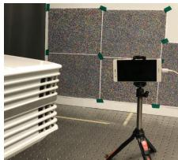

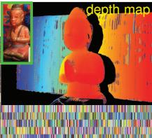

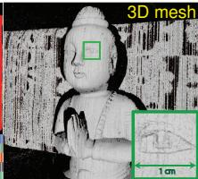

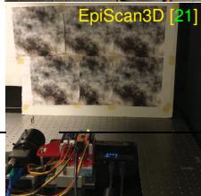

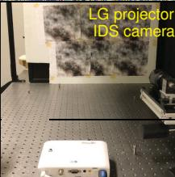

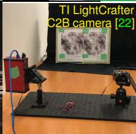  
0-tolerance tolerance   
1-tolerance

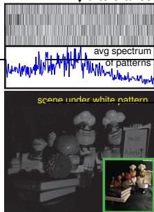  
0-tolerance

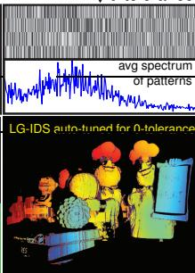

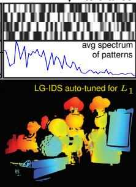

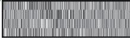  
pixels with no error avg error [15] [16] $9 \%$ 6.6 29% 196.2 ours 65% 3.7

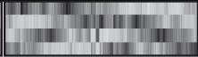  
Figure 1: Top: Optimal structured light with smartphones. We placed a randomly-colored board in front of an Optoma 4K projector and a Huawei P9 phone, let them auto-tune for five color-stripe patterns and the 1-tolerance penalty (Table 1), and used the resulting patterns (middle) to reconstruct a scene (inset). Middle: Auto-tuning systems for 4 patterns and various penalties. Note the patterns’ distinct spatial structure and frequency content, especially for Episcan3D which employs a scanning-laser projector. Bottom: Auto-tuning the same system for two different penalties yields markedly different patterns, and disparity maps with very different distribution of disparity errors (please zoom in). In both cases, we obtain significant gains over the state of the art [15, 16].

To prepare a system for optical SGD, we adjust its settings for the desired imaging conditions (e.g., exposure time, light source brightness, etc.) and place a randomly-textured “training board” in its field of view (Figure 1). The process runs automatically after that, minimizing a rigorouslyderived estimate of the expected reconstruction error for the system at hand. Optical SGD requires no radiometric or geometric calibration; no manual initialization; no prior training data; and most importantly, no precise image formation model for the system or the scenes of interest.

The key idea behind our approach is to push the hardest computations in this optimization—i.e., calculating derivatives that depend on an accurate model of the system—to the optical domain, where they are easy to do (Figure 2). Intuitively, optical SGD treats the imaging system as a perfect “end-to-end model” of itself—with realistic noise and optical imperfections all included.

Using this idea as a starting point, we develop an optimization procedure that runs partly in the numerical and partly in the optical domain. It begins with a random set of $K$ illuminations; uses them to illuminate the training board; captures real images to estimate the gradient of the expected reconstruction error; and updates its illuminations by stochastic gradient descent [23, 24]. Applying this procedure to a given system requires (1) a way to repeatedly acquire higher-accuracy (but still noisy) depth maps of the training board, and (2) programmable light sources that allow small adjustments to their illumination.

At a conceptual level, optical SGD is related to three lines of recent work. First, the end-to-end optimization of computational imaging systems is becoming increasingly popular [25–30]. These methods train deep neural networks and require precise models of the system or extensive training data, whereas our approach needs neither. Second, the principle of replacing “hard” numerical computations with “easy” optical ones goes back several decades to the field of optical computing [31–33]. It has been revived recently for calculations such as optical correlation [34], hyperspectral imaging [35] and light transport analysis [36] but we are not aware of any attempts to implement SGD in the optical domain, as we do. Third, optical SGD can also be thought of as training a small, shallow neural network with a problemspecific loss; noisy labels [37–39] and noisy gradients [40]; and with training and data-augmentation strategies [41, 42] that are implemented partly in the optical domain.

We believe our work represents the first attempt to reduce illumination coding—a hard problem with a rich history [18, 19, 43–55]—to an online procedure akin to selfcalibration [56, 57]. In addition to this basic contribution, we introduce two important new elements to the optimization of structured-light triangulation systems: plug-andplay penalty functions and neighborhood decoding. The former is a departure from prior work, which has so far conflated the definition of optimal illuminations with the way to find them (e.g., using $L _ { 1 }$ [15, 17] and $\epsilon$ -tolerance [16] penalties). Crucially, we show that just switching the penalty function—with everything else fixed—automatically produces structured-light patterns with completely different spatial structure, and far better performance for the chosen penalty (Figure 1, bottom). On the empirical side, we generalize the recently-proposed ZNCC decoder [16] to take into account a tiny neighborhood at each pixel ( $3 \times 1$ or $5 \times 1$ ). This seemingly straightforward extension more than doubles per-pixel disparity accuracy in our tests, highlighting the hitherto unnoticed role the decoder can play in per-pixel depth estimation.

  
Figure 2: Differentiable imaging systems allow us to “probe” their behavior by differentiating them in the optical domain, i.e., by repeatedly adjusting their control vector, taking images, and computing image differences. Projector-camera systems, as shown above, are one example of a differentiable system where projection patterns play the role of control vectors. Many other combinations of programmable sources and sensors have this property (Table 1).

We first develop our approach in the context of more general 3D imaging systems, and focus specifically on structuredlight triangulation in Section 4.

# 2. Differentiable Imaging Systems

Many devices available today allow us to control image formation in an extremely fine-grained—almost continuous— manner: off-the-shelf projectors can adjust a scene’s illumination at the resolution of individual gray levels of a single projector pixel; spatial light modulators can do likewise for phase [58] or polarization [59]; programmable laser drivers can smoothly control the temporal waveform of a laser at sub-microsecond scales [8]; and sensors with codedexposure [22, 60, 61] or correlation [9, 17, 62] capabilities can adjust their spatio-temporal responses at pixel- and microsecond scales.

Our focus is on the optimization of programmable imaging systems that rely on such devices for fine-grained control of illumination and sensing. In particular, we restrict our attention to systems that approximate the idealized notion of a differentiable imaging system. Intuitively, differentiable imaging systems have the property that a small adjustment to their settings will cause a small, predictable change to the image they output (Figure 2):

Definition 1 (Differentiable Imaging System) An imaging system is differentiable if the following two conditions hold:

• the behavior of its sources, sensors, and/or optics during the exposure time is governed by a single $N$ -dimensional vector, called a control vector, that takes continuous values;   
• for a stationary scene $s$ , the directional derivatives of the image with respect to the system’s control vector, i.e.,

$$
\mathrm {D} _ {\mathbf {a}} \operatorname {i m g} (\mathbf {c}, \mathcal {S}) \stackrel {\text {d e f}} {=} \lim  _ {h \rightarrow 0} \frac {\operatorname {i m g} (\mathbf {c} + h \mathbf {a} , \mathcal {S}) - \operatorname {i m g} (\mathbf {c} , \mathcal {S})}{h}, \tag {1}
$$

Table 1: Devices and penalty functions compatible with our framework. $^ \dagger$ indicates the choices we validate experimentally.   

<table><tr><td>Light source</td><td>Camera sensor</td><td>Decoder</td><td></td></tr><tr><td>†DMD projector [63]</td><td>†Grayscale</td><td>†max-ZNCC [16]</td><td></td></tr><tr><td>†Laser projector [21]</td><td>†RGB filter</td><td>†max-ZNCCp (Section 4)</td><td></td></tr><tr><td>LCoS projector [64]</td><td>†Coded-exposure [60]</td><td>†max-ZNCCp-NN (Section 4)</td><td></td></tr><tr><td>Projection array [65]</td><td>Correlation ToF [17]</td><td>deep neural net [66]</td><td></td></tr><tr><td>MHz laser [8]</td><td>ToF sensor array [5]</td><td></td><td></td></tr><tr><td>MHz laser + DMD [61]</td><td>Light field [67]</td><td></td><td></td></tr><tr><td>MHz laser array [68]</td><td></td><td></td><td></td></tr><tr><td>†ε-tolerance [16]</td><td>L2 [18]</td><td>†L1 [15]</td><td>M-estimator [69]</td></tr><tr><td>-ε 0 ε x</td><td>0 x</td><td>0 x</td><td>0 x</td></tr></table>

are well defined for any control vector c and unit-length adjustment a, where $\mathrm { i m } \mathbf { g } ( \mathbf { c } , S )$ is the noise-less image.

As we will see in Section 3, differentiable imaging systems open the possibility of optical SGD—iteratively adjusting their behavior in real time via optical-domain differentiation—to optimize performance on a given task.

The specific task we consider in this paper is depth imaging. More formally, we seek a solution to the following general optimization problem:

# Definition 2 (System Optimization for Depth Imaging) Given

• a differentiable imaging system that outputs a noisy intensity image $\mathbf { i } _ { k }$ in response to a control vector $\mathbf { c } _ { k }$ ;   
• a differentiable decoder that estimates a depth map d from a sequence of $K \geq 1$ images acquired with control vectors $\mathbf { c } _ { 1 } , \ldots , \mathbf { c } _ { K }$ :

$$
\mathbf {d} = \operatorname {r e c} \left(\mathbf {i} _ {1}, \mathbf {c} _ {1}, \dots , \mathbf {i} _ {K}, \mathbf {c} _ {K}, \theta\right) \tag {2}
$$

where θ is a vector of additional tunable parameters; and   
• a pixel-wise penalty function $\rho ( )$ that penalizes differences between the estimated depth map d and the ground-truth depth map g,

compute the settings that minimize expected reconstruction error:

$$
\hat {\mathbf {c}} _ {1}, \dots \hat {\mathbf {c}} _ {K}, \hat {\boldsymbol {\theta}} = \underset {\mathbf {c} _ {1}, \dots , \mathbf {c} _ {K}, \boldsymbol {\theta}} {\arg \min } \mathbb {E} _ {\text {s c e n e s , n o i s e}} \left[ \sum_ {m = 1} ^ {M} \rho (\mathbf {d} [ m ] - \mathbf {g} [ m ]) \right] (3)
$$

where the index $m$ ranges over image pixels and expectation is taken over noise and a space of plausible scenes.

Different combinations of light source, sensor, decoder and penalty function lead to different instances of the system optimization problem (Table 1). Correlation time-of-flight (ToF) systems, for example, capture $K \geq 3$ images of a scene, and vectors $\mathbf { c } _ { 1 } , \ldots , \mathbf { c } _ { K }$ control their associated laser modulation and pixel demodulation functions [8, 17]. In active triangulation systems that rely on $K$ images to compute depth, the control vectors are simply the projection patterns (Figure 2). In both cases, the decoder maps the $K$ observations at each pixel to a depth (or stereo disparity) value.

In the following we use a vector-valued function err $( \mathbf { d } , \mathbf { g } )$ to collect all pixel-wise penalties into a single vector:

$$
\operatorname {e r r} (\mathbf {d}, \mathbf {g}) [ m ] = \rho (\mathbf {d} [ m ] - \mathbf {g} [ m ]) . \tag {4}
$$

# 3. Optical SGD Framework

Suppose for a moment that we have a perfect forward model for the image formation process, i.e., we have a perfect model for (1) the system’s light sources, optics, and sensors, (2) the scenes to be imaged, and (3) the light transport between them.

In that case, the widespread success of optimization techniques such as Stochastic Gradient Descent (SGD) [23, 24, 70] suggest a way to minimize our system-optimization objective numerically: approximate it by a sum of reconstruction errors for a large set of fairly-drawn, synthetic training scenes, and for realistic noise; find a way to efficiently evaluate its gradient with respect to the unknowns $\boldsymbol { \Theta } , \mathbf { c } _ { 1 } , \dots , \mathbf { c } _ { K }$ ; and apply SGD to (locally) minimize it.

Model-driven optimization by numerical SGD Approximating the expectation in Eq. (3) with a sum we get:

$$
\mathbb {E} _ {\text {s c e n e s , n o i s e}} \left[ \sum_ {m = 1} ^ {M} \rho (\mathbf {d} [ m ] - \mathbf {g} [ m ]) \right] \approx \frac {1}{T} \sum_ {t = 1} ^ {T} \| \operatorname {e r r} \left(\mathbf {d} ^ {t}, \mathbf {g} ^ {t}\right) \| _ {1} \tag {5}
$$

where $\left. . \right. _ { 1 }$ denotes the $L _ { 1 }$ norm of a vector and $\mathbf { d } ^ { t } , \mathbf { g } ^ { t }$ are the reconstructed shape and ground-truth shape for the $t$ -th training sample, respectively. Each training sample consists of a scene $S ^ { t }$ and the noise present in the images $\mathbf { i } _ { 1 } , \ldots , \mathbf { i } _ { K }$ acquired for that scene. Figure 3 (left) outlines the basic steps of the resulting numerical SGD procedure.

Optical computation of the image Jacobian What if we do not have enough information about the imaging system and its noise properties to reproduce them exactly, or if the forward image formation model is too complex or expen-

  
Figure 3: Numerical vs. optical-domain implementation of SGD, with red boxes highlighting their differences.

sive to simulate? Fortunately, differentiable imaging systems allow us to overcome these limitations by implementing the difficult gradient calculations directly in the optical domain.

More specifically, SGD requires evaluation of the gradient with respect to $\dot { \Theta }$ and $\mathbf { c } _ { 1 } , \ldots , \mathbf { c } _ { K }$ of vector err $( \mathbf { d } ^ { t } , \mathbf { g } ^ { t } )$ :

$$
\nabla_ {\theta} \operatorname {e r r} = \frac {\partial \operatorname {e r r}}{\partial \operatorname {r e c}} \frac {\partial \operatorname {r e c}}{\partial \theta} \tag {6}
$$

$$
\begin{array}{l} \nabla_ {\mathbf {c} _ {k}} \operatorname {e r r} = \frac {\partial \operatorname {e r r}}{\partial \operatorname {r e c}} \frac {\partial \operatorname {r e c}}{\partial \mathbf {c} _ {k}} + \frac {\partial \operatorname {e r r}}{\partial \operatorname {r e c}} \frac {\partial \operatorname {r e c}}{\partial \mathbf {i} _ {k}} \frac {\partial \mathbf {i} _ {k}}{\partial \mathbf {c} _ {k}} \tag {7} \\ \approx \frac {\partial \operatorname {e r r}}{\partial \operatorname {r e c}} \frac {\partial \operatorname {r e c}}{\partial \mathbf {c} _ {k}} + \frac {\partial \operatorname {e r r}}{\partial \operatorname {r e c}} \frac {\partial \operatorname {r e c}}{\partial \mathbf {i} _ {k}} \underbrace {\left(\frac {\partial \operatorname {i m g}}{\partial \mathbf {c}}\right) _ {\substack {\mathbf {c} = \mathbf {c} _ {k} \\ S = S ^ {t}}} (8)} _ {\text {image Jacobian} J (\mathbf {c}, S) \text {for} \mathbf {c} _ {k} \text {and} S ^ {t}} \\ \end{array}
$$

with points of evaluation omitted for brevity. Eq. (8) is obtained by approximating $\mathbf { i } _ { k }$ with its noise-less counterpart. Of all the individual terms in Eqs. (6)-(8), only one depends on a precise model of the system and scene: the image Jacobian $\mathbf { J } ( \mathbf { c } , S )$ .

For a system that captures an $M$ -pixel image in response to an $N$ -element control vector, ${ \bf J } ( \mathbf { c } , S )$ is an $M \times N$ matrix. Intuitively, element $[ m , n ]$ of this matrix tells us how the intensity of image pixel $m$ will change if element $n$ of the control vector is adjusted by an infinitesimal amount. As such, it is related to the system’s directional image derivatives (Eq. (1)) by a matrix-vector product:

$$
\mathrm {D} _ {\mathbf {a}} \operatorname {i m g} (\mathbf {c}, S) = \mathbf {J} (\mathbf {c}, S) \mathbf {a}. \tag {9}
$$

It follows that if we have physical access to both a differential imaging system and a scene $s$ , we can compute individual columns of this matrix without having any computational model of the system or the scene. All we need is to implement a discrete version of Eq. (9) in the optical domain, as illustrated in Figure 2 with a projector-camera system. This leads to the following “optical subroutine:”

Optical-domain computation of $_ n$ -th column of $\mathbf { J } ( \mathbf { c } , { \mathcal { S } } )$

Input: control vector c, adjustment magnitude $h$   
Output: noisy estimate of the column   
step 0: position scene $s$ in front of system   
step 1: set control vector to c and capture noisy image i   
step 2: set control vector to $\mathbf { c } + h \mathbf { a }$ , where a is the unit vector along dimension $_ n$ , and capture new image $\mathbf { i } ^ { \prime }$   
step 3: return $( \mathbf { i } ^ { \prime } - \mathbf { i } ) / h$   
step 4: (optional) repeat steps 1 & 2 to get multiple samples of i and $\mathbf { i } ^ { \prime }$ & return the empirical distribution of $( \mathbf { i } ^ { \prime } - \mathbf { i } ) / h$

Optical SGD The above subroutine makes it possible to turn numerical SGD—which depends on system and scene models—into an optical algorithm that is model free. To do this, we replace with image-capture operations all steps in Figure 3 (left) that require modeling of systems and scenes.1

  
Figure 4: Decoder for $K$ -pattern triangulation.

Practical implementations of optical SGD face three challenges: (1) a closed-form expression must be derived for a scene’s expected reconstruction error (Eq. (5)) in order to evaluate its gradient, (2) imaging a large set of real-world training scenes is impractical, and (3) the image Jacobian is too large to acquire by brute force. Below we address these challenges by exploiting the structure of the systemoptimization problem specifically for triangulation-based systems. The resulting optical SGD procedure is shown in Figure 3 (right).

# 4. Auto-Tuning Structured Light

We now turn to the problem of optimizing projector-camera systems for structured-light triangulation (Figure 2). In this setting, $\mathbf { c } _ { 1 } , \ldots , \mathbf { c } _ { K }$ represent 1D patterns projected sequentially onto a scene and the reconstruction task is to compute, independently for every camera pixel, its stereo correspondence on the projector plane. This task is equivalent to computing the pixel-to-column correspondence map d, where $\mathbf { d } [ m ]$ is the projector column that contains the stereo correspondence of camera pixel $m$ (Figure 4). We thus optimize a projector-camera system by minimizing errors in d.2 Furthermore, we define the disparity of pixel $m$ to be the difference of $\mathbf { d } [ m ]$ and the pixel’s column on the image plane.

Image Jacobian of projector-camera systems We treat projectors and cameras as two non-linear “black-box” functions proj() and $\mathsf { c a m } ( )$ , respectively (Figure 5). These account for device non-linearities as well as internal low-level processing of patterns and images (e.g., non-linear contrast enhancement, color processing, demosaicing, etc.).

Between the two, light propagation is linear and can thus be modeled by a transport matrix $\mathbf { T } ( { \cal S } )$ . This matrix is unknown and generally depends on the scene’s shape and material properties, as well as the system’s optics [16, 46]. It

  
Figure 5: Image formation in general projector-camera systems. The projector function proj() maps a control vector of digital numbers to a vector of outgoing radiance values. Similarly, the camera function cam() maps a vector of sensor irradiance values to a vector holding the processed image.

follows that the image and its Jacobian are given by

$$
\mathbf {i} = \underbrace {\operatorname {c a m} (\mathbf {T} (S) \operatorname {p r o j} (\mathbf {c}) + \text {a m b i e n t})} _ {\operatorname {i m g} (\mathbf {c}, S)} + \text {n o i s e} \tag {10}
$$

$$
\mathbf {J} (\mathbf {c}, \mathcal {S}) = \underbrace {\frac {\partial \operatorname {c a m}}{\partial \operatorname {i r r}}} _ {\substack {\text {camera}\\ \text {non-linearities} \\ (M \times M)}} \underbrace {\mathbf {T} (\mathcal {S})} _ {\substack {\text {optics, 3D shape,} \\ \text {reflectance, etc.} \\ (M \times N)}} \underbrace {\frac {\partial \operatorname {p r o j}}{\partial \mathbf {c}}} _ {\substack {\text {projector}\\ \text {non-linearities} \\ (N \times N)}} \tag{11}
$$

where noise may include a signal-dependent component and irr denotes the vector of irradiances incident on the camera’s pixels. Thus, auto-tuning a system without indirect light forces it to account for its non-linearities and end-to-end optical transfer function.

Neighborhood decoding For perfectly linear systems and low signal-independent noise, a very simple correspondence-finding algorithm was recently shown to be optimal in a maximum-likelihood sense [16]: (1) treat the intensities $\mathbf { i } _ { 1 } [ m ] , \dots , \mathbf { i } _ { K } [ m ]$ observed at pixel $m$ as a $K$ -dimensional “feature vector,” (2) compare it to the vector of intensities at each projector column, and (3) choose the column that is most similar according to the zero-mean normalized cross-correlation (ZNCC) score3 (Figure 4):

$$
\mathbf {z} _ {m} [ n ] \stackrel {\text {d e f}} {=} \mathsf {Z N C C} \left(\left[ \mathbf {i} _ {1} [ m ], \dots , \mathbf {i} _ {K} [ m ] \right], \left[ \mathbf {c} _ {1} [ n ], \dots , \mathbf {c} _ {K} [ n ] \right]\right) \tag {12}
$$

$$
\mathbf {d} [ m ] = \arg \max  _ {1 \leq n \leq N} \mathbf {z} _ {m} [ n ]. \tag {13}
$$

Here we generalize this decoder in three ways. First, we expand feature vectors to include their $1 \times p$ neighborhood (on the same image row as pixel $m$ , in the case of images). We use small, 3- or 5-pixel neighborhoods in our experiments, making it possible to exploit intensity correlations that may

exist in them:

$$
\left(\mathbf {Z N C C} _ {p} \text {s i m i l a r i t y}\right) \quad \mathbf {z} _ {m} [ n ] = Z N C C \left(\mathbf {f} _ {m}, \hat {\mathbf {f}} _ {n}\right) \tag {14}
$$

where $\mathbf { f } _ { m } , \hat { \mathbf { f } } _ { n }$ are vectors collecting these intensities. Second, we model the projector’s response curve as an unknown monotonic, scalar function $\grave { g } ( \grave { \mathbf { \mu } }$ consisting of 32 linear segments [72]. This introduces a learnable component to the decoder, whose 32-dimensional parameter vector $\theta$ is optimized by optical SGD along with $\mathbf { c } _ { 1 } , \ldots , \mathbf { c } _ { K }$ Third, we add a second learnable component to better exploit neighborhood correlations, and to account for noise and system non-linearities that cannot be captured by the scalar response $g ( \ u )$ alone. This consists of two ResNet blocks [42, 73], for the camera and projector, respectively:

$$
(\mathbf {Z N C C - N N} _ {p} \text {s i m i l a r i t y})
$$

$$
\mathbf {z} _ {m} [ n ] = \mathsf {Z N C C} (\mathbf {f} _ {m} + \mathcal {F} (\mathbf {f} _ {m}), g (\hat {\mathbf {f}} _ {n}) + \hat {\mathcal {F}} (g (\hat {\mathbf {f}} _ {n}))) \tag {15}
$$

where $\mathcal { F } ( )$ and $\hat { \mathcal { F } } ( \ v u )$ are neural nets with two fully-connected layers of dimension $( p K ) \times ( p K )$ and a ReLU in between. Thus the total number of learnable parameters in the decoder—and thus in vector θ—is $4 p ^ { 2 } K ^ { 2 } + 3 2$ .4

Optimization with plug-and-play penalty functions Optimizing the expected reconstruction error of Eq. (5) requires a differentiable estimate of the total penalty, $\| \mathsf { e r r } (  { \mathbf { d } } ,  { \mathbf { g } } ) \| _ { 1 }$ , incurred on a given scene. A tight closedform approximation can be expressed in terms of the scene’s ground-truth correspondence map g, the ZNCC score vectors of all pixels, and the vector of pixel-wise penalties [74]:

$$
\left\| \operatorname {e r r} (\mathbf {d}, \mathbf {g}) \right\| _ {1} \approx \sum_ {m = 1} ^ {M} \operatorname {s o f t m a x} \left(\tau \mathbf {z} _ {m}\right) \cdot \operatorname {e r r} \left(\operatorname {i n d e x} - \mathbf {g} [ m ], \mathbf {0}\right) \tag {16}
$$

where · denotes dot product; $\tau$ is the softmax temperature; $\mathbf { z } _ { m }$ is given by Eqs. (12)-(15); 0 is the zero vector; and index is a vector whose $i$ -th element is equal to its index $i$ .

# 4.1. Efficient Optical-Domain Implementation

Different rows $\Leftrightarrow$ different training scenes Suppose we place an object in front of the system whose ground-truth correspondence map, g, is known. In principle, since the column correspondence of each camera pixel must be estimated independently of all others, each pixel can be thought of as a separate instance of the depth estimation task. To reduce correlations between these instances we use randomlytextured boards for training (Figure 1). This allows us to treat each camera row as a different “training scene” that consists of points with randomly-distributed albedos.

Circular pattern shifts $\Leftrightarrow$ different scene depths While the albedo of scene points in the system’s field of view may be random, their depth is clearly not: since our training boards are nearly planar and (mostly) stationary, the pixel-to-column correspondence map varies smoothly

across rows and is fixed in time. To break their temporal continuity we move the patterns instead of the scene: we apply the same randomly-chosen circular shift to all $K$ projection patterns prior to projection and image capture, and alter that shift every few iterations. This changes the pixelto-column correspondence map, and results in images that would have been obtained had the scene moved in depth.5 It also allows optimization of patterns that span all columns of a projector even when the training scene does not.

Acquisition of ground-truth correspondences Optical SGD hinges on being able to compute ground truth far more accurately than the procedure it is optimizing. Since our focus is on optimizing systems for minimal numbers of patterns, we use the same system for ground-truth estimation but with many more patterns. We first assess a system’s maximum attainable accuracy and precision by reconstructing a training board repeatedly with two independent coding schemes—160 phase-shifted patterns [43] and 30 patterns optimized for the 0-tolerance penalty [16]—and crossvalidating both across runs and across coding schemes. We use only the shorter of the two schemes for optical SGD, and re-apply it every 50 iterations to account for minor disturbances (e.g., slight motions of the board or the camera).

Efficient acquisition of image Jacobians Although the Jacobian is large, it is usually very sparse for scenes without indirect light transport (e.g., our training boards). This makes it possible to acquire several columns of the Jacobian at once from just one invocation of the optical-domain subroutine of Section 3. In particular, an adjustment vector with $N / B$ equally-spaced non-zero elements will yield the sum of $N / B$ columns of the Jacobian. If $B$ is large enough to avoid overlap between the non-zero elements of these columns, exact recovery is possible.

Numerical considerations We adopt RMSprop [24] and Tensorflow [75] for the numerical loop of Optical SGD. The learning rate is set to 0.001, and allowed to decay by $50 \%$ every 350 iterations. We use a softmax temperature of $\tau = 2 0 0$ , a step size of $B = 7$ for Jacobian acquisition, and initialize patterns with uniform noise in the range [0.45, 0.55]. Mini-batches are created by randomly choosing $15 \%$ of image rows in each SGD iteration. We estimate ground-truth correspondences and the image Jacobian every 50 and 15 iterations, respectively. To ensure a stable optimization, we band-limit the patterns’ frequency to $1 / 2$ Nyquist for the projector being used. Optimization typically converges in 1000 iterations and takes approximately one hour. The main bottleneck is image acquisition, which runs at $1 5 \mathrm { H z }$ for our unsynchronized HDMI-driven devices.

Figure 6 illustrates how the patterns (and decoder) evolve in a sample auto-tuning run—with marked improvements in reconstruction performance over time. Crucially, performance on a much darker scene with lots of depth discontinuities shows a similar trend, suggesting lack of over-fitting.

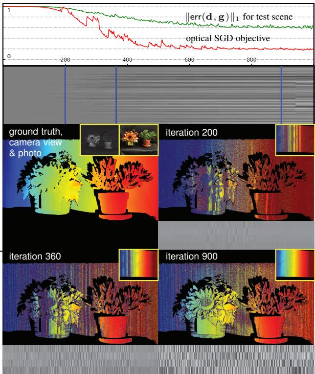  
Figure 6: Optical SGD in action for the LG-IDS pair and the training board in Figure 1. Top: The red graph shows the progress of the optimization objective (Eq. 5) across iterations when autotuning on the training board for four patterns, the zero-tolerance penalty, and the $\mathrm { Z N C C { \cdot } N N _ { 3 } }$ decoder. The green graph shows $\| \mathsf { e r r } (  { \mathbf { d } } ,  { \mathbf { g } } ) \| _ { 1 }$ as a function of iteration for the previously-unseen (and much more challenging) test scene below. Middle: Visualizing the evolution of pattern $\mathbf { c } _ { 1 }$ as a grayscale image whose $i$ -th column is the pattern at iteration $_ { i }$ . Bottom: Three snapshots of the optimization, each showing the patterns at iteration $_ { i }$ ; the disparity map of the training board (inset) reconstructed from those patterns; and the disparity map of the test scene reconstructed from the same patterns. See [74] for a video visualization.

# 5. Experimental Results

For all experiments below, pixel-to-column correspondence errors are measured in units of one projector column. Additional results and experimental details can be found in [74].

Auto-tuning computational imaging systems Since optical SGD is agnostic about the imaging system, it can optimize computational ones as well. Figure 7 shows one such example. The system takes four structured-light patterns as input; projects them rapidly onto a scene; captures one coded 2-bucket (C2B) frame of resolution $2 4 4 \times 1 6 0$ pixels; and processes it internally to produce four full-resolution images taken under the four projection patterns.

Simulations with Mitsuba CLT [76, 77] and Model-Net [78] To assess how well an auto-tuned system can perform on other scenes, we treated the Mitsuba CLT renderer as a black-box projector-camera system and autotuned it using a virtual training board similar to those in

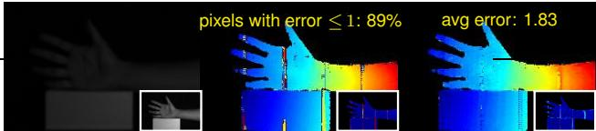  
Hamiltonian [15] & ZNCC5

ground truth

a la carte [16] & $\mathrm { Z N C C _ { 5 } }$

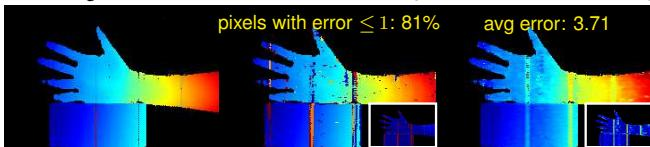  
Figure 7: Auto-tuning a one-shot 3D imaging system. We replaced the projection patterns and depth estimation algorithm of Wei et al. [22] with the patterns and $\mathrm { Z N C C - N N _ { 5 } }$ decoder computed automatically by optical SGD for the LightCrafter-C2B pair in Figure 1. Our disparity maps (top row) outperform the state-ofthe-art patterns for each penalty even when our $\mathrm { Z N C C _ { 5 } }$ decoder is used to boost their performance (bottom row). Auto-tuning is also less affected by the prototype’s many “bad pixels.” In each case, we also show correspondence errors as an inset (please zoom in).

Figure 1(middle). We then used the optimized patterns and optimized $\mathrm { Z N C C { \cdot } N N _ { 3 } }$ decoder to reconstruct a set of 30 randomly-selected models from the ModelNet dataset [78]. The results in Figure 8 show no evidence of over-fitting to the virtual training board, and mirror those of Figure 6.

Comparisons to the state of the art The tables in Figures 1 and 9 evaluate the performance of the LG-IDS pair for many combinations of encoding schemes and decoders, and two penalty functions. Three observations can be made about these results. First, despite being automatic and calibration free, optical SGD yields state-of-the-art performance for both 0-tolerance and $L _ { 1 }$ penalties. Second, adopting a neighborhood decoder has a big impact on a system’s overall performance, almost doubling it in some cases. This suggests that even further performance improvements may be possible with more sophisticated decoders. Third, while encoding schemes tailored for the $L _ { 1 }$ penalty may produce fairly smooth disparity maps, few of their correspondences are exact (e.g., well below $20 \%$ in the case of Hamiltonian coding for real scenes we tested). In contrast, auto-tuning for the 0-tolerance penalty yielded disparity maps with a substantial fraction of pixels reconstructed perfectly (e.g., well over $60 \%$ of the scenes in Figures 1 and 9). This raises interesting questions about how raw 3D data from tolerance-optimized systems could be processed downstream.

Operating range of an auto-tuned system We auto-tuned the LG-IDS pair for several configurations with the $L _ { 1 }$ penalty and $\mathrm { Z N C C - N N _ { 5 } }$ decoder, varying the pair’s baseline and the training board’s distance and orientation. Figure 10 shows results from one of these sessions in which the system is moved away from a test scene considerably, thereby reducing image signal-to-noise ratio (SNR). In that setting, auto-tuning separately for near- and far-field imaging leads to improved performance over the state of the art.

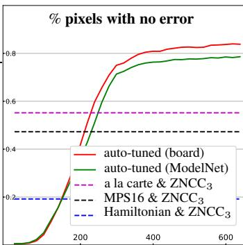

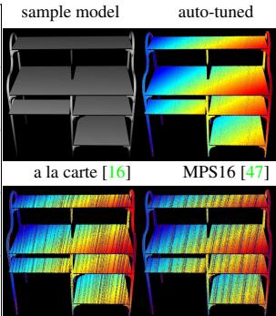  
Figure 8: Auto-tuning Mitsuba CLT for four patterns and the 0- tolerance penalty. Left: Performance of optimized patterns and ZNCC-NN3 decoder across iterations of optical SGD. We measure performance by reconstructing the virtual training board (red plot) as well as ModelNet objects (green plot, averaged over 30 models). Optical SGD performs considerably better on ModelNet than state-of-the-art patterns combined with our $\mathrm { Z N C C _ { 3 } }$ decoder (dashed lines). Right: Disparity maps for a sample model.

Auto-tuning for indirect light As a final experiment, we explore the possibility of auto-tuning a system in order to make it robust to indirect light. We used EpiScan3D [21] (operated as a conventional projector-camera system) to reconstruct a scene made of beeswax and other translucent materials, approximately ${ 8 0 } \mathrm { c m }$ away. As a baseline, we auto-tuned with the training board for the 2- tolerance penalty and $\mathrm { Z N C C { \cdot } N N _ { 5 } }$ decoder, and used it to reconstruct the scene. This produced a result considerably worse than the $\mathrm { M P S 1 6  – Z N C C _ { 5 } }$ decoder combination. (Figure 11). Auto-tuning with a beeswax training scene at a similar distance improved performance significantly $7 5 \%$ of pixels with error ${ \leq } 2$ ) but did not outperform MPS16. We then made three small changes to the auto-tuning procedure: (1) bringing the training scene closer (40cm); (2) using Hadamard multiplexing [55] for Jacobian acquisition during optical SGD; and (3) refining the auto-tuned patterns and decoder by running additional Optical SGD iterations with a higher softmax temperature $\tau = 1 0 0 0$ ). Upon convergence, this yielded patterns and a decoder that performed well above MPS16 on the test scene ${ 8 0 } \mathrm { c m }$ away.

# 6. Concluding Remarks

Our optical-domain implementation of SGD offers an alternative way to solve optimal coding problems in imaging, that emphasizes real-time control—and learning by imaging—over modeling. Although we have shown that very competitive coding schemes for structured light can emerge on the fly with this approach, the question of how a system can be tuned even further—for specific materials, for specific families of 3D shapes, for complex light transport, etc.—remains wide open.

Acknowledgements WC, PM and KK thank the support of NSERC under the RGPIN and SPG programs, and DARPA under the REVEAL program. SF was supported by a Canada CIFAR AI Chair award at the Vector Institute.

pixels with no correspondence error   

<table><tr><td></td><td>ZNCC</td><td>ZNCC5</td><td>ZNCC-NN5</td></tr><tr><td>MPS16 [47]</td><td>27%</td><td>52%</td><td>50%</td></tr><tr><td>Hamiltonian [15]</td><td>9%</td><td>15%</td><td>15%</td></tr><tr><td>a la carte [16]</td><td>33%</td><td>62%</td><td>62%</td></tr><tr><td>auto-tuned (0-tol.)</td><td>32%</td><td>67%</td><td>72%</td></tr></table>

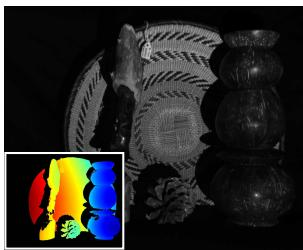

average correspondence error   

<table><tr><td></td><td>ZNCC</td><td>ZNCC5</td><td>ZNCC-NN5</td></tr><tr><td>MPS16 [47]</td><td>137.6</td><td>42.8</td><td>43.0</td></tr><tr><td>Hamiltonian [15]</td><td>6.5</td><td>4.6</td><td>4.7</td></tr><tr><td>a la carte [16]</td><td>173.7</td><td>39.8</td><td>41.3</td></tr><tr><td>auto-tuned (L1)</td><td>9.8</td><td>4.2</td><td>3.7</td></tr></table>

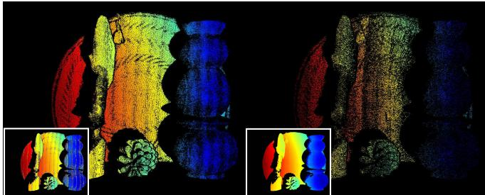  
MPS16 & ZNCC5   
Hamiltonian & ZNCC-NN5   
a la carte & ZNCC5   
auto-tuned (0-tolerance)

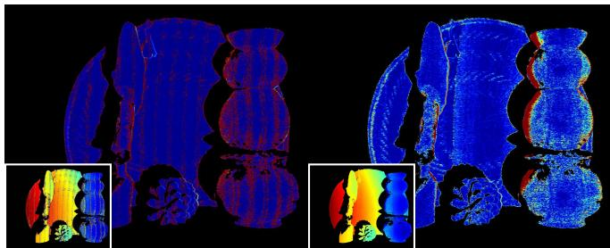  
MPS16 & ZNCC5   
Hamiltonian & ZNCC5   
a la carte & ZNCC5   
auto-tuned (L1)

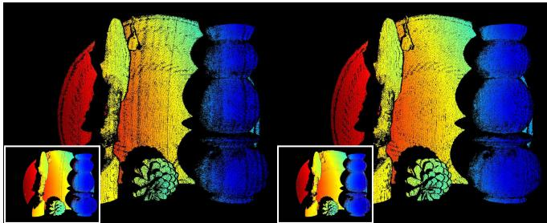

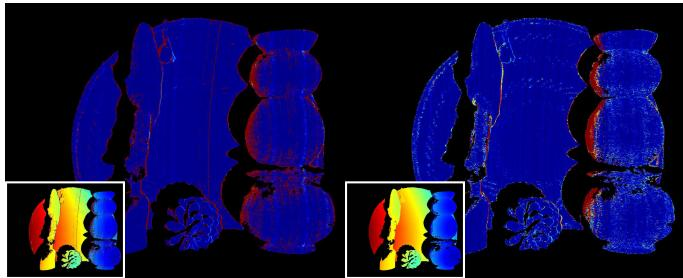  
Figure 9: Top row: Performance evaluations for an example scene whose ground-truth disparity map is shown as an inset. Framed numbers compare the current state of the art to auto-tuning with the $\mathrm { Z N C C - N N _ { 5 } }$ decoder. We used a base frequency of 16 for MPS since we found that it gives the best overall performance in our experiments. Note that while neighborhood decoding boosts the performance of previously-proposed encoding schemes, none of them matches that of optical SGD. Moreover, jointly optimizing the patterns and the decoder is more effective than optimizing only the decoder and using fixed patterns. Middle & bottom rows: Comparing the results from the auto-tuned LG-IDS pair to those obtained by pairing previously-proposed patterns with their best-performing decoder. The two leftmost columns show the disparity of all perfectly-reconstructed pixels (i.e., denser maps indicate higher accuracy). The complete disparity maps are shown as insets. Rightmost columns compare the error maps of each method (darkest blue for 0 error, darkest red for error $\geq 2 0$ ).

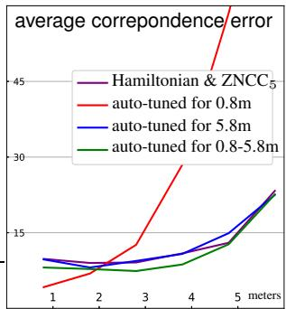

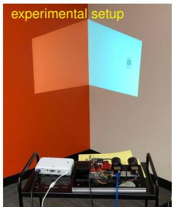

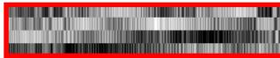

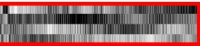

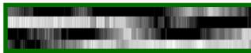

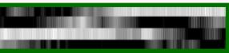  
Figure 10: Reconstructing a room corner from different standoff distances after auto-tuning for a specific distance (or a range of distances). Observe that the frequency content of patterns optimized for $0 . 8 \mathrm { m }$ (red) is much higher than those for $0 . 8 – 5 . 8 \mathrm { m }$ (green).

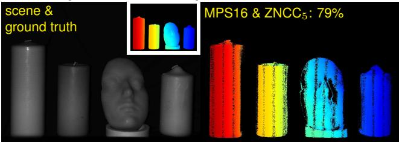  
pixels with correspondence error $\leq 2$

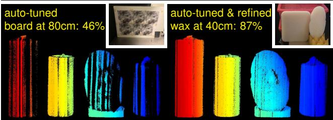  
Figure 11: A scene with candles and a beeswax face cast, reconstructed three different ways. Insets show the training scenes. Only pixels with error $\leq 2$ are shown, along with their percentage.

# References

[1] J. Y. Bouguet and P. Perona, “3D photography on your desk,” in Proc. IEEE ICCV, pp. 43–50, 1998.   
[2] D. Scharstein and R. Szeliski, “High-accuracy stereo depth maps using structured light,” in Proc. IEEE CVPR, pp. 195– 202, 2003.   
[3] D. Moreno, F. Calakli, and G. Taubin, “Unsynchronized structured light,” in ACM TOG (SIGGRAPH Asia), vol. 34, 2015.   
[4] M. Donlic, T. Petkovic, and T. Pribanic, “On Tablet 3D Structured Light Reconstruction and Registration,” in Proc. IEEE ICCV, pp. 2462–2471, 2017.   
[5] S. Shrestha, F. Heide, W. Heidrich, and G. Wetzstein, “Computational imaging with multi-camera time-of-flight systems,” ACM TOG (SIGGRAPH), vol. 35, no. 4, 2016.   
[6] A. Bhandari, A. Kadambi, R. Whyte, C. Barsi, M. Feigin, A. Dorrington, and R. Raskar, “Resolving multipath interference in time-of-flight imaging via modulation frequency diversity and sparse regularization,” Optics Letters, vol. 39, no. 6, pp. 1705–1708, 2014.   
[7] S. Achar, J. R. Bartels, W. L. R. Whittaker, K. N. Kutulakos, and S. G. Narasimhan, “Epipolar time-of-flight imaging,” ACM TOG (SIGGRAPH), vol. 36, no. 4, 2017.   
[8] A. Kadambi, R. Whyte, A. Bhandari, L. Streeter, C. Barsi, A. Dorrington, and R. Raskar, “Coded time of flight cameras: sparse deconvolution to address multipath interference and recover time profiles,” ACM TOG (SIGGRAPH Asia), vol. 32, no. 6, 2013.   
[9] A. Kadambi and R. Raskar, “Rethinking Machine Vision Time of Flight With GHz Heterodyning,” IEEE Access, vol. 5, pp. 26211–26223, 2017.   
[10] F. Li, J. Yablon, A. Velten, M. Gupta, and O. S. Cossairt, “High-depth-resolution range imaging with multiplewavelength superheterodyne interferometry using 1550-nm lasers,” Appl Optics, vol. 56, pp. H51–H56, Nov. 2017.   
[11] C. Callenberg, F. Heide, G. Wetzstein, and M. B. Hullin, “Snapshot difference imaging using correlation time-offlight sensors,” ACM TOG, vol. 36, Nov. 2017.   
[12] F. Li, H. Chen, C. Yeh, A. Veeraraghavan, and O. Cossairt, “High spatial resolution time-of-flight imaging,” in Computational Imaging III (A. Ashok, J. C. Petruccelli, A. Mahalanobis, and L. Tian, eds.), pp. 7–14, May 2018.   
[13] F. Heide, W. Heidrich, M. Hullin, and G. Wetzstein, “Doppler Time-of-Flight Imaging,” ACM TOG, vol. 34, pp. – 36:11, Aug. 2015.   
[14] F. Gutierrez-Barragan, S. A. Reza, A. Velten, and M. Gupta, “Practical Coding Function Design for Time-Of-Flight Imaging,” in Proc. IEEE CVPR, pp. 1566–1574, 2019.   
[15] M. Gupta and N. Nakhate, “A Geometric Perspective on Structured Light Coding,” in Proc. ECCV, pp. 87–102, 2018.   
[16] P. Mirdehghan, W. Chen, and K. N. Kutulakos, “Optimal Structured Light `a La Carte,” in Proc. IEEE CVPR, pp. 6248– 6257, 2018.

[17] M. Gupta, A. Velten, S. Nayar, and E. Breitbach, “What are optimal coding functions for time-of-flight imaging?,” ACM TOG, vol. 37, no. 2, 2018.   
[18] E. Horn and N. Kiryati, “Toward optimal structured light patterns,” in Proc. IEEE 3DIM, pp. 28–35, 1997.   
[19] T. Pribanic, H. Dˇzapo, and J. Salvi, “Efficient and Low-Cost 3D Structured Light System Based on a Modified Number-Theoretic Approach,” EURASIP J. Adv. Signal Process., vol. 2010, no. 1, 2010.   
[20] A. Adam, C. Dann, O. Yair, S. Mazor, and S. Nowozin, “Bayesian Time-of-Flight for Realtime Shape, Illumination and Albedo,” IEEE T-PAMI, vol. 39, no. 5, pp. 851–864, 2017.   
[21] M. O’Toole, S. Achar, S. G. Narasimhan, and K. N. Kutulakos, “Homogeneous codes for energy-efficient illumination and imaging,” ACM TOG (SIGGRAPH), vol. 34, no. 4, 2015.   
[22] M. Wei, N. Sarhangnejad, Z. Xia, N. Gusev, N. Katic, R. Genov, and K. N. Kutulakos, “Coded Two-Bucket Cameras for Computer Vision,” in Proc. ECCV, pp. 54–71, 2018.   
[23] D. P. Kingma and J. Ba, “Adam: A Method for Stochastic Optimization,” in Proc. ICLR, 2015.   
[24] T. Tieleman and G. E. Hinton, “Lecture 6.5-rmsprop: Divide the gradient by a running average of its recent magnitude,” in COURSERA: Neural Networks for Machine Learning, 2012.   
[25] M. Kellman, E. Bostan, N. Repina, and L. Waller, “Physicsbased Learned Design: Optimized Coded-Illumination for Quantitative Phase Imaging,” IEEE TCI, 2019.   
[26] R. Horstmeyer, R. Y. Chen, B. Kappes, and B. Judkewitz, “Convolutional neural networks that teach microscopes how to image,” arXiv, 2017.   
[27] A. Chakrabarti, “Learning Sensor Multiplexing Design through Back-propagation,” in Proc. NIPS, pp. 3081–3089, 2016.   
[28] V. Sitzmann, S. Diamond, Y. Peng, X. Dun, S. Boyd, W. Heidrich, F. Heide, and G. Wetzstein, “End-to-end optimization of optics and image processing for achromatic extended depth of field and super-resolution imaging,” ACM TOG (SIGGRAPH), vol. 37, no. 4, 2018.   
[29] S. Su, F. Heide, G. Wetzstein, and W. Heidrich, “Deep end-to-end time-of-flight imaging,” in Proc. IEEE CVPR, pp. 6383–6392, 2018.   
[30] E. Tseng, F. Yu, Y. Yang, F. Mannan, K. S. Arnaud, D. Nowrouzezahrai, J.-F. Lalonde, and F. Heide, “Hyperparameter optimization in black-box image processing using differentiable proxies,” ACM TOG (SIGGRAPH), vol. 38, no. 4, 2019.   
[31] P. Ambs, “A short history of optical computing: rise, decline, and evolution,” in Proc. SPIE, 2009.   
[32] J. W. Goodman, Introduction to Fourier Optics. Roberts & Company Publishers, 3rd ed., 2005.

[33] E. Leith, “The evolution of information optics,” IEEE J. Select Topics in Quantum Electronics, vol. 6, no. 6, pp. 1297– 1304, 2000.   
[34] J. Chang, V. Sitzmann, X. Dun, W. Heidrich, and G. Wetzstein, “Hybrid optical-electronic convolutional neural networks with optimized diffractive optics for image classification,” Sci. Rep., vol. 8, no. 1, 2018.   
[35] V. Saragadam and A. C. Sankaranarayanan, “KRISM—Krylov Subspace-based Optical Computing of Hyperspectral Images,” ACM TOG, vol. 38, no. 5, 2019.   
[36] M. O’Toole and K. N. Kutulakos, “Optical computing for fast light transport analysis,” ACM TOG (SIGGRAPH Asia), vol. 29, no. 6, 2010.   
[37] B. Chen, W. Deng, and J. Du, “Noisy Softmax: Improving the Generalization Ability of DCNN via Postponing the Early Softmax Saturation,” in Proc. IEEE CVPR, pp. 5372– 5381, 2017.   
[38] C. Zhang, S. Bengio, M. Hardt, B. Recht, and O. Vinyals, “Understanding deep learning requires rethinking generalization,” in Proc. ICLR, 2017.   
[39] L. Xie, J. Wang, Z. Wei, M. Wang, and Q. Tian, “DisturbLabel: Regularizing CNN on the Loss Layer,” in Proc. IEEE CVPR, pp. 4753–4762, 2016.   
[40] A. Neelakantan, L. Vilnis, Q. V. Le, I. Sutskever, L. Kaiser, K. Kurach, and J. Martens, “Adding Gradient Noise Improves Learning for Very Deep Networks,” in Proc. ICLR, 2017.   
[41] A. Krizhevsky, I. Sutskever, and G. E. Hinton, “ImageNet Classification with Deep Convolutional Neural Networks,” in Proc. NIPS, pp. 1097–1105, 2012.   
[42] K. He, X. Zhang, S. Ren, and J. Sun, “Deep Residual Learning for Image Recognition,” in Proc. IEEE CVPR, pp. 770– 778, 2016.   
[43] J. Salvi, J. Pages, and J. Batlle, “Pattern codification strategies in structured light systems,” Pattern Recogn, vol. 37, no. 4, pp. 827–849, 2004.   
[44] J. Salvi, S. Fernandez, T. Pribanic, and X. Llado, “A state of the art in structured light patterns for surface profilometry,” Pattern Recogn, vol. 43, no. 8, pp. 2666–2680, 2010.   
[45] T. Pribanic, S. Mrvoˇs, and J. Salvi, “Efficient multiple phase shift patterns for dense 3D acquisition in structured light scanning,” Image and Vision Computing, vol. 28, no. 8, pp. 1255–1266, 2010.   
[46] M. Gupta, Y. Tian, S. G. Narasimhan, and L. Zhang, “A Combined Theory of Defocused Illumination and Global Light Transport,” Int. J. Computer Vision, vol. 98, no. 2, pp. 146–167, 2011.   
[47] M. Gupta and S. Nayar, “Micro Phase Shifting,” in Proc. IEEE CVPR, pp. 813–820, 2012.   
[48] M. Gupta, A. Agrawal, A. Veeraraghavan, and S. G. Narasimhan, “A Practical Approach to 3D Scanning in the Presence of Interreflections, Subsurface Scattering and Defocus,” Int. J. Computer Vision, vol. 102, no. 1-3, pp. 33–55, 2012.

[49] D. Moreno, K. Son, and G. Taubin, “Embedded phase shifting: Robust phase shifting with embedded signals,” in Proc. IEEE CVPR, pp. 2301–2309, 2015.   
[50] J. Gu, T. Kobayashi, M. Gupta, and S. K. Nayar, “Multiplexed illumination for scene recovery in the presence of global illumination,” in Proc. IEEE ICCV, pp. 691–698, 2011.   
[51] T. Chen, H.-P. Seidel, and H. P. A. Lensch, “Modulated phase-shifting for 3D scanning,” in Proc. IEEE CVPR, 2008.   
[52] Y. Xu and D. G. Aliaga, “Robust pixel classification for 3D modeling with structured light,” in Proc. GI, 2007.   
[53] Y. Y. Schechner, S. K. Nayar, and P. N. Belhumeur, “Multiplexing for optimal lighting,” IEEE T-PAMI, vol. 29, no. 8, pp. 1339–1354, 2007.   
[54] N. Ratner and Y. Y. Schechner, “Illumination Multiplexing within Fundamental Limits,” in Proc. IEEE CVPR, 2007.   
[55] Y. Schechner, S. Nayar, and P. N. Belhumeur, “Multiplexing for Optimal Lighting,” IEEE T-PAMI, vol. 29, no. 8, pp. 1339–1354, 2007.   
[56] B. Li and I. Sezan, “Automatic keystone correction for smart projectors with embedded camera,” in Proc. IEEE ICIP, pp. 2829–2832, 2004.   
[57] F. Li, H. Sekkati, J. Deglint, C. Scharfenberger, M. Lamm, D. Clausi, J. Zelek, and A. Wong, “Simultaneous Projector-Camera Self-Calibration for Three-Dimensional Reconstruction and Projection Mapping,” IEEE TCI, vol. 3, no. 1, pp. 74–83, 2017.   
[58] C. A. Metzler, M. K. Sharma, S. Nagesh, R. G. Baraniuk, O. Cossairt, and A. Veeraraghavan, “Coherent inverse scattering via transmission matrices: Efficient phase retrieval algorithms and a public dataset,” in Proc. IEEE ICCP, 2017.   
[59] I. Moreno, J. A. Davis, T. M. Hernandez, D. M. Cottrell, and D. Sand, “Complete polarization control of light from a liquid crystal spatial light modulator,” Opt Express, vol. 20, no. 1, pp. 364–376, 2012.   
[60] J. Zhang, R. Etienne-Cummings, S. Chin, T. Xiong, and T. Tran, “Compact all-CMOS spatiotemporal compressive sensing video camera with pixel-wise coded exposure,” Opt Express, vol. 24, no. 8, pp. 9013–9024, 2016.   
[61] M. O’Toole, F. Heide, L. Xiao, M. B. Hullin, W. Heidrich, and K. N. Kutulakos, “Temporal frequency probing for 5D transient analysis of global light transport,” ACM TOG (SIG-GRAPH), vol. 33, no. 4, 2014.   
[62] F. Heide, M. B. Hullin, J. Gregson, and W. Heidrich, “Lowbudget Transient Imaging Using Photonic Mixer Devices,” in ACM TOG (SIGGRAPH), 2013.   
[63] S. J. Koppal, S. Yamazaki, and S. G. Narasimhan, “Exploiting DLP Illumination Dithering for Reconstruction and Photography of High-Speed Scenes,” Int. J. Computer Vision, vol. 96, no. 1, pp. 125–144, 2012.   
[64] G. Damberg, J. Gregson, and W. Heidrich, “High Brightness HDR Projection Using Dynamic Freeform Lensing,” ACM TOG, vol. 35, no. 3, pp. 1–11, 2016.

[65] M. Levoy, B. Chen, V. Vaish, M. Horowitz, I. Mcdowall, and M. Bolas, “Synthetic aperture confocal imaging,” in ACM SIGGRAPH, pp. 825–834, 2004.   
[66] S. R. Fanello, J. Valentin, C. Rhemann, A. Kowdle, V. Tankovich, P. Davidson, and S. Izadi, “UltraStereo: Efficient Learning-Based Matching for Active Stereo Systems,” in Proc. IEEE CVPR, pp. 6535–6544, 2017.   
[67] A. Li, B. Z. Gao, J. Wu, X. Peng, X. Liu, Y. Yin, and Z. Cai, “Structured light field 3D imaging,” Opt Express, vol. 24, no. 18, pp. 20324–20334, 2016.   
[68] C. Ti, R. Yang, J. Davis, and Z. Pan, “Simultaneous Timeof-Flight Sensing and Photometric Stereo With a Single ToF Sensor,” in Proc. IEEE CVPR, pp. 4334–4342, 2015.   
[69] Z. Zhang, “Parameter estimation techniques: a tutorial with application to conic fitting,” Image and Vision Computing, vol. 15, no. 1, pp. 59–76, 1997.   
[70] H. Robbins and S. Monro, “A Stochastic Approximation Method,” Ann. Math. Stat., vol. 22, no. 3, pp. 400–407, 1951.   
[71] N. Natarajan, I. S. Dhillon, P. K. Ravikumar, and A. Tewari, “Learning with Noisy Labels,” in Proc. NIPS, pp. 1196– 1204, 2013.   
[72] Y. Hu, H. He, C. Xu, B. Wang, and S. Lin, “Exposure: A White-Box Photo Post-Processing Framework,” ACM TOG, vol. 37, no. 2, pp. 1–17, 2018.   
[73] K. He, X. Zhang, S. Ren, and J. Sun, “Identity Mappings in Deep Residual Networks,” in Proc. ECCV, pp. 630–645, 2016.   
[74] W. Chen, P. Mirdehghan, S. Fidler, and K. N. Kutulakos, “Auto-tuning structured light by optical stochastic gradient descent: Supplementary materials,” in Proc. IEEE CVPR, 2020.   
[75] M. ı. Abadi, A. Agarwal, P. Barham, E. Brevdo, Z. Chen, C. Citro, G. S. Corrado, A. Davis, J. Dean, M. Devin, S. Ghemawat, I. Goodfellow, A. Harp, G. Irving, M. Isard, Y. Jia, R. Jozefowicz, L. Kaiser, M. Kudlur, J. Levenberg, D. M. e, R. Monga, S. Moore, D. Murray, C. Olah, M. Schuster, J. Shlens, B. Steiner, I. Sutskever, K. Talwar, P. Tucker, V. Vanhoucke, V. Vasudevan, F. V. e. gas, O. Vinyals, P. Warden, M. Wattenberg, M. Wicke, Y. Yu, and X. Zheng, “TensorFlow: Large-Scale Machine Learning on Heterogeneous Systems,” tech. rep., 2015.   
[76] J. C. Sun and I. Gkioulekas, “Mitsuba clt renderer.” https://github.com/cmu-ci-lab/mitsuba clt.   
[77] W. Jakob, “Mitsuba renderer,” 2010. http://www.mitsubarenderer.org.   
[78] Z. Wu, S. Song, A. Khosla, L. Zhang, X. Tang, and J. Xiao, “3d shapenets: A deep representation for volumetric shape modeling,” in Proc. IEEE CVPR, 2015.