## 实验结果与分析

本次实验围绕结构光图案优化展开，目标是在两类场景中比较不同解码器与梯度求解策略的表现，并分析优化后的图案是否能够降低 correspondence 误差。保留的两个场景为：

- `sl_marble_objects`：带颜色变化和近似高光的大理石风格物体场景
- `sl_diffuse_objects`：更接近理想漫反射的基准场景

### 实验设置

所有正式实验均使用 640 列投影宽度、5 张编码图案、500 次迭代。完整实验组合如下：

| 场景 | 梯度方式 | 解码器 |
| --- | --- | --- |
| `sl_marble_objects` | autodiff | `zncc`、`zncc_nn`、`zncc_nn_response` |
| `sl_marble_objects` | finite difference | `zncc` |
| `sl_diffuse_objects` | autodiff | `zncc`、`zncc_nn`、`zncc_nn_response` |

其中 `zncc_nn_response` 在 `zncc_nn` 的基础上额外学习投影仪响应曲线；有限差分实验使用随机抽样坐标的梯度估计，仅作为对比基线。

### 当前渲染链路

当前代码统一使用项目内的 **PyTorch 可微渲染器** 完成训练前向、反向和有限差分对比。该渲染器直接解析当前实验场景中的几何、材质、相机与投影仪参数，并输出：

- 相机观测图像
- 深度图 `depth_gt`
- 相机像素到投影仪列的真值对应 `gt_corr`

因此本轮实验中的自动微分和有限差分共享同一套前向模型，梯度对比结果可以直接解释为梯度估计误差，而不再混入前向模型失配。

### 自检结果

正式训练之前，先用自检流程验证场景几何、渲染链路、深度图和 GT correspondence 是否合理。下图分别给出两个场景的自检渲染结果、GT 深度图和 GT correspondence。

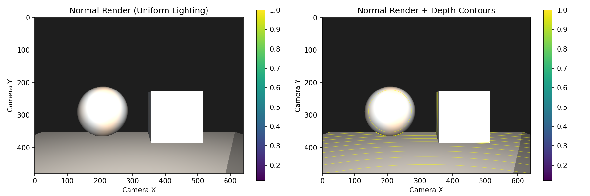
*图 1. 大理石场景自检渲染图。*

*图 2. 大理石场景自检深度图。*

*图 3. 大理石场景自检 GT correspondence。*

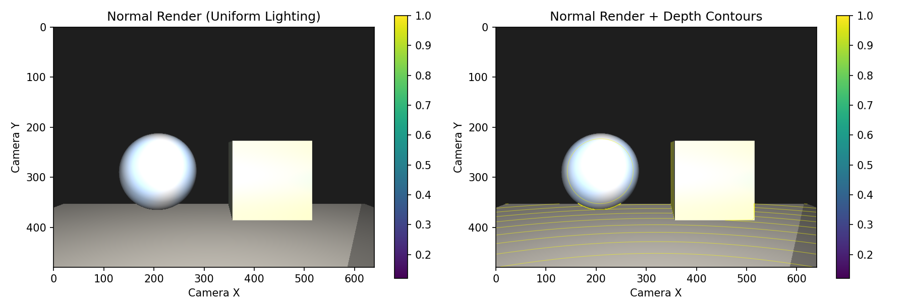
*图 4. 漫反射场景自检渲染图。*

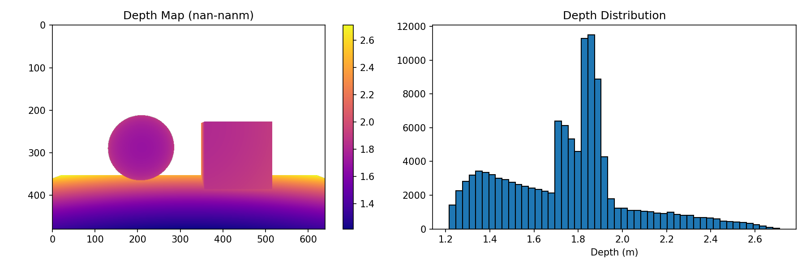
*图 5. 漫反射场景自检深度图。*

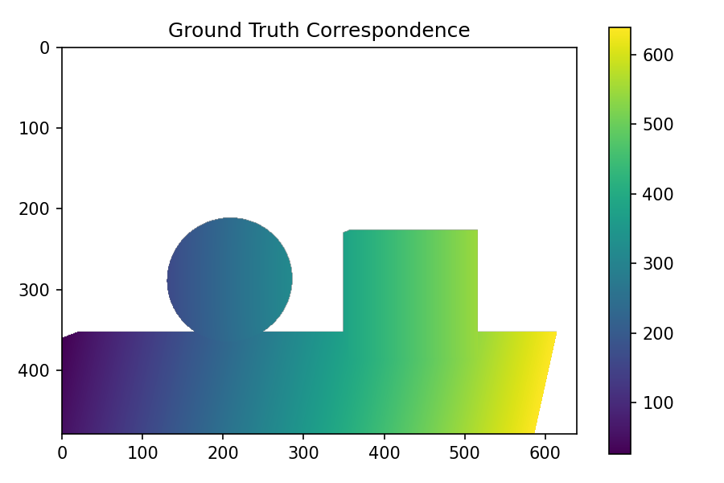
*图 6. 漫反射场景自检 GT correspondence。*

从自检结果可以看到，两类场景的几何轮廓、地面截面以及投影仪列坐标分布都与场景设置一致，说明当前 PyTorch 渲染器输出的 `depth_gt` 和 `gt_corr` 可以作为后续训练与评估的可靠参考。

### 场景结果示意

下图给出了两个场景在最佳实验配置下的最终渲染结果与深度误差图。可以看出漫反射场景的干扰比较大。

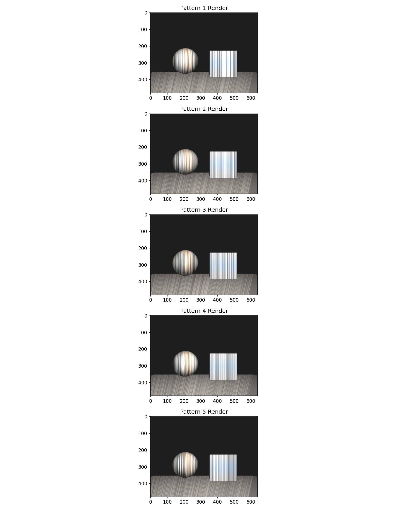
*图 7. 大理石场景最优配置下的最终渲染结果。*

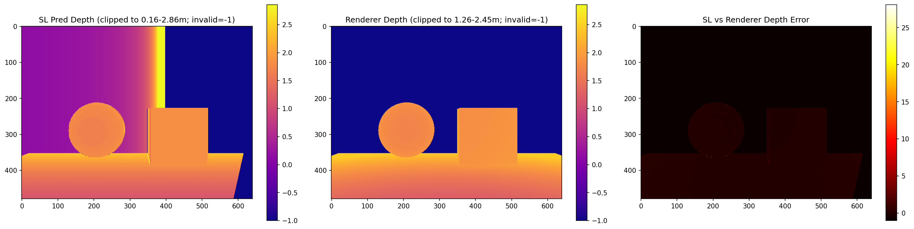
*图 8. 大理石场景中结构光重建深度与渲染器返回深度的对比及误差图。*

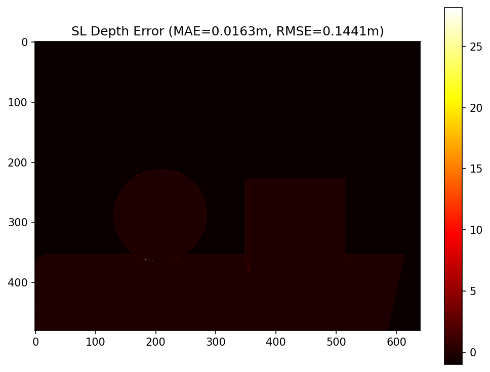
*图 9. 大理石场景最优配置下的严格结构光深度绝对误差热力图。*

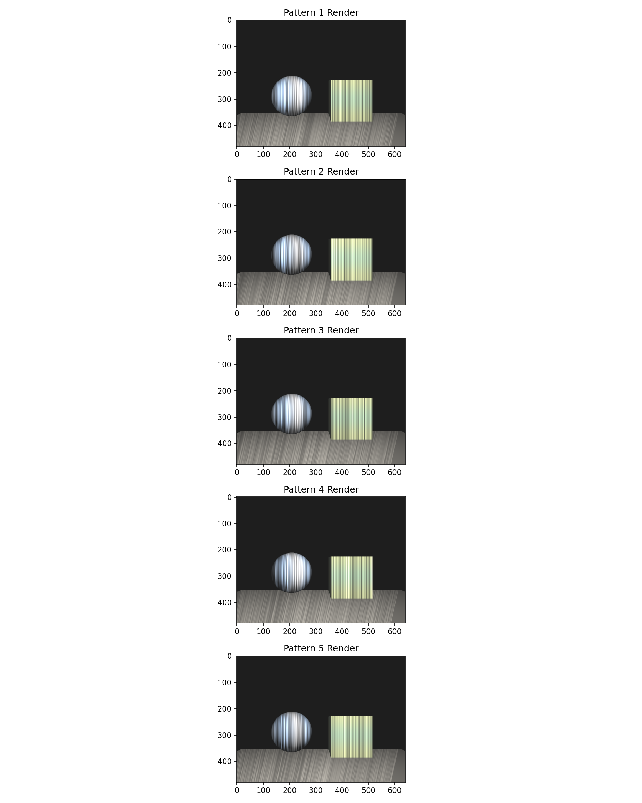
*图 11. 漫反射场景最优配置下的最终渲染结果。*

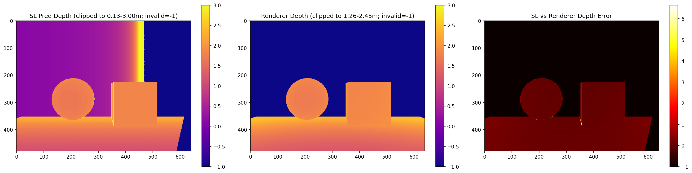
*图 12. 漫反射场景中结构光重建深度与渲染器返回深度的对比及误差图。*

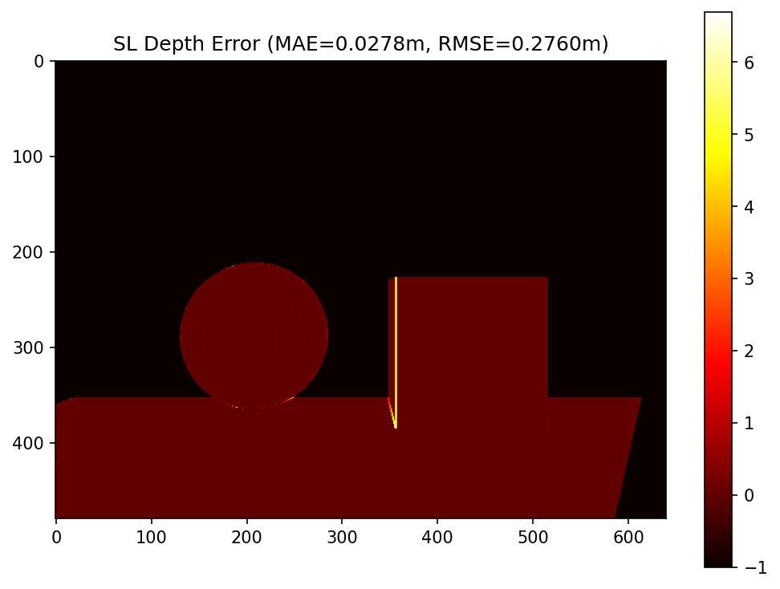
*图 13. 漫反射场景最优配置下的严格结构光深度绝对误差热力图。*

### 梯度对比结果

使用 `sl_marble_objects + zncc` 进行自动微分与有限差分对比，有限差分每个样本随机抽样 16 个坐标。最新统计如下：

| 指标 | 数值 |
| --- | ---: |
| 样本数 | 4 |
| 平均相对 L2 误差 | 0.0322 |
| 标准差 | 0.0100 |
| 最小值 | 0.0175 |
| 最大值 | 0.0446 |

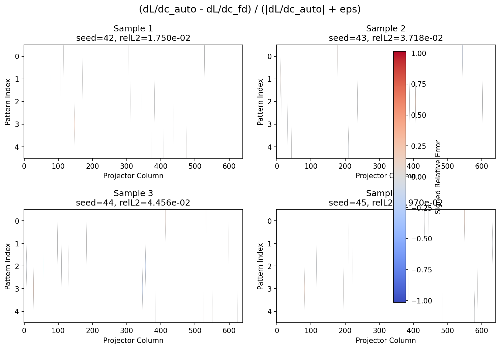
*图 14. 大理石场景中 autodiff 与 finite difference 梯度的带符号相对误差热力图。*

从单样本计时看，autodiff 每次梯度计算约为 `0.07` 到 `0.24` 秒，finite difference 约为 `0.39` 到 `0.41` 秒；在当前抽样配置下，自动微分依然更快，而且更稳定。

### 训练损失曲线

#### 大理石场景

大理石场景中三种 autodiff 配置都能稳定下降，而 finite difference 明显收敛更慢、停留在更高损失区间。

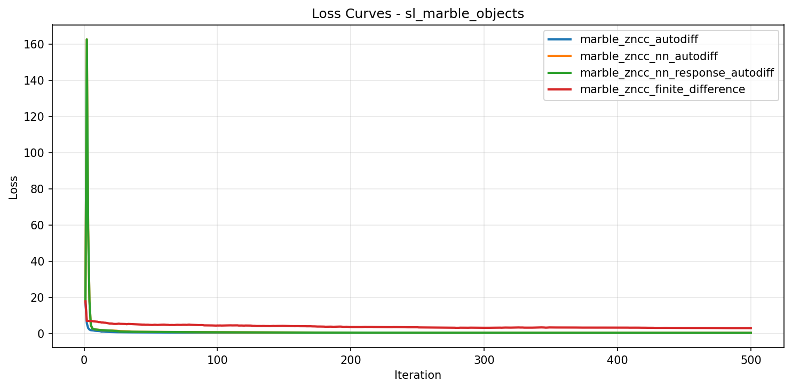
*图 15. 大理石场景中多种方法的训练损失曲线对比。*

#### 漫反射场景

漫反射场景的结论和旧版结果不同。最新 run 中，最优配置不再是 `zncc_nn_response`，而是最简单的 `zncc_autodiff`。其最终 loss 为 `0.3618`，优于 `zncc_nn_response_autodiff` 的 `0.4420` 和 `zncc_nn_autodiff` 的 `0.4456`。说明在更接近理想 Lambertian 的场景里，额外的可学习解码器和响应曲线并没有带来收益，反而引入了额外自由度。

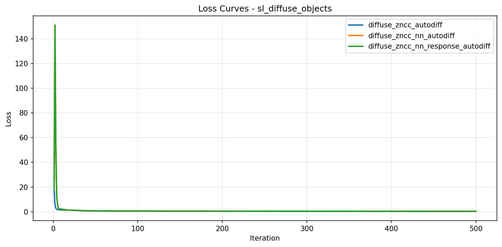
*图 16. 漫反射场景中多种方法的训练损失曲线对比。*

### 定量结果

表中 `Acc@0`、`Acc@1`、`Acc@2` 分别表示误差不超过 0、1、2 像素的像素比例。运行时间取 `timing.csv` 中的 `total_run`，因此包含训练、导出历史和 GIF 生成等步骤。

#### 大理石场景结果

| 方法 | Final Loss | MAE | RMSE | Acc@0 | Acc@1 | Acc@2 | 总耗时 / s |
| --- | ---: | ---: | ---: | ---: | ---: | ---: | ---: |
| `zncc_autodiff` | 0.3980 | 0.3729 | 2.9805 | 0.9638 | 0.9884 | 0.9900 | 311.46 |
| `zncc_nn_autodiff` | 0.4058 | 0.3693 | 2.0634 | 0.9671 | 0.9904 | 0.9913 | 302.54 |
| `zncc_nn_response_autodiff` | 0.3800 | 0.3467 | 1.9136 | 0.9664 | 0.9904 | 0.9913 | 305.37 |
| `zncc_finite_difference` | 2.9867 | 1.9677 | 18.1783 | 0.9645 | 0.9822 | 0.9822 | 288.96 |

最新结果下，大理石场景的整体最优方法是 `zncc_nn_response_autodiff`。由于带有额外的响应曲线学习器，可学习的参数更多，`zncc_nn_response_autodiff` 取得了最低的 final loss、最低的 MAE 和最低的 RMSE。`zncc_nn_autodiff` 在 `Acc@0` 和 `Acc@2` 上略高，但差距非常小，整体仍不如 `zncc_nn_response_autodiff` 稳定。finite difference 的误差显著更差，是明确的弱基线。

#### 漫反射场景结果

| 方法 | Final Loss | MAE | RMSE | Acc@0 | Acc@1 | Acc@2 | 总耗时 / s |
| --- | ---: | ---: | ---: | ---: | ---: | ---: | ---: |
| `zncc_autodiff` | 0.3618 | 0.3371 | 1.6541 | 0.9660 | 0.9900 | 0.9913 | 301.61 |
| `zncc_nn_autodiff` | 0.4456 | 0.4093 | 2.7029 | 0.9634 | 0.9888 | 0.9897 | 309.27 |
| `zncc_nn_response_autodiff` | 0.4420 | 0.4050 | 2.6595 | 0.9631 | 0.9895 | 0.9902 | 307.18 |

漫反射场景中的最佳方法是 `zncc_autodiff`。这说明当成像过程较干净、结构光条纹主导观测时，传统 ZNCC 已足够有效，额外的学习模块并不能稳定提升性能。

### 图案演化

下图给出了两个代表性实验的图案演化过程。

*图 17. 大理石场景中 `zncc_nn_response_autodiff` 的图案演化过程。*

*图 18. 漫反射场景中 `zncc_autodiff` 的图案演化过程。*

相比漫反射场景，大理石场景的图案在后期仍然会保留更强的局部变化，这与其更复杂的外观扰动相一致。

## 代码解读

### env.py

该模块负责运行前的环境准备，主要包括 Mitsuba / Dr.Jit / OpenCV 的依赖检查与相关环境变量设置。虽然默认训练后端已切到 PyTorch 渲染器，但项目仍保留 Mitsuba 后端用于兼容和对照，因此这部分初始化仍然有效。

### common.py

提供共享工具函数。`set_random_seed()` 同时设置 Python、NumPy 和 PyTorch 的随机种子；`prepare_decoder_images()` 负责把渲染输出的 RGB 图像转换为解码器需要的灰度输入：

$$
I_{\text{gray}}(u,v) = \frac{1}{3}\big(I_R(u,v) + I_G(u,v) + I_B(u,v)\big)
$$

这样渲染器可以保留彩色材质，而解码器继续使用统一的单通道相关性匹配。

### scene_genertor.py

该模块定义相机、投影仪和场景构造流程。

### pytorch_renderer.py

这是当前实验默认使用的核心渲染器。它提供了一条**低内存、可微、可控**的结构光前向链路。

#### 1. 相机射线生成

渲染器首先根据相机内参为每个像素生成一条相机射线。对像素 `(u,v)`，在相机坐标系中构造方向：

$$
\mathbf{d}_{\text{cam}}(u,v)=
\frac{1}{\left\|\cdot\right\|}
\begin{bmatrix}
(u-c_x)/f_x \\
-(v-c_y)/f_y \\
1
\end{bmatrix}
$$

这里对 `y` 分量取负号，是因为图像行坐标向下增长，而相机坐标系的 `+Y` 向上。随后利用外参把方向旋转到世界坐标系。

#### 2. 解析几何求交

当前场景只包含三类几何体，因此渲染器直接用解析方法求交：

- 地面：与固定平面 `y=-0.45` 求交，再检查落点是否在有效矩形区域内
- 球体：解二次方程求最小正根
- 立方体：用 slab method 求射线进入和离开 AABB 的参数区间

对三类候选交点取最近的有效交点，得到每个像素的：

- 世界坐标点 `P`
- 法向 `n`
- 物体 id
- 材质参数

这一步同时生成了深度图 `depth_gt`。

#### 3. 真值 correspondence 计算

有了世界坐标点后，可以直接重投影到投影仪平面，得到真值对应列：

$$
\mathbf{p}_{\text{proj}} = R_{\text{proj}} P + t_{\text{proj}}, \qquad
x_{\text{gt}} = f_x^{\text{proj}} \frac{p_x}{p_z} + c_x^{\text{proj}}
$$

若 `p_z <= 0` 或投影超出投影仪宽度，则该像素记为无效并写成 `NaN`。这就是训练与评估中使用的 `gt_corr`。

#### 4. 投影图案采样

训练变量是 1D pattern `P_k(x)`。渲染时根据 `gt_corr` 对每个像素的投影仪列位置做线性插值采样：

$$
I_k^{\text{proj}}(u,v) =
(1-\alpha) P_k(\lfloor x_{\text{gt}}\rfloor) +
\alpha P_k(\lfloor x_{\text{gt}}\rfloor + 1)
$$

这一步完全使用 PyTorch 张量操作实现，因此对 pattern 保持可微。

#### 5. 近似彩色着色模型

渲染器为不同物体分配不同 RGB albedo，并加入两类近似光照：

- 投影仪方向光的 Lambert 项
- 一个固定 fill light 的漫反射补光项

在大理石场景中，还额外加入：

- 基于 half vector 的简化高光项
- 基于三角函数的颜色纹理扰动，用来模拟大理石纹理

因此单帧彩色图像大致为：

$$
I_k(u,v)=I_{\text{ambient}} + \rho(u,v)\Big(I_k^{\text{proj}}(u,v)\,s_{\text{proj}}(u,v)+s_{\text{fill}}(u,v)\Big)
$$

其中 `rho` 为 RGB albedo，`s_proj` 包含漫反射与近似高光，`s_fill` 为补光项。最终输出为 `[K, H, W, 3]` 的 RGB 图像序列。

#### 6. autodiff 与 finite difference

`render_images_autodiff()` 是当前训练默认前向，直接对 pattern 保持梯度。  
`finite_difference()`、`finite_difference_batch()` 等函数则在同一前向模型上做差分扰动，用于梯度对比或有限差分训练。也正因为两者共享同一前向实现，最新版实验中前向损失已经完全一致。

### shader.py

`shader.py` 现在主要承担两个职责：

1. 定义 `CameraConfig`、`ProjectorConfig`、`LightConfig` 等共享数据结构
2. 保留 Mitsuba 后端 `StructuredLightRenderer` 的实现

在当前 PyTorch 分支中，`shader.py` 不再是默认训练渲染器，但它仍然是兼容 Mitsuba 后端所必需的模块。

### decoder.py

解码器负责从相机观测图像中恢复每个像素对应的投影仪列位置。

#### 1. 特征提取

对每个像素收集跨越 `K` 张图案的局部邻域，构成特征向量：

$$
F_{\text{cam}}[u,v] \in \mathbb{R}^{pK}, \qquad
F_{\text{proj}}[x] \in \mathbb{R}^{pK}
$$

其中 `p` 是水平邻域宽度。

#### 2. ZNCC 相似度

对相机特征和投影图案特征计算零均值归一化互相关：

$$
\text{ZNCC}(f,g) =
\frac{(f-\bar f)\cdot(g-\bar g)}
{\|f-\bar f\|\,\|g-\bar g\|+\epsilon}
$$

`ZNCCDecoder` 直接使用这个相似度矩阵解码；`ZNCCNNDecoder` 则在 ZNCC 前加入残差 MLP 做特征变换。

#### 3. 响应曲线

`MonotonicProjectorResponseCurve` 用单调分段线性函数建模投影仪响应，通过 `softplus` 保证每一段增量为正，并归一化到 `g(0)=0, g(1)=1`。在 `zncc_nn_response` 模式下，pattern 会先经过该响应曲线再参与匹配。

### losses.py

损失函数的核心是对不可微的 `argmax` 做 soft 替代。定义相似度分数 `scores[u,v,n]` 后，用温度为 `tau` 的 softmax 构造列位置分布，并对与真值列 `x_gt(u,v)` 的偏差施加惩罚：

$$
\mathcal{L}_{\text{corr}} =
\frac{1}{|V|}\sum_{(u,v)\in V}\sum_n
\text{softmax}(\tau \cdot \text{scores}[u,v,n]) \cdot
\text{Penalty}(n-x_{\text{gt}}(u,v))
$$

除此之外，还可以叠加频率正则项，抑制过高频的投影图案。

### OpticalSGD.py

`OpticalSGDOptimizer` 负责把渲染器、解码器和损失函数串起来。单步优化流程如下：

1. 用当前 pattern 调用渲染器得到图像
2. 将 RGB 图像转成解码器输入
3. 计算相似度分数与 soft correspondence loss
4. `loss.backward()` 回传到 pattern 和可学习解码器参数
5. 更新后对 pattern 做 `clamp` 和可选频率约束

### training_pipeline.py

`training_pipeline.py` 负责执行单个实验：读取配置、初始化渲染器、生成 GT、创建优化器、运行训练、导出可视化、计算最终指标。当前版本会从配置中读取 `rendering.backend` 并传给 `create_standard_renderer()`，因此一套实验脚本即可同时支持两个后端。

### analysis.py

负责可视化与结果导出，包括：

- `plot_patterns()`：显示最终 1D 图案
- `plot_frequency_spectrum()`：显示频谱
- `plot_loss_curve()`：绘制训练损失
- `generate_pattern_evolution_gif()` / `generate_spectrum_evolution_gif()`：生成演化动画

本报告中引用的大部分损失曲线、误差图和图案演化 GIF 都由该模块导出。

### run_logging.py

该模块实现日志与计时功能。`RunLogSession` 负责把控制台输出同步写入日志文件；`TimingTracker` 记录诸如 `init_renderer`、`training_loop`、`generate_pattern_gif` 等阶段的耗时，并写入 `timing.csv`。这也是本报告中运行时间统计的来源。

## AI 使用报告

本此实验的代码大部分由 Claude Code 和 Codex 生成并互相进行核验，人工负责模块设计，并介入最终的粗粒度审阅。使用网页对话模型（不舍得在 Codex 中开GPT5.5）辅助理解论文内容。

AI在处理空间相对位置时还是容易出错，本次实现过程中出现下述问题：

- 在 `pytorch_renderer.py` 得到的渲染结果上下颠倒。
- 几何体和相机的相对位置没有排布好，导致摄像机拍不到物体。
