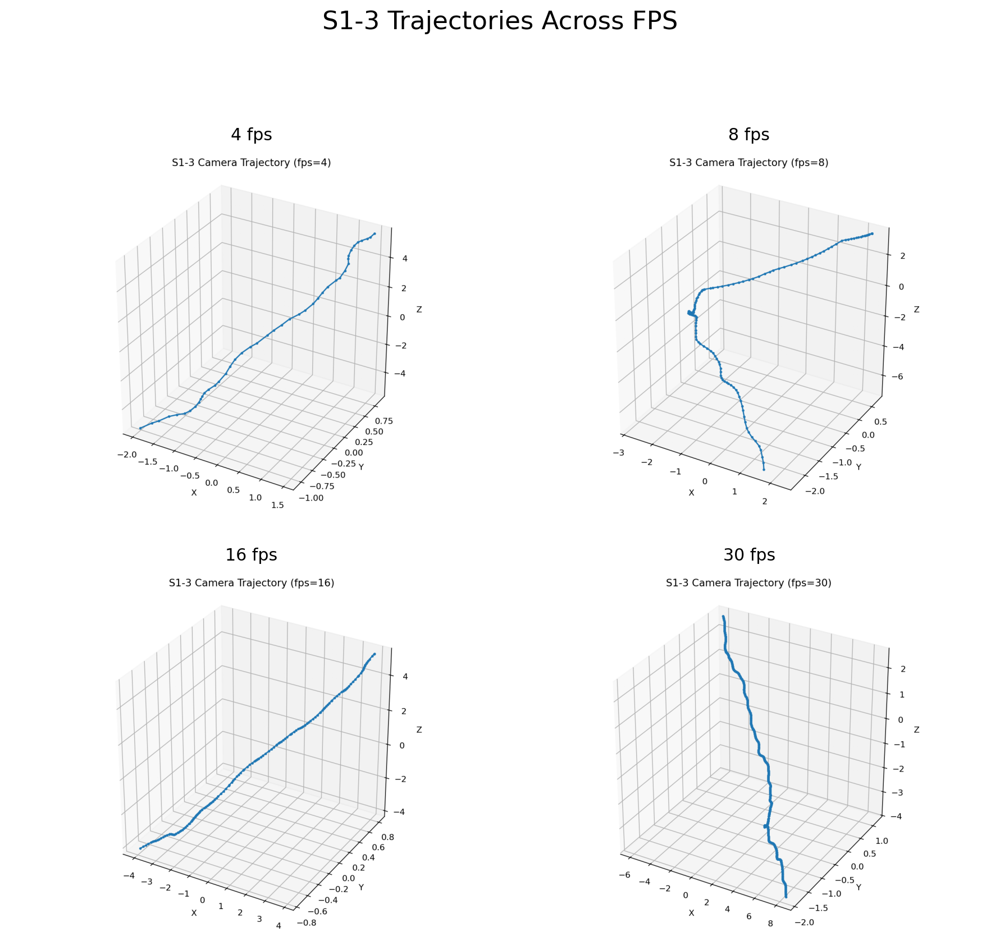
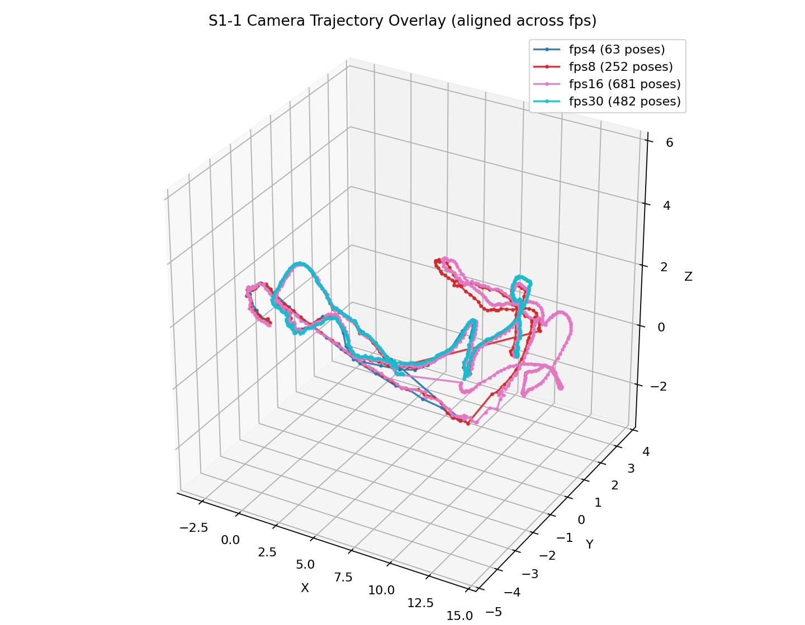
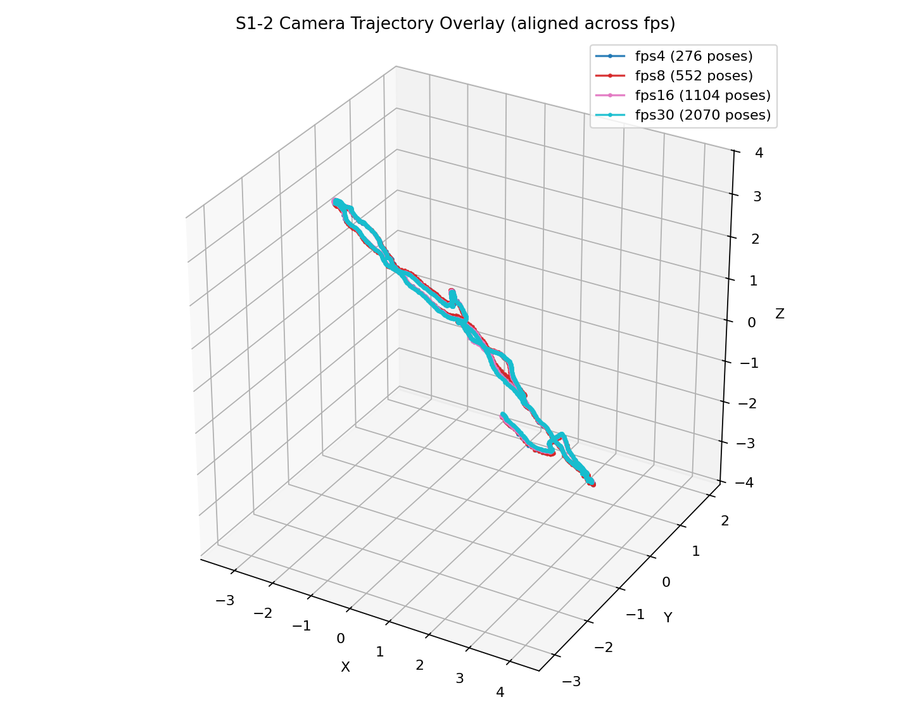
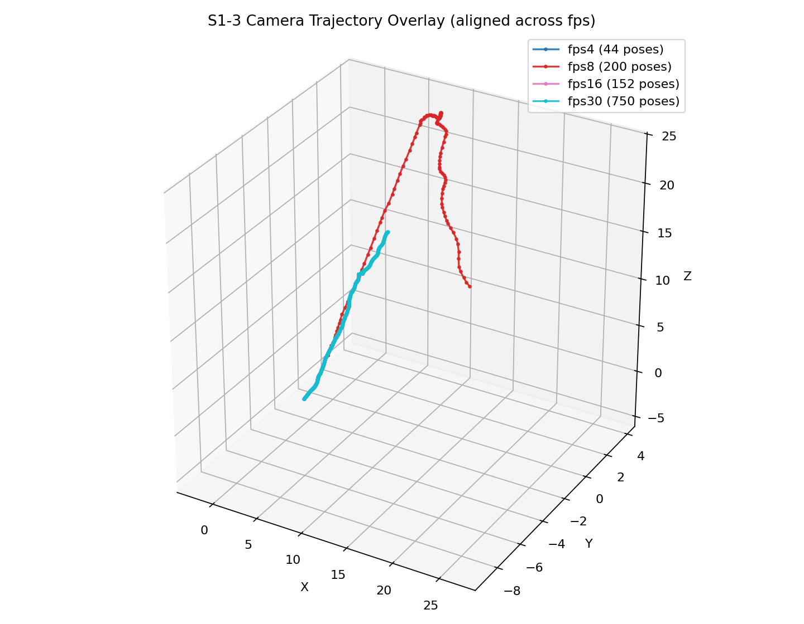

# Lab1 Report

## 题目一：静态场景 SfM

题目一的流程由 `ffmpeg + COLMAP` 完成。实现上，先用 `ffmpeg` 按固定 `fps` 从视频均匀抽帧，再依次调用 `COLMAP` 的 `feature_extractor`、`sequential_matcher`、`mapper` 和 `model_converter` 得到稀疏重建结果，最后根据 `images.txt` 反算相机中心并绘制轨迹图。实验中使用了 `single_camera=1` 和 `PINHOLE` 相机模型，抽帧策略采用等时间间隔采样。

为了比较抽帧策略对结果的影响，三段视频都测试了 `4 / 8 / 16 / 30 fps` 四组设置。相关素材已经复制到未忽略目录 [report_assets/task1](/d:/Codes/Camera3D/lab1/report_assets/task1)。其中四宫格拼图由通用脚本 [make_image_grid.py](/d:/Codes/Camera3D/lab1/report_assets/make_image_grid.py) 生成；对齐叠加图则直接使用项目已有的 `uv run lab1 task1 merge` 输出。

### 拼图展示

`S1-1` 在四组帧率下的轨迹差异很明显。`4 fps` 和 `30 fps` 的注册率都偏低，`16 fps` 的轨迹最完整，回环和高度变化也最清楚，因此这一段最适合中等偏高的抽帧率。

`S1-2` 在四组帧率下都得到了稳定的环绕式轨迹，注册率始终为 **100%**。这一段说明场景本身约束充分，抽帧率更多影响的是轨迹稠密度和运行时间，而不是能否成功重建。

`S1-3` 对抽帧率最敏感。`8 fps` 和 `30 fps` 可以得到完整轨迹，`4 fps` 和 `16 fps` 则明显退化。这一段更接近单方向扫描，因此相邻视角跨度是否合适会直接影响匹配连续性。

### 合并图展示

仅看四宫格可以观察到不同 `fps` 的轨迹形状差异，但还不能直接判断它们在同一坐标系下是否一致。项目中现有的 `task1 merge` 会基于公共源帧建立对应关系，再对不同 `fps` 的轨迹做 `Sim(3)` 对齐并叠加绘制，因此更适合用来比较不同抽帧率得到的结果是否互相吻合。

`S1-1` 的合并图显示，`8 fps`、`16 fps` 和 `30 fps` 在主干部分大体一致，但局部回环区域仍存在明显偏移，说明该视频对抽帧率有一定敏感性。

`S1-2` 的合并图几乎完全重合。四组抽帧率在对齐后都沿着同一条主轨迹分布，这和它在定量表中始终保持 **100%** 注册率的结果一致，说明该场景最稳定。

`S1-3` 的合并图差异最大。`8 fps` 与 `30 fps` 的主轨迹虽然仍有重合区域，但整体分叉明显，说明这一段视频的几何约束较弱，抽帧率变化会显著改变最终重建。

### 定量比较

注册率和 SfM 时间随抽帧率变化的统计结果如下。可以直接看出，**运行时间基本随 fps 增长而上升，但注册率并不单调变好**。这说明抽帧率不是越高越好，合理的采样密度比盲目增加帧数更重要。

| 视频 | fps | 抽帧数 | 注册帧数 | 注册率 | SfM时间/s |
|---|---:|---:|---:|---:|---:|
| S1-1 | 4  | 182  | 63  | 0.346 | 18.94 |
| S1-1 | 8  | 363  | 252 | 0.694 | 76.18 |
| S1-1 | 16 | 726  | 681 | 0.938 | 280.49 |
| S1-1 | 30 | 1362 | 482 | 0.354 | 441.65 |
| S1-2 | 4  | 276  | 276 | 1.000 | 71.94 |
| S1-2 | 8  | 552  | 552 | 1.000 | 135.47 |
| S1-2 | 16 | 1104 | 1104 | 1.000 | 668.25 |
| S1-2 | 30 | 2070 | 2070 | 1.000 | 878.84 |
| S1-3 | 4  | 100  | 44  | 0.440 | 68.21 |
| S1-3 | 8  | 200  | 200 | 1.000 | 1182.61 |
| S1-3 | 16 | 400  | 152 | 0.380 | 522.49 |
| S1-3 | 30 | 750  | 750 | 1.000 | 5936.41 |

综合来看，`S1-2` 对抽帧率最不敏感，低帧率就能稳定重建；`S1-1` 在 `16 fps` 时最平衡；`S1-3` 则最依赖合适的采样密度。题目一的结果说明，视频 SfM 的效果既取决于场景本身，也强烈受抽帧策略影响。
